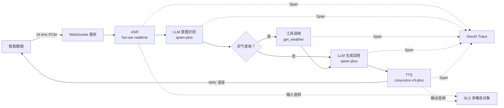

# 多模态场景：智能眼镜语音助手可观测实践

以一个智能眼镜语音助手为例：用户对眼镜说出“今天杭州天气怎么样”，设备将音频通过 WebSocket 发送到服务端。服务端依次完成实时语音识别（ASR）、意图判断、天气工具调用、回答生成和语音合成（TTS），再将生成的语音返回智能眼镜。

通过 LoongSuite GenAI 可观测能力，可以在一条 Trace 中观察 ASR、LLM、工具调用和 TTS 各阶段的耗时、输入输出、模型信息及异常。输入语音和合成语音还可以按需存储到日志服务（SLS），并通过 `sls://` URI 与 Span 关联，在阿里云可观测的 GenAI 视图中查看。

::: tip 示例源码
本文使用 [LoongSuite Java asr-example](https://github.com/alibaba/loongsuite-java/tree/main/examples/asr-example){target="_blank"}。该示例只有后端服务，不包含浏览器页面；请使用仓库内的 `scripts/ws_voice_client.py` 发送测试音频。
:::

## 场景架构

一次完整语音交互包括以下步骤：

1. 智能眼镜或测试客户端通过 WebSocket 发送 16 kHz、单声道、16-bit PCM 音频。
2. `fun-asr-realtime` 将音频实时转换为文本。
3. `qwen-plus` 判断用户意图。天气查询会触发 `get_weather` 工具调用，普通对话直接进入回答生成。
4. `qwen-plus` 生成最终回答。
5. `cosyvoice-v3-plus` 将回答合成为 WAV 音频并流式返回客户端。

## 可观测链路

示例使用 `otel-util-genai` 手动埋点，并按照 GenAI 语义约定记录工作流、模型推理和工具调用。

| Span | `gen_ai.operation.name` | 观测内容 |
| --- | --- | --- |
| `websocket.session` | - | WebSocket 会话、会话 ID 和地址 |
| `invoke_workflow voice_assistant_turn` | `invoke_workflow` | 一轮完整语音交互 |
| `generate_content fun-asr-realtime` | `generate_content` | 输入 PCM 音频、识别文本和 ASR 耗时 |
| `chat qwen-plus` | `chat` | 意图识别请求、响应和 Token 用量 |
| `execute_tool get_weather` | `execute_tool` | 天气工具参数、结果和耗时，仅天气场景产生 |
| `chat qwen-plus` | `chat` | 回答生成请求、响应和 Token 用量 |
| `generate_content cosyvoice-v3-plus` | `generate_content` | 输入文本、输出 WAV 音频和 TTS 耗时 |

ASR 输入在 Span 中使用 `BlobPart("audio/pcm", ...)` 表示，TTS 输出使用 `BlobPart("audio/wav", ...)` 表示。启用多模态上传后，音频会上传到 SLS，并在 Span 结束前替换为包含 `sls://` 地址的 `UriPart`。

## 在线体验

访问 [AgentLoop Demo](https://sls.aliyun.com/doc/playground/agentloopdemo.html){target="_blank"}，在左侧导航栏选择 **AI Agent 可观测**。

在应用列表中找到并点击 **dashscope-smart-glasses** 应用，然后进入该应用的 **链路追踪** 页面，即可查看智能眼镜语音交互产生的相关 Trace，分析 ASR、LLM、工具调用和 TTS 等环节的调用链与耗时。
