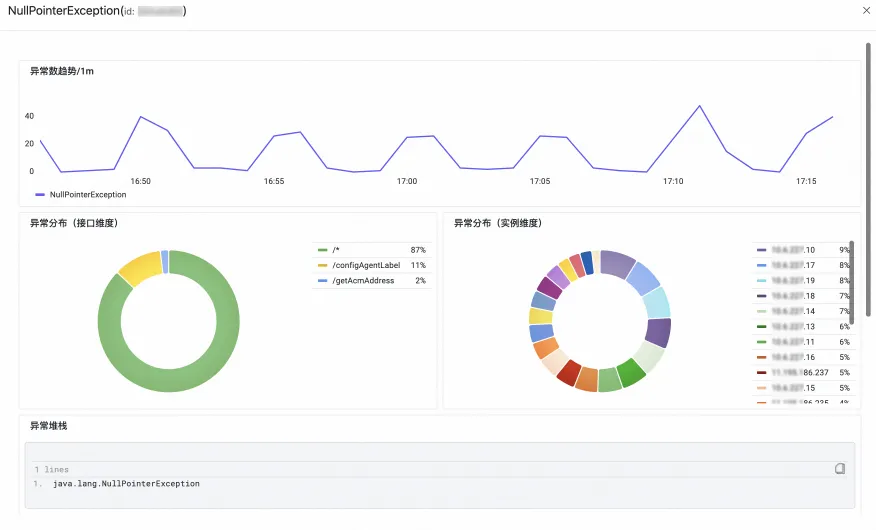

# 分析应用新增/突增异常

:::tip 分析应用新增/突增异常
[试用 Demo](/playground/armsdemo.html?dest=https%3A%2F%2Ftrace4service.console.aliyun.com%2F%23%2FsceneAnalysis%2Fcn-hangzhou%2FexceptionAnalysis){target="_blank"}
:::

## 使用场景

接入 ARMS 应用监控或可观测链路 OpenTelemetry 版后，您可以在**异常分析**页面按照异常名称、接口名称、主机对异常次数、异常列表进行筛选分析，优化产生异常的代码。您可以按**异常名称**、**接口名称**、**主机地址**对异常次数、异常列表进行筛选过滤。单击**操作**列的**概览**，可在右侧面板中查看该异常的异常数趋势、接口和实例维度的异常分布、异常堆栈等概览信息。

## 使用前提

- 已接入 ARMS 应用监控
