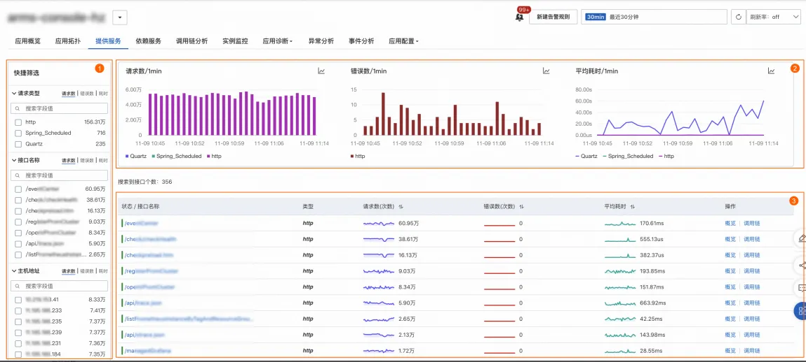

# 查询应用提供/依赖服务监控

:::tip 监控
[试用 Demo](/doc/playground/armsdemo.html?dest=https%3A%2F%2Ftrace4service.console.aliyun.com%2F%23%2Ftracing%2Fcn-hangzhou%3FappId%3Dckv8e2vzfj%2540a71c26ffd651d46%26tab%3DprovisionService%26source%3DXTRACE%26xtraceType%3Dtrace){target="_blank"}
:::

## 使用场景

接入 ARMS 应用监控或可观测链路 OpenTelemetry 版后，您可以在**提供/依赖服务**页面了解应用提供的服务详情，包括接口调用、消息队列和定时任务的详细信息。您可以按**请求类型**、**接口名称**、**主机地址**对图表、服务列表进行筛选过滤。也可以单击接口名称查看接口详情，比如目标接口的请求数、错误数、平均耗时、HTTP 状态码、数据库 SQL、消息时延等。

## 使用前提

- 已接入 ARMS 应用监控或可观测链路 OpenTelemetry 版
