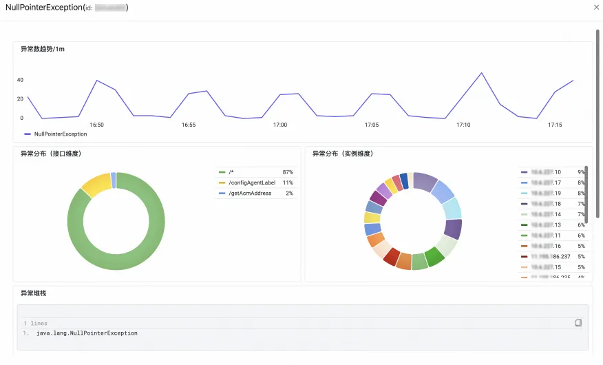

# 查询应用实例资源监控

:::tip 查询应用实例资源监控
[试用 Demo](/doc/playground/armsdemo.html?dest=https%3A%2F%2Ftrace4service.console.aliyun.com%2F%23%2Ftracing%2Fcn-hangzhou%3FappId%3Dckv8e2vzfj%2540a71c26ffd651d46%26tab%3DinstanceMonitoring%26source%3DXTRACE%26xtraceType%3Dtrace){target="_blank"}
:::

## 使用场景

为 Java 应用安装探针后，ARMS 即可开始监控 Java 应用，您可以在**实例监控**页面了解应用的主机或容器监控、JVM GC 或内存、线程池或连接池等监控信息。您可以按**主机地址**对实例列表进行筛选过滤，单击实例 IP 可以查看实例详情，比如流量黄金三指标（请求数、错误数、平均耗时）、**JVM 监控**（GC、内存、线程、文件）、**池化监控**（包括核心线程数量、当前线程数量、最大线程数量、活跃线程数量、任务队列容量）、**主机或容器监控**（CPU、内存、Disk、Load、网络流量和网络数据包）。

## 使用前提

- 已接入 ARMS 应用监控

