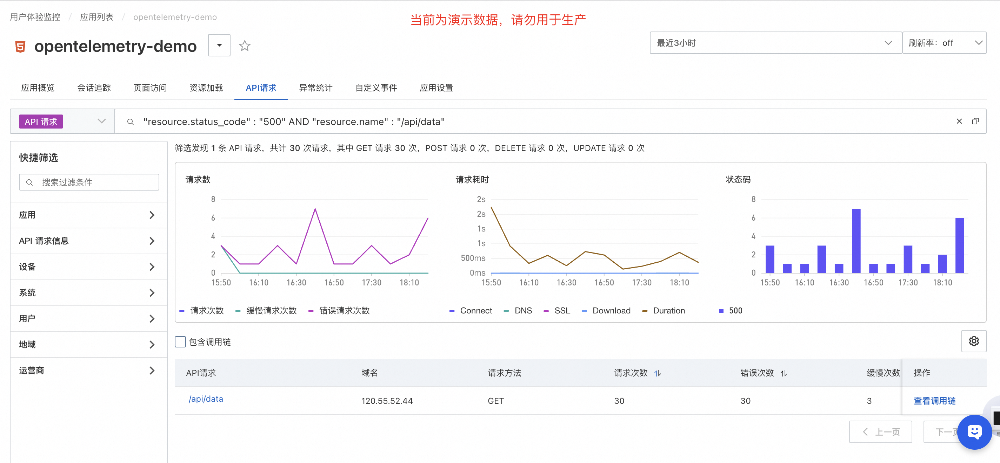
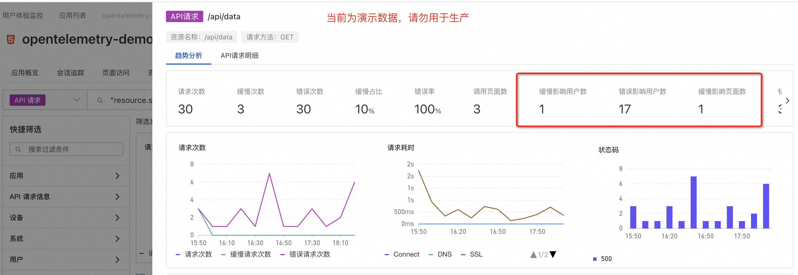

# 快速统计因故障造成用户影响面

:::tip 快速统计因故障造成用户影响面
[试用 Demo](/doc/playground/armsdemo.html?dest=https%3A%2F%2Farms4service.console.aliyun.com%2F%23%2Frum%2Fapp%2Fcn-hangzhou%2Fckv8e2vzfj%40b688a844b49f67f%3Ftab%3DexceptionStatistics%26appType%3Dweb%26from%3Dnow-3h%26to%3Dnow%26refresh%3Doff){target="_blank"}
:::

## 使用场景
第一步：在异常统计或者API请求页面，通过已知的异常名称或者已知的 API 调用和异常状态码筛选出对应的数据

第二步：点击 API 请求，即可查看到错慢影响的用户数

## 使用前提

- 已接入 ARMS 用户体验监控
