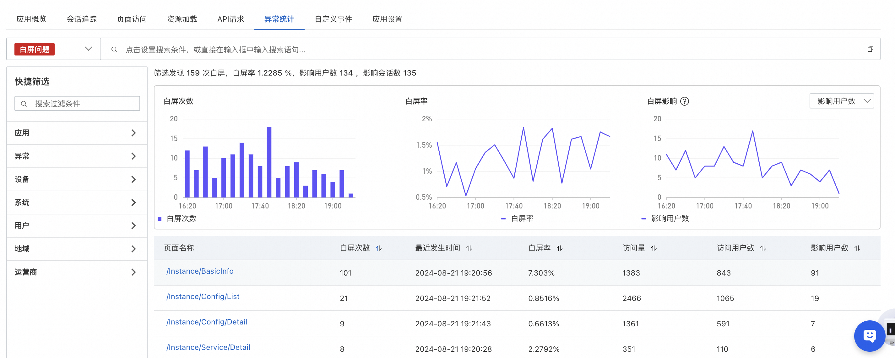
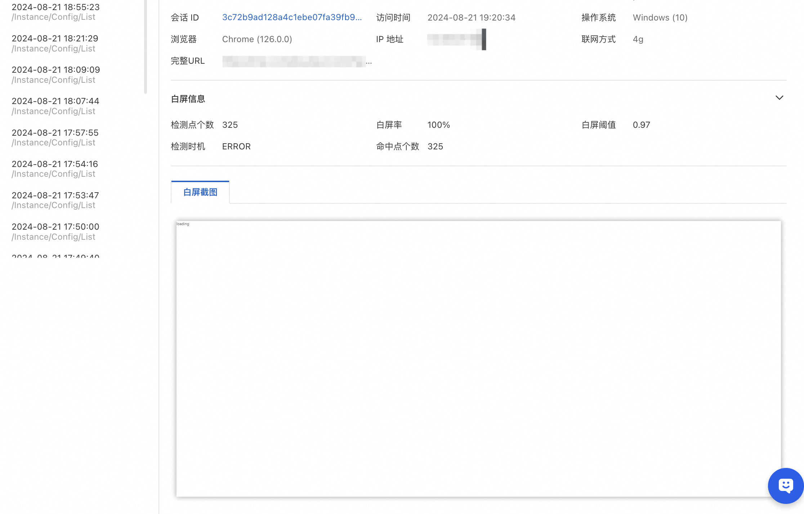
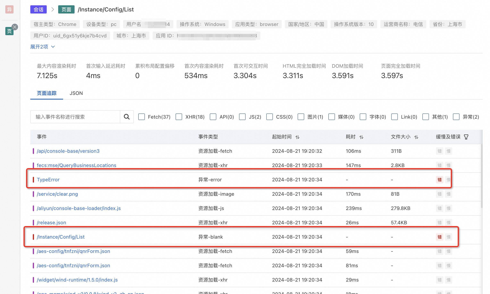

# 快速定位白屏，还原用户操作路径

:::tip 快速定位白屏，还原用户操作路径
[试用 Demo](/doc/playground/armsdemo.html?dest=https%3A%2F%2Farms4service.console.aliyun.com%2F%23%2Frum%2Fapp%2Fcn-hangzhou%2Fckv8e2vzfj%40b688a844b49f67f%3Ftab%3DexceptionStatistics%26appType%3Dweb%26from%3Dnow-3h%26to%3Dnow%26refresh%3Doff%26exceptionTypeKey%3Dblank){target="_blank"}
:::

## 使用场景
第一步：进入“异常统计”，选择“白屏问题”异常类型，可通过页面名称筛选目标页面

第二步：点击对应的页面，查看白屏明细，能看到对应的白屏发生时的情况

第三步：点击上方“会话ID”，跳转到会话轨迹，可以通过会话轨迹看出 js 的异常导致白屏发生

## 使用前提

- 已接入 ARMS 用户体验监控
- 已开启白屏监控
