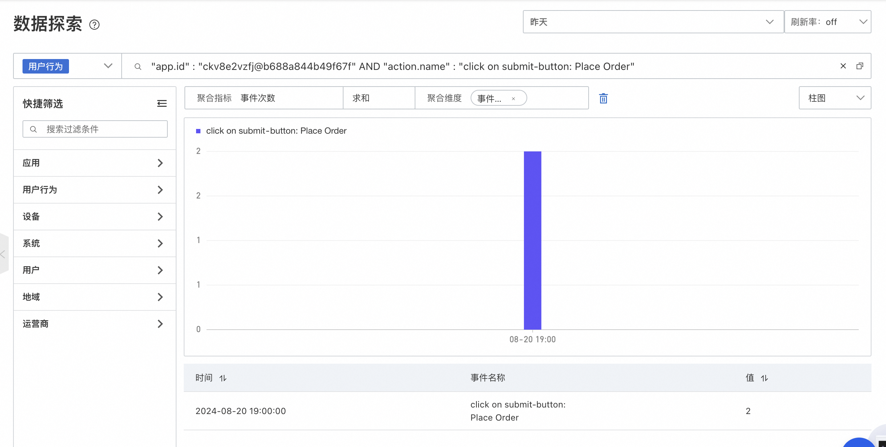

# 统计活动点击次数

:::tip 统计活动点击次数
[试用 Demo](/playground/armsdemo.html?dest=https%3A%2F%2Farms4service.console.aliyun.com%2F%23%2Frum%2Frum-explorer%2Fcn-hangzhou%3FgroupKey%3Dsession%26from%3Dnow-3h%26to%3Dnow%26refresh%3Doff){target="_blank"}
:::

## 使用场景
第一步：首先需要确定活动事件点击名称，可在会话轨迹中查看，比如这里“提交订单”对应的事件是“Place Order”。

第二步：进入数据探索，通过应用ID和事件名称筛选事件

第三步：在聚合指标选择“事件次数”，选择“求和”，按“事件名称”维度聚合，选择柱状图，则就统计出下单数据。

## 使用前提

- 已接入 ARMS 用户体验监控
