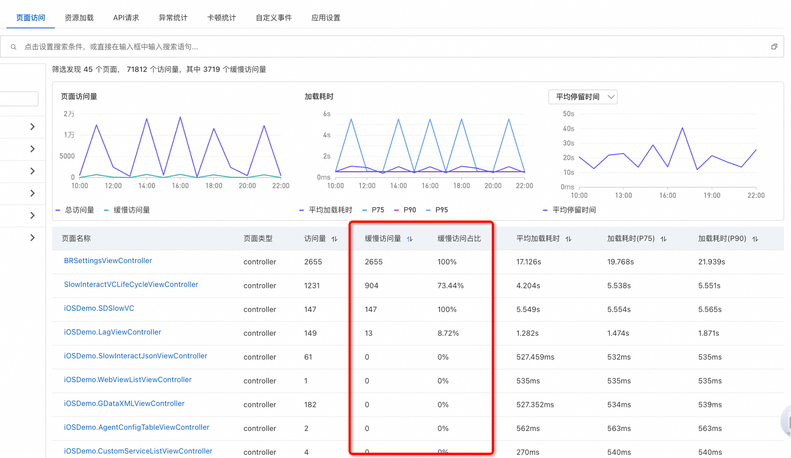
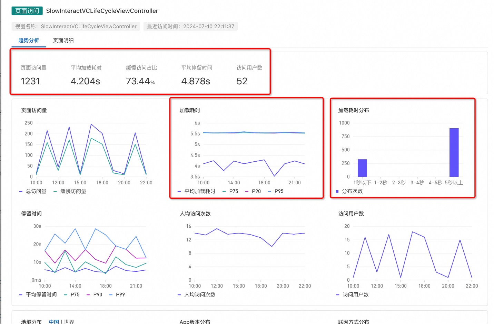
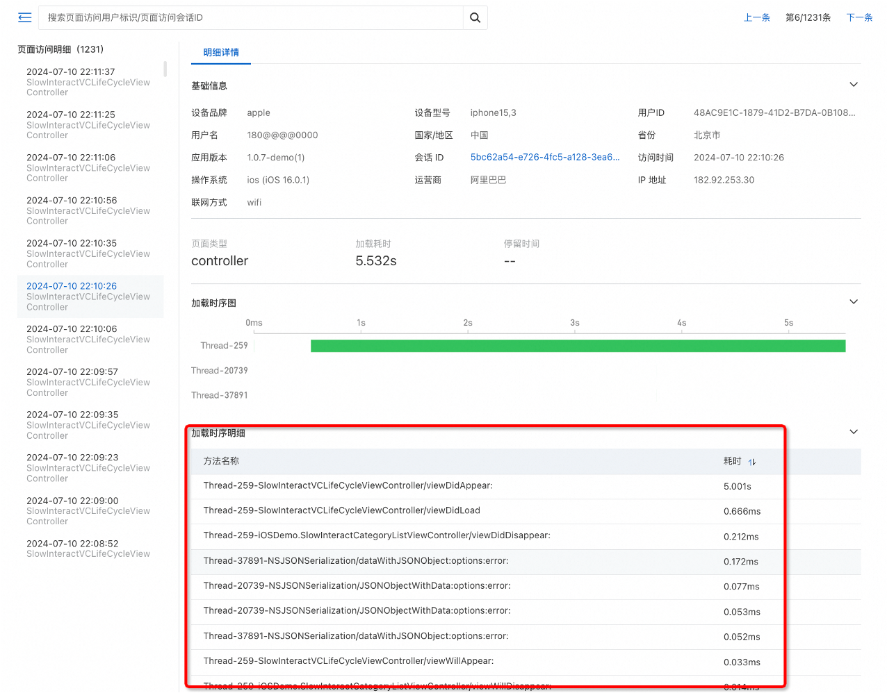

# 定位 App 页面打开缓慢问题

:::tip 定位 App 页面打开缓慢问题
[试用 Demo](/doc/playground/armsdemo.html?dest=https%3A%2F%2Farms4service.console.aliyun.com%2F%23%2Frum%2Fapp%2Fcn-hangzhou%2Fckv8e2vzfj%40319a9c9b047183c%3Ftab%3DpageView-mobile%26appType%3Dios%26from%3Dnow-3h%26to%3Dnow%26refresh%3Doff){target="_blank"}
:::

## 使用场景
第一步： 通过页面访问查看缓慢访问和缓慢访问占比页面（超过2秒为缓慢）

第二步：点击缓慢页面可查看 P75、P90、P95加载耗时，以及秒开分布次数，了解此页面用户加载整体情况

第三步：通过页面明细加载时序图和加载明细，结合基础信息和线程信息分析缓慢原因

## 使用前提

- 已接入 ARMS 用户体验监控
