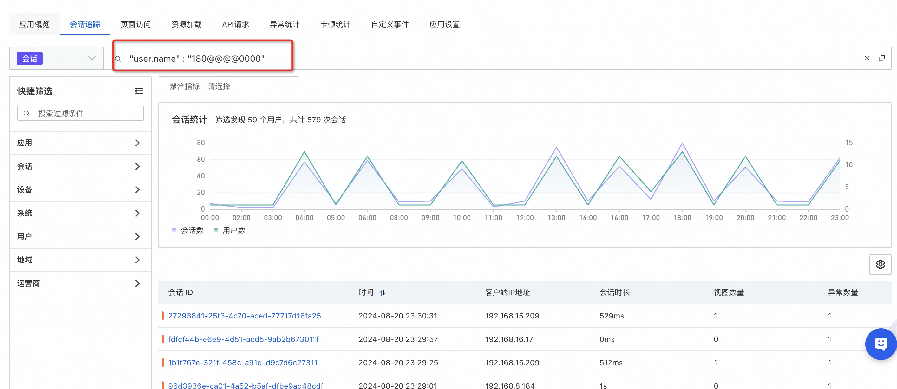
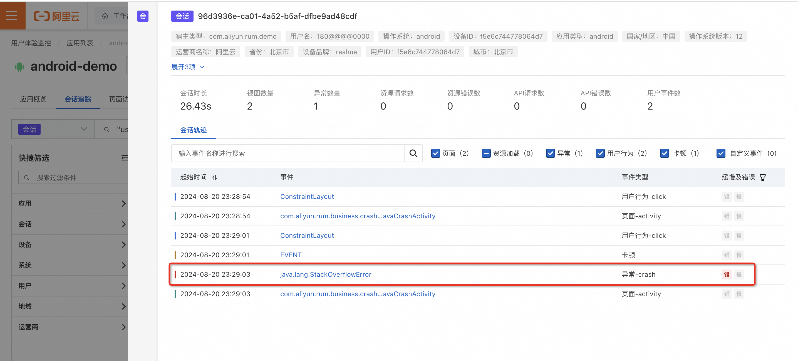
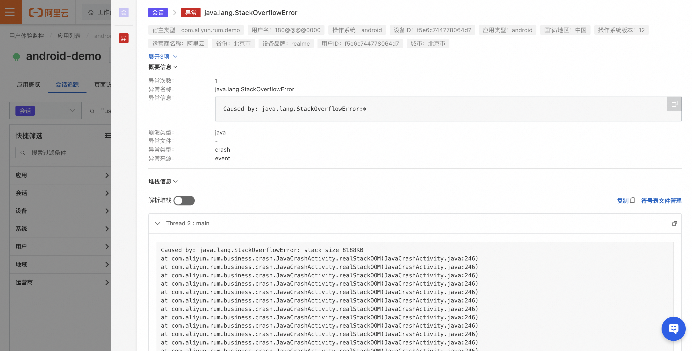

# 定位某用户产品使用异常

:::tip 定位某用户产品使用异常
[试用 Demo](/playground/armsdemo.html?dest=https%3A%2F%2Farms4service.console.aliyun.com%2F%23%2Frum%2Fapp%2Fcn-hangzhou%2Fckv8e2vzfj%40b688a844b49f67f%3Ftab%3DsessionTrace%26appType%3Dweb%26from%3Dnow-3h%26to%3Dnow%26refresh%3Doff){target="_blank"}
:::

## 使用场景
第一步：通过“会话追踪”功能，按“user.name”指定用户信息，做会话筛选。

第二步：根据时间，点击对应会话ID，查看“会话轨迹”，找到相关上下文，查看错慢信息。

第三步：点击异常事件，查看异常详情，可上传符号表，对堆栈进行解析。

## 使用前提

- 已接入 ARMS 用户体验监控
