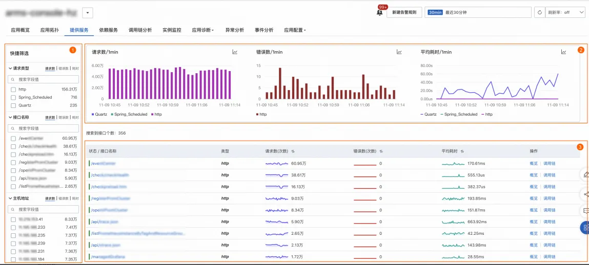
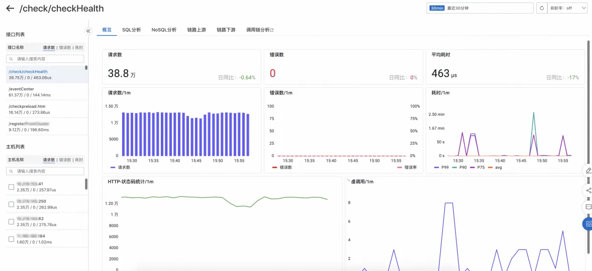
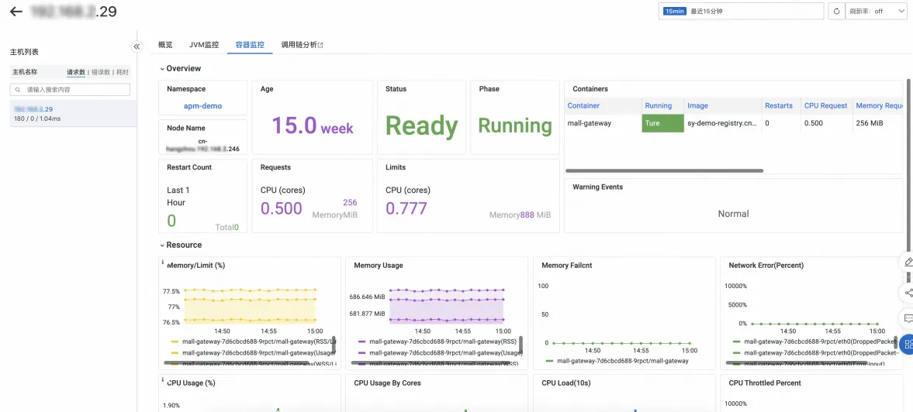
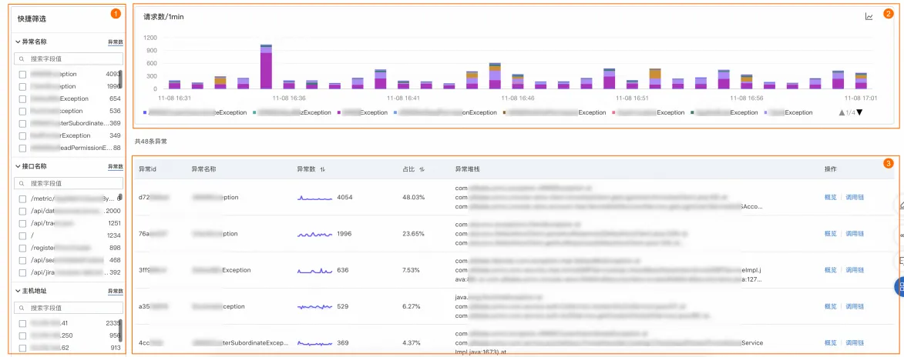
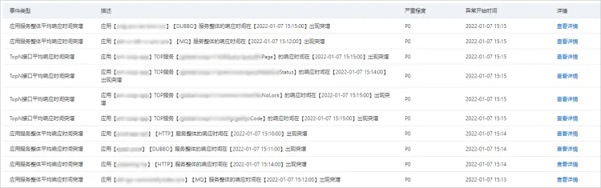
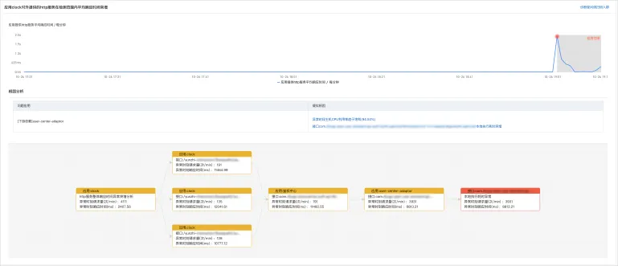

# **应用监控**
## **查询应用提供/依赖服务监控**
### 使用场景
接入 ARMS 应用监控或可观测链路 OpenTelemetry 版后，您可以在**提供/依赖服务**页面了解应用提供的服务详情，包括接口调用、消息队列和定时任务的详细信息。您可以按**请求类型**、**接口名称**、**主机地址**对图表、服务列表进行筛选过滤。也可以单击接口名称查看接口详情，比如目标接口的请求数、错误数、平均耗时、HTTP 状态码、数据库SQL、消息时延等。

### 使用前提

- 已接入 ARMS 应用监控或可观测链路 OpenTelemetry 版

### Demo地址
[https://trace4service.console.aliyun.com/#/tracing/cn-hangzhou?appId=ckv8e2vzfj%40a71c26ffd651d46&tab=provisionService&source=XTRACE&xtraceType=trace](https://trace4service.console.aliyun.com/#/tracing/cn-hangzhou?appId=ckv8e2vzfj%40a71c26ffd651d46&tab=provisionService&source=XTRACE&xtraceType=trace)
## **查询应用实例资源监控**
### 使用场景
为Java应用安装探针后，ARMS即可开始监控Java应用，您可以在**实例监控**页面了解应用的主机或容器监控、JVM GC或内存、线程池或连接池等监控信息。您可以按**主机地址**对实例列表进行筛选过滤，单击实例IP可以查看实例详情，比如流量黄金三指标（请求数、错误数、平均耗时）、**JVM监控**（GC、内存、线程、文件）、**池化监控**（包括核心线程数量、当前线程数量、最大线程数量、活跃线程数量、任务队列容量）、**主机或容器监控**（CPU、内存、Disk、Load、网络流量和网络数据包）。

### 使用前提

- 已接入 ARMS 应用监控
### Demo地址
[https://trace4service.console.aliyun.com/#/tracing/cn-hangzhou?appId=ckv8e2vzfj%40a71c26ffd651d46&tab=instanceMonitoring&source=XTRACE&xtraceType=trace](https://trace4service.console.aliyun.com/#/tracing/cn-hangzhou?appId=ckv8e2vzfj%40a71c26ffd651d46&tab=instanceMonitoring&source=XTRACE&xtraceType=trace)
## **分析应用新增/突增异常**
### 使用场景
接入 ARMS 应用监控或可观测链路 OpenTelemetry 版后，您可以在**异常分析**页面按照异常名称、接口名称、主机对异常次数、异常列表进行筛选分析，优化产生异常的代码。您可以按**异常名称**、**接口名称**、**主机地址**对异常次数、异常列表进行筛选过滤。单击**操作**列的**概览**，可在右侧面板中查看该异常的异常数趋势、接口和实例维度的异常分布、异常堆栈等概览信息。

### 使用前提

- 已接入 ARMS 应用监控
### **Demo地址**
### [https://trace4service.console.aliyun.com/#/sceneAnalysis/cn-hangzhou/slowAnalysis](https://trace4service.console.aliyun.com/#/sceneAnalysis/cn-hangzhou/slowAnalysis)

## **通过智能洞察自动诊断错慢根因**
### 使用场景
定位、排查异常需要对多项指标逐一排查，过程漫长且复杂。针对此类问题，ARMS应用监控提供主动诊断功能，帮助您快速准确地定位应用中各类异常，提供异常分析报告，进而解决应用响应时间过长等问题。
智能洞察目前已经支持巡检问题主要针对应用性能指标RT（平均响应时间）、Error（应用错误数）、QPS（平均请求量）进行阈值检测校验。您无需做任何设置，智能洞察将会基于应用历史数据并结合智能算法完成巡检，同时您可以订阅不同的异常事件类型。

### 使用前提

- 已接入 ARMS 应用监控
### Demo地址
[https://arms4service.console.aliyun.com/#/problem/list/cn-hangzhou](https://arms4service.console.aliyun.com/#/problem/list/cn-hangzhou)
