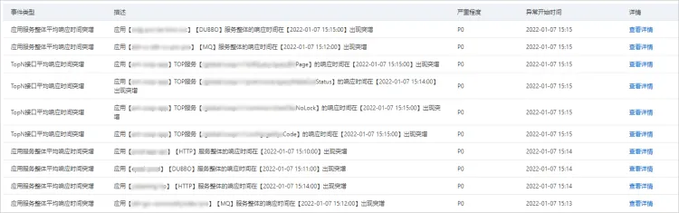

## **通过智能洞察自动诊断错慢根因**

### 使用场景
定位、排查异常需要对多项指标逐一排查，过程漫长且复杂。针对此类问题，ARMS应用监控提供主动诊断功能，帮助您快速准确地定位应用中各类异常，提供异常分析报告，进而解决应用响应时间过长等问题。
智能洞察目前已经支持巡检问题主要针对应用性能指标RT（平均响应时间）、Error（应用错误数）、QPS（平均请求量）进行阈值检测校验。您无需做任何设置，智能洞察将会基于应用历史数据并结合智能算法完成巡检，同时您可以订阅不同的异常事件类型。

### 使用前提

- 已接入 ARMS 应用监控
### Demo地址
[https://arms4service.console.aliyun.com/#/problem/list/cn-hangzhou](https://arms4service.console.aliyun.com/#/problem/list/cn-hangzhou)
