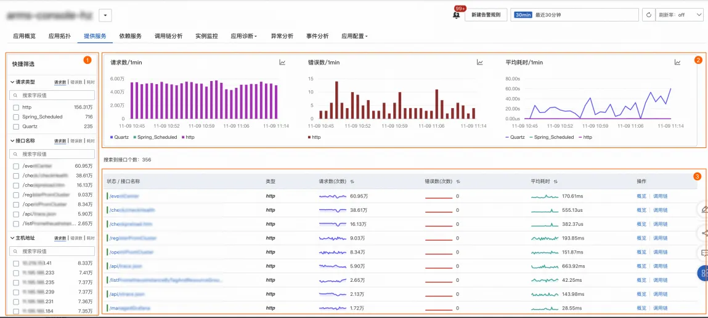

## **查询应用提供/依赖服务监控**

### 使用场景
接入 ARMS 应用监控或可观测链路 OpenTelemetry 版后，您可以在**提供/依赖服务**页面了解应用提供的服务详情，包括接口调用、消息队列和定时任务的详细信息。您可以按**请求类型**、**接口名称**、**主机地址**对图表、服务列表进行筛选过滤。也可以单击接口名称查看接口详情，比如目标接口的请求数、错误数、平均耗时、HTTP 状态码、数据库SQL、消息时延等。

### 使用前提

- 已接入 ARMS 应用监控或可观测链路 OpenTelemetry 版

### Demo地址
[https://trace4service.console.aliyun.com/#/tracing/cn-hangzhou?appId=ckv8e2vzfj%40a71c26ffd651d46&tab=provisionService&source=XTRACE&xtraceType=trace](https://trace4service.console.aliyun.com/#/tracing/cn-hangzhou?appId=ckv8e2vzfj%40a71c26ffd651d46&tab=provisionService&source=XTRACE&xtraceType=trace)