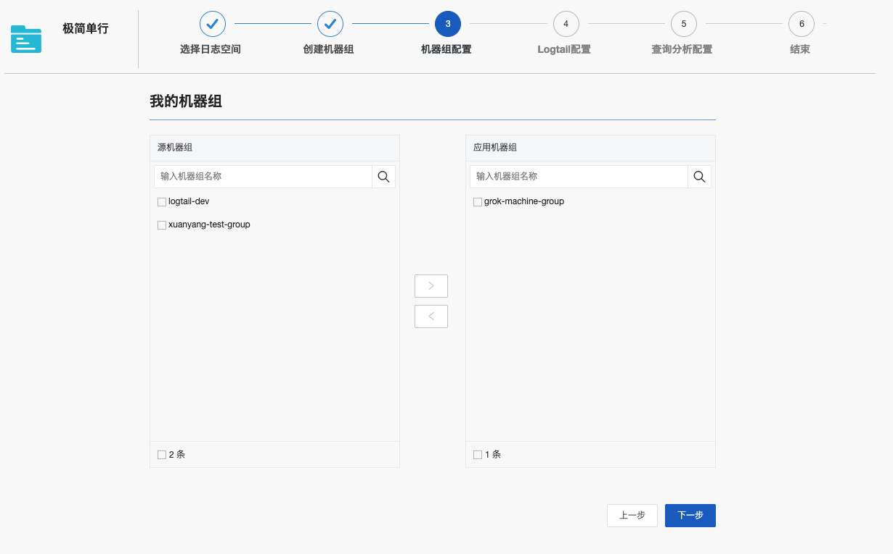

# iLogtail 使用 Grok 语法解析日志

## 目标读者

数字化系统开发运维（DevOps）工程师、稳定性工程师（SRE）、可观测平台运维人员等。

## 背景介绍

日志的形式往往多种多样，如果只是简单的读入日志数据，将很难进行搜索、分析及可视化。将原始的日志数据解析为结构化的数据，将大幅提升数据的可用性，方便用户进行快捷的“字段-值”的查询和分析。最基础的解析工具是正则表达式，但是正则表达式书写困难，上手不易，因此相对简单而又功能强大的日志解析工具成为了开发者们的共同需求。目前最流行的日志解析语法是 Grok，它是一种采用组合多个预定义的正则表达式，用来匹配分割文本并映射到关键字的工具。<br />本文档介绍如何使用 iLogtail 配合 Grok 语法解析日志文件。

## 相关概念

### iLogtail

iLogtail 是日志服务提供的日志采集 Agent，用于采集阿里云 ECS、自建 IDC、其他云厂商等服务器上的日志。

## Grok 语法

Grok 是一种将行与正则表达式匹配、将行的特定部分映射到专用字段并基于此映射执行操作的方法，它的基础语法是：

```
%{SYNTAX:SEMANTIC}
```

SYNTAX 是用于匹配文本的匹配规则名称，例如 NUMBER 匹配规则可以匹配 3.14 ，IP 匹配规则可以匹配 127.0.0.1 。SEMANTIC 是为要匹配的文本提供的标识符。例如，3.14 可能是事件的持续时间，因此可以简单地标注 duration ；字符串 127.0.0.1 可能是发出请求的地址，所以标识为 client 。这两个例子用 Grok 表达就像这样：

```
%{NUMBER:duration} %{IP:client}
```

同时，Grok 基于正则表达式之上，因此任何正则表达式在 Grok 中也是有效的。每一个匹配规则，也对应着一个 Grok 表达式或者正则表达式，例如上文的 NUMBER 和 IP 的定义如下：

```
NUMBER (?:%{BASE10NUM})
IP (?:%{IPV6}|%{IPV4})
```

而 BASE10NUM 和 IPV4 的定义如下：

```
BASE10NUM (?<![0-9.+-])(?>[+-]?(?:(?:[0-9]+(?:\.[0-9]+)?)|(?:\.[0-9]+)))
IPV4 (?<![0-9])(?:(?:[0-1]?[0-9]{1,2}|2[0-4][0-9]|25[0-5])[.](?:[0-1]?[0-9]{1,2}|2[0-4][0-9]|25[0-5])[.](?:[0-1]?[0-9]{1,2}|2[0-4][0-9]|25[0-5])[.](?:[0-1]?[0-9]{1,2}|2[0-4][0-9]|25[0-5]))(?![0-9])
```

## 方案实施

### 前提条件

> 开通阿里云日志服务

### 样例说明

这里以采集文件日志举例。这里假定日志文件为服务器上的/home/test-ilogtail/test-log/processor-grok.log，内容是单行的数据，每条数据包含年月日和一句话。我们需要把这样的一整行数据，解析为年、月、日、说的话四个字段。

> .样例输入

```
2022 Nov 1 "Hello World"
```

> .预期输出

```json
{
  "month": "Nov",
  "year": "2022",
  "motto": "\"Hello World\"",
  "day": "1"
}
```

## 基础使用

### 步骤一：创建 Project、Logstore

1. 登录日志服务控制台，在 Project 列表页面，选择已有的 Project 或者创建新的 Project。
2. 在日志库标签页，选择已有 Logstore 或者单击+图标创建新的 Logstore。

### 步骤二：创建/选择机器组

1. 在数据接入-> Logtail 配置，点击+，接入数据。
   
2. 快速数据接入页面，选择单行-文本日志。
   

3. 创建/选择机器组。
   > .如果您已有可用的机器组，请单击使用现有机器组。
   > .如果您还没有可用的机器组，请执行以下操作（以 ECS 为例）。在 ECS 机器页签中，通过手动选择实例方式选择目标 ECS 实例，单击立即执行。
   > 

- 安装完成后，单击确认安装完毕。

  > .在创建机器组页面，输入名称，单击下一步。日志服务支持创建 IP 地址机器组和用户自定义标识机器组
  > 

  > .在创建机器组页面，输入名称，单击下一步。日志服务支持创建 IP 地址机器组和用户自定义标识机器组

### 步骤三：创建 Grok 采集配置

根据样例需求，编辑采集配置文件。
Grok 插件有丰富的可配置项，详细信息可以参考[链接](https://help.aliyun.com/document_detail/196154.html?spm=a2c4g.26937906.0.0.615f12c9SsVo9e#section-ucx-pqc-4wh){target="_blank"}。

```json
{
  "processors": [
    {
      "detail": {
        "SplitKey": "content"
      },
      "type": "processor_split_log_string"
    },
    {
      "detail": {
        "SourceKey": "content",
        "IgnoreParseFailure": false,
        "KeepSource": false,
        "Match": ["%{YEAR:year} %{MONTH:month} %{MONTHDAY:day} %{QUOTEDSTRING:motto}"]
      },
      "type": "processor_grok"
    }
  ]
}
```



点击下一步，开始查询日志。

### 步骤四：查询采集后的日志

1. 写入日志
   在 ECS 中写入日志文件

```
echo '2022 Nov 1 "Hello World"' >> /home/test-ilogtail/test-log/processor-grok.log
```

2. 登录日志服务控制台。
3. 选择目标 Project 和 Logstore，点开 logstore 菜单，选择放大镜按钮，查询分析，即可查询采集到的日志。可以看到，一条日志已经被解析为了不同的字段。


## 进阶用法

### 自定义匹配规则

Grok 支持两种匹配规则自定义的方式：
直接配置：设置 Grok 插件配置文件的 CustomPatterns 参数，可以配置多条。这种方式支持修改匹配模式后热加载生效。
文件导入：预先创建匹配规则文件，将文件所在的文件夹通过 Grok 插件配置文件的 CustomPatternDir 参数导入。这种方式若修改匹配规则文件，由于无法触发配置文件更新，需要重启 ilogtail 使匹配规则生效。

Grok 插件自带一些默认加载的匹配规则，也提供了其他常用的匹配规则（需要将文件导入）。若是不同定义方法的匹配规则出现规则名冲突的情况，Grok 会按以下优先级使用匹配规则：CustomPatterns > CustomPatternDir > 默认匹配规则。

### 优化匹配失败时间

Grok 插件的性能与正则表达式一致。所有的匹配规则和 Match 参数中的匹配目标都会在插件初始化时翻译成正则表达式并编译，在实际运行时实际就是进行正则表达式的匹配，性能取决于正则引擎效率。<br />与正则表达式类似，Grok 在匹配失败的情况下时间开销巨大，为了提高效率必须优化匹配失败的时间。这里给出几种可以优化匹配失败时间的思路。

### 表达式与数据尽量完全匹配

在 Grok 表达式中添加锚点，例如^、$等，减少不必要的匹配尝试
设置超时时间，即配置参数中的 TimeoutMilliSeconds 参数

### 多项匹配优化

使用多项匹配时，由于需要一个个匹配合适的表达式，会经历很多匹配失败的情况。在使用时，最好是能做到尽量不使用多项匹配，或者减少重复的匹配。下面是使用分层策略减少重复匹配的一个样例。

> . 输入
> 输入共三条数据。

```
'8.8.8.8 process-name[666]: a b 1 2 a lot of text at the end'
'8.8.8.8 process-name[667]: a 1 2 3 a lot of text near the end;4'
'8.8.8.8 process-name[421]: a completely different format | 1111'
```

> . 常规配置

标准的多项匹配，一个一个匹配完整的表达式。

```
processors:
  - Type: processor_grok
    SourceKey: content
    Match:
      - '%{IPORHOST:clientip} %{DATA:process_name}\[%{NUMBER:process_id}\]: %{WORD:word_1} %{WORD:word_2} %{NUMBER:number_1} %{NUMBER:number_2} %{DATA:data}'
      - '%{IPORHOST:clientip} %{DATA:process_name}\[%{NUMBER:process_id}\]: %{WORD:word_1} %{NUMBER:number_1} %{NUMBER:number_2} %{NUMBER:number_3} %{DATA:data};%{NUMBER:number_4}'
      - '%{IPORHOST:clientip} %{DATA:process_name}\[%{NUMBER:process_id}\]: %{DATA:data} \| %{NUMBER:number}'

```

> . 优化配置
> 先统一处理前半部分，然后统一处理后半部分。

```
processors:
  - Type: processor_grok
    SourceKey: content
    Match:
      - '%{IPORHOST:clientip} %{DATA:process_name}\[%{NUMBER:process_id}\]: %{GREEDYDATA:content_2}'
    KeepSource: false
  - Type: processor_grok
    SourceKey: content_2
    Match:
      - '%{WORD:word_1} %{WORD:word_2} %{NUMBER:number_1} %{NUMBER:number_2} %{GREEDYDATA:data}'
      - '%{WORD:word_1} %{NUMBER:number_1} %{NUMBER:number_2} %{NUMBER:number_3} %{DATA:data};%{NUMBER:number_4}'
      - '%{DATA:data} \| %{NUMBER:number}'
    KeepSource: false
```

## 如何快速配置 Grok 插件

我们用一个例子，来学习如何使用 Grok 插件。假设我们有一些日志，他们有三种格式：

```
# 日志类型A：普通运行日志
# 'tag=run | 2022-11-24 16:22:37 | 0.0.0.0 | 12345 | "some info"'
tag=run | time | ip | process_id | content

# 日志类型B：运行成功日志
# 'tag=succses | 2022-11-24 16:23:02 | 0.0.0.0 | 12345 | "some info" | 114 | "some result"'
tag=success | time | ip | process_id | content | interval | result

# 日志类型C：运行失败日志
# 'tag=succses | 2022-11-24 16:23:02 | 0.0.0.0 | 12345 | 1000 | "type" | "some msg"'
tag=fail | time | ip | process_id | interval | err_type | err_msg
```

我们需要同时处理三种类型的日志，分别进行解析。如何分析这样一个需求？回想上面的内容，我们可能需要使用多项匹配。我们定义 LOGA、LOGB、LOGC 三种自定义的匹配规则，这里因为量不多，而且为了方便查看，就直接写在 CustomPatterns 参数里：

```
processors:
  - Type: processor_grok
    SourceKey: content
    CustomPatterns:
      LOGA: ''
      LOGB: ''
      LOGC: ''
    Match:
      -	'%{LOGA}'
      - '%{LOGB}'
      - '%{LOGC}'
    KeepSource: false
```

如何定义这三个自定义的匹配规则呢？来看一下每个类型包含的数据类型。以最复杂的 B 为例，它包括了：

> .tag：格式是“tag=success”
> .time：是一个 timestamp 格式的日期
> .ip：是一个 ipv4 地址
> .process_id、interval：正整数
> .content、result：字符串

查阅之前提到的 Grok 插件自带一些默认加载的匹配规则，发现上述格式处理 tag 都可以直接使用，例如 time 可以用 grok 表达式 %{TIMESTAMP_ISO8601:time}将这里的值提取到 time 字段中去。还剩下什么呢？tag 和 “|”。这个解决起来就更简单了，之前提到过，grok 语法基于正则表达式，这里可以直接用正则表达式自定义一个 tag 匹配规则 TAG tag=%{WORD:tag}，“|”直接写在表达式中。整理好的 Grok 插件如下：

```
processors:
  - Type: processor_grok
    SourceKey: content
    CustomPatterns:
      TAG: 'tag=%{WORD:tag}'
      LOGA: '%{TAG} \| %{TIMESTAMP_ISO8601:time} \| %{IP:ip} \| %{NUMBER:process_id} \| %{QUOTEDSTRING:content}'
      LOGB: '%{TAG} \| %{TIMESTAMP_ISO8601:time} \| %{IP:ip} \| %{NUMBER:process_id} \| %{QUOTEDSTRING:content} \| %{NUMBER:interval} \| %{QUOTEDSTRING:result}'
      LOGC: '%{TAG} \| %{TIMESTAMP_ISO8601:time} \| %{IP:ip} \| %{NUMBER:process_id} \| %{NUMBER:interval} \| %{QUOTEDSTRING:err_type} \| %{QUOTEDSTRING:err_msg}'
    Match:
      -	'%{LOGA}'
      - '%{LOGB}'
      - '%{LOGC}'
    KeepSource: false
```

这样的插件已经是可以使用的了，但是他还是有可以改进的地方。我们发现三种日志的开头非常相似，匹配失败的可能性非常大。一种方法是参考前面提到的多项匹配优化，使用分层策略进行处理。但是这里还有更简单的方法。三种日志可以直接通过开头来区分，所以不如直接就在开头区分好。将 tag 直接用正则表达式书写，并在前面加上锚点，可以极大的减少匹配失败的消耗。又由于 CustomPatterns 中只剩下三个待匹配的表达式，就直接将它们写在 Match 里。修改后的 Grok 插件配置如下：

```
processors:
  - Type: processor_grok
    SourceKey: content
    Match:
      -	'^tag=(?P<tag>run) \| %{TIMESTAMP_ISO8601:time} \| %{IP:ip} \| %{NUMBER:process_id} \| %{QUOTEDSTRING:content}'
      - '^tag=(?P<tag>success) \| %{TIMESTAMP_ISO8601:time} \| %{IP:ip} \| %{NUMBER:process_id} \| %{QUOTEDSTRING:content} \| %{NUMBER:interval} \| %{QUOTEDSTRING:result}'
      - '^tag=(?P<tag>fail) \| %{TIMESTAMP_ISO8601:time} \| %{IP:ip} \| %{NUMBER:process_id} \| %{NUMBER:interval} \| %{QUOTEDSTRING:err_type} \| %{QUOTEDSTRING:err_msg}'
    KeepSource: false

```

这样我们就成功配置了一个简单高效的 Grok 插件。

## 关于 iLogtail

iLogtail 作为阿里云 SLS 提供的可观测数据采集器，可以运行在服务器、容器、K8s、嵌入式等多种环境，支持采集数百种可观测数据（日志、监控、Trace、事件等），已经有千万级的安装量。目前，iLogtail 已正式开源，欢迎使用及参与共建。

GitHub: https://github.com/alibaba/ilogtail

社区版文档：https://ilogtail.gitbook.io/ilogtail-docs/about/readme

企业版官网：https://help.aliyun.com/document_detail/65018.html

哔哩哔哩：阿里云 SLS

知乎：阿里云日志服务


