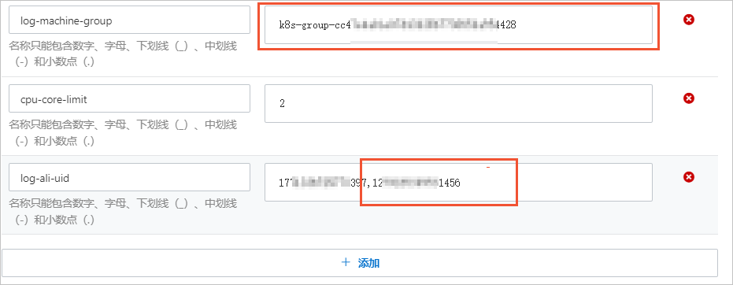

# 通过 Logtail 跨阿里云账号采集容器日志

本文介绍跨阿里云账号采集阿里云 Kubernetes 中的容器日志的操作步骤。

## 背景信息

例如某电商公司拥有两个电商应用，部署在阿里云杭州地域的 Kubernetes 集群中，并使用杭州地域的日志服务进行日志管理。

> 应用 A 部署在阿里云账号 A（12\***\*456）下的 Kubernetes 集群中，并使用该账号下的日志服务进行日志管理。
> 应用 B 部署在阿里云账号 B（17\*\***397）下的 Kubernetes 集群中，并使用该账号下的日志服务进行日志管理。

现公司业务调整，计划将两个应用的日志集中采集到阿里云账号 A（12\*\*\*\*456）下的日志服务中，即将两个应用的日志分别采集到同一个日志服务 Project 下的不同 Logstore 中。因此您需要新增一个 Logtail 采集配置、机器组和 Logstore，用于采集和存储应用 B 相关的日志。应用 A 相关的日志采集保持不变（使用原有的 Logtail 采集配置、机器组和 Logstore）。

## 步骤一：设置阿里云账号为用户标识

1. 使用阿里云账号 B 登录[容器服务管理控制台](https://cs.console.aliyun.com/?spm=a2c4g.11186623.0.0.490e598dKX7ysr){target="_blank"}。
2. 设置阿里云账号 A 为用户标识。
   > 在左侧导航栏中，单击集群。
   > 在集群列表页面中，单击目标集群。
   > 在左侧导航栏中，选择配置管理 > 配置项。
   > 选择命名空间为 kube-system，然后在配置项列表中单击 alibaba-log-configuration 对应的编辑。
   > 在编辑面板中，完成如下操作，然后单击确定。

- 在 log-ali-uid 配置项中增加阿里云账号 A 的 ID，然后记录 log-machine-group 配置项的值（例如 k8s-group-cc47\*\*\*\*54428），在创建机器组时需设置用户自定义标识为该值。
- 多个账号之间使用半角逗号（,）相隔，例如 17\***\*397,12\*\***456。

3. 重启 logtail-ds，使配置生效。

   > a.在左侧导航栏中，选择工作负载 > 进程守护集。
   > b.在守护进程集列表中，单击 logtail-ds 对应的编辑。
   > c.在环境变量区域，单击新增。
   > d.新增一个任意内容的自定义变量（例如 random_id：439157431651471905349）。

   

> e.单击更新。

- 在 logtail-ds 详情页面，确认各个容器组的状态为 Running 且创建时间为您更新配置后的时间。

# 步骤二：创建机器组

1.  使用阿里云账号 A 登录[日志服务控制台](https://account.alibabacloud.com/login/login.htm?oauth_callback=https://sls.console.aliyun.com/?spm=a2c4g.11186623.0.0.490e598dKX7ysr){target="_blank"}。
2.  在 Project 列表区域，单击目标 Project。
3.  在左侧导航栏中，选择资源 > 机器组。
4.  选择机器组右侧的机器组 > 创建机器组。
5.  在创建机器组对话框中，配置如下参数，然后单击确定

- 其中用户自定义标识需设置为您在[步骤一：设置阿里云账号为用户标识](./aliyunAcountlog.md)中获取的机器组标识（例如 k8s-group-cc47\*\*\*\*54428）。其他参数说明，请参见[创建用户自定义标识机器组](https://help.aliyun.com/zh/sls/user-guide/create-a-custom-identifier-based-machine-group?spm=a2c4g.11186623.0.i1#concept-gyy-k3q-zdb){target="_blank"}。

6. 检查机器组中的服务器心跳都为 OK。
   > a.在机器组列表中，单击目标机器组。
   > b.在机器组配置页面，查看容器节点（ECS）的心跳状态。
   > 心跳为 OK 表示容器节点与日志服务的连接正常。如果显示 FAIL 请参见[Logtail 机器组无心跳](https://help.aliyun.com/zh/sls/user-guide/troubleshoot-the-errors-related-to-logtail-machine-groups?spm=a2c4g.11186623.0.i2#concept-nfs-hs3-bfb){target="_blank"}。

    

## 步骤三：创建 Logtail 采集配置

1. 使用阿里云账号 A 登录[日志服务控制台] (https://sls.console.aliyun.com/?spm=a2c4g.11186623.0.0.1eae598dLCgNTM)。
2. 在数据接入区域，单击 Kubernetes-文件。
3. 选择目标 Project 和 Logstore，单击下一步。
4. 单击使用现有机器组。
5. 选中您在步骤二：创建机器组中所创建的机器组，将该机器组从源机器组移动到应用机器组，单击下一步。
6. 设置 Logtail 采集配置，单击下一步。

- 具体参数说明，请参见通过 DaemonSet-控制台方式采集容器文本日志。

  **重要**

- 默认一个文件只能匹配一个 Logtail 采集配置。此时账号 B 下的采集未停止，账号 A 下的 Logtail 采集配置无法生效，因此您需要使用如下方式使账号 A 下的 Logtail 采集配置生效。
  > 停止账号 B 下的采集，即使用账号 B 登录日志服务控制台，从目标机器组中移除 Logtail 采集配置。具体操作，请参见[应用 Logtail 采集配置](https://help.aliyun.com/zh/sls/user-guide/manage-machine-groups?spm=a2c4g.11186623.0.i19#section-gqq-rp1-ry){target="_blank"}。
  > 在账号 A 下添加强制采集配置。更多信息，请参见[如何实现文件中的日志被采集多份](https://help.aliyun.com/zh/sls/user-guide/what-do-i-do-if-i-want-to-use-multiple-logtail-configurations-to-collect-logs-from-a-log-file?spm=a2c4g.11186623.0.i21#concept-2180900){target="_blank"}。
- 此处创建 Logtail 采集配置成功后，请删除阿里云账号 B 下的原有 Logtail 采集配置，避免重复采集日志。如何删除，请参见[删除 Logtail 采集配置](https://help.aliyun.com/zh/sls/user-guide/manage-logtail-configurations-for-log-collection?spm=a2c4g.11186623.0.i20#section-vgw-rm1-ry){target="_blank"}。

7. 预览数据及设置索引，单击下一步。

- 日志服务默认开启全文索引。您也可以根据采集到的日志，手动或者自动设置字段索引。更多信息，请参见[配置索引](https://help.aliyun.com/zh/sls/user-guide/create-indexes?spm=a2c4g.11186623.0.i24#task-jqz-v55-cfb){target="_blank"}。

## 相关操作

如果您需要将阿里云账号 B 下的历史数据迁移到当前的 Logstore 中，可以在原 Logstore 中创建数据加工任务，将数据复制到当前 Logstore 中。具体操作，请参见[复制 Logstore 数据](https://help.aliyun.com/zh/sls/user-guide/replicate-data-from-a-logstore?spm=a2c4g.11186623.0.i29#task-2036148){target="_blank"}。
**重要** 跨账号加工数据时，需使用自定义角色或密钥方式进行授权，此处以自定义角色为例。

> 第一个角色 ARN 用于授予数据加工任务使用该角色来读取源 Logstore 中的数据。角色权限配置说明请参见[授予 RAM 角色源 Logstore 读权限](https://help.aliyun.com/zh/sls/user-guide/access-data-by-using-a-custom-role?spm=a2c4g.11186623.0.i37#section-wms-rsm-fgd){target="_blank"}。
> 第二个角色 ARN 用于授予数据加工任务使用该角色将数据加工结果写入目标 Logstore。角色权限配置说明请参见[授予 RAM 角色目标 Logstore 写权限（跨账号）](https://help.aliyun.com/zh/sls/user-guide/access-data-by-using-a-custom-role?spm=a2c4g.11186623.0.i41#section-5y6-5dk-etx){target="_blank"}。
