# Logtail日志采集支持纳秒精度时间戳

本文为您介绍在使用Logtail进行日志采集时，如何从原始日志中提取纳秒精度时间戳。

## 目标读者

数字化系统开发运维（DevOps）工程师、稳定性工程师（SRE）、可观测平台运维人员等。

## 背景介绍

iLogtail 是阿里云日志服务（SLS）团队自研的可观测数据采集 Agent，拥有的轻量级、高性能、自动化配置等诸多生产级别特性，可以署于物理机、虚拟机、Kubernetes
等多种环境中来采集遥测数据。目前 iLogtail 已有千万级的安装量，每天采集数十 PB
的可观测数据，广泛应用于线上监控、问题分析/定位、运营分析、安全分析等多种场景，在实战中验证了其强大的性能和稳定性。

## 适用场景

某些业务场景下对于时间精度要求较高（例如不同子模块日志保序要求），会依赖纳秒精度的时间戳，此时往往会在业务日志中打印纳秒精度的时间，这也就要求日志分析平台能够提供纳秒精度时间戳的存储跟查询分析能力。

本文将会介绍使用Logtail进行日志采集时，根据业务需求提取匹配精度的时间戳。

## 使用前提

已在服务器上安装Logtail，并已经创建了包含该服务器的机器组。

> 说明：纳秒精度时间戳的提取功能需要Linux Logtail 1.8.0及以上版本。

## 文件采集场景

以下分了三个文件采集场景作为案例。

| 日志特点                                                                                                                                                                                                                   | 处理方式                                                                           |
|------------------------------------------------------------------------------------------------------------------------------------------------------------------------------------------------------------------------|--------------------------------------------------------------------------------|
| 场景一：分隔符日志 <br />日志样例：<br /> 2023.11.06-15.12.12.123456,10.10.\*.\*,"POST /PutData?Category=a a s d f&AccessKeyId=\*\*\*\*\*\*\*\*\*\*\*\*\*\*\*\*&Date=123&Topic=raw&Signature=123 HTTP/1.1",200,18204,aliyun-sdk-java | 使用分隔符解析插件对分隔符日志进行解析，并提取高精度时间`2023.11.06-15.12.12.123456`                       |
| 场景二：使用拓展Processor进行Json数据处理，并使用strptime时间格式进行时间提取                                                                                                                                                                      | 需要使用拓展Processor进行数据处理（例如展开JSON字段-processor\_json插件），然后需要使用strptime时间格式，进行时间提取。 |
| 场景三：使用拓展Processor进行Json数据处理，并使用Go语言时间格式进行时间提取                                                                                                                                                                          | 需要使用拓展Processor进行数据处理（例如展开JSON字段-processor\_json插件），然后需要使用Go语言时间格式，进行时间提取      |

### 场景一：分隔符日志解析操作步骤

#### 解析效果展示

测试日志

```text
2023.11.06-15.12.12.123456,10.10.*.*,"POST /PutData?Category=YunOsAccountOpLog&AccessKeyId=****************&Date=Fri%2C%2028%20Jun%202013%2006%3A53%3A30%20GMT&Topic=raw&Signature=******************************** HTTP/1.1",200,18204,aliyun-sdk-java
```

解析结果

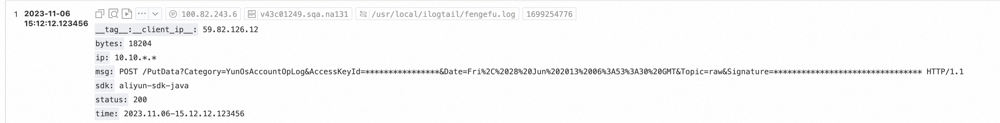

#### 步骤1：采集配置开启高级参数

在高级参数中添加`"EnableTimestampNanosecond":true`。


```json
{
  "EnableTimestampNanosecond": true
}
```

#### 步骤2：使用`分隔符解析插件`进行分隔符解析

处理配置新增分隔符解析（processor\_parse\_delimiter\_native），具体可参考[官方文档](https://help.aliyun.com/zh/sls/user-guide/separator-pattern-resolution)


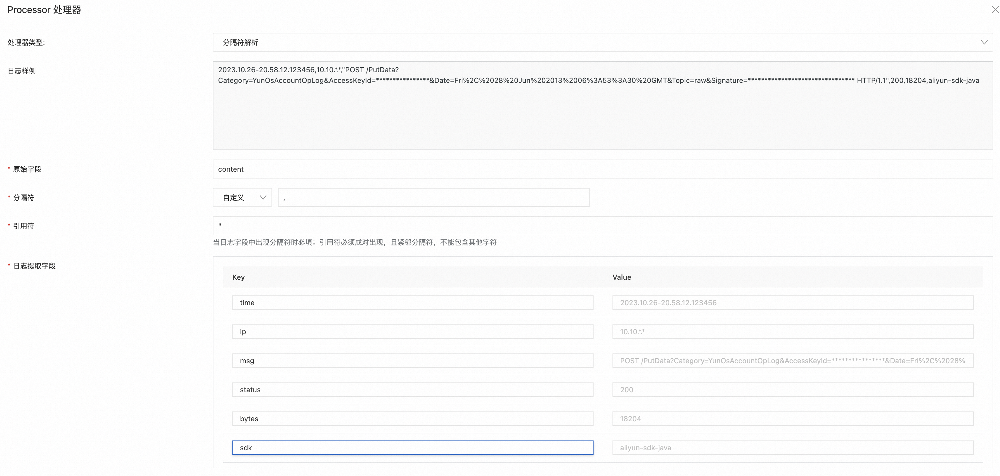

#### 步骤3：使用`时间解析插件`进行时间解析

时间解析插件需要配置时间格式，例如分隔符插件解析后的字段`time`为`2023.10.26-20.58.12.123456`，`时间转换格式`
应调整为`%Y.%m.%d-%H.%M.%S.%f`，其中`%f`
为秒的小数部分，精度最高支持为纳秒。时间转换格式需要与原始日志中的时间格式保持一致，完整格式参考[常见时间格式表达式](https://help.aliyun.com/document_detail/28980.html)
。该插件的具体配置说明可参考[官方文档](https://help.aliyun.com/zh/sls/user-guide/time-parsing)。

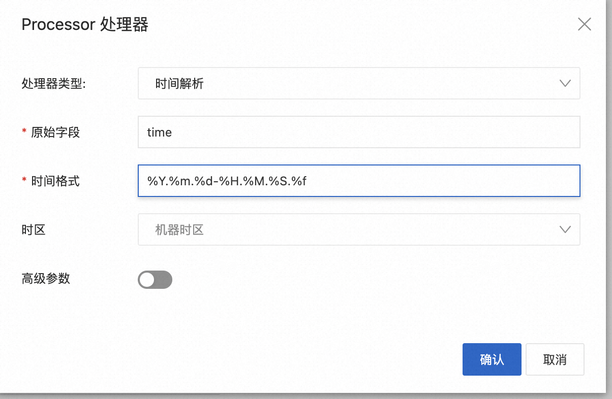

### 场景二：扩展插件提取日志时间（strptime时间格式）操作步骤

#### 解析效果展示

源日志

```json
{
  "asctime": "2023-10-25 23:51:10,199999999",
  "filename": "generate_data.py",
  "levelname": "INFO",
  "lineno": 51,
  "module": "generate_data",
  "message": "{\"no\": 14, \"inner_loop\": 166, \"loop\": 27451, \"uuid\": \"9be98c29-22c7-40a1-b7ed-29ae6c8367af\"}",
  "threadName": "MainThread"
}
```

解析结果

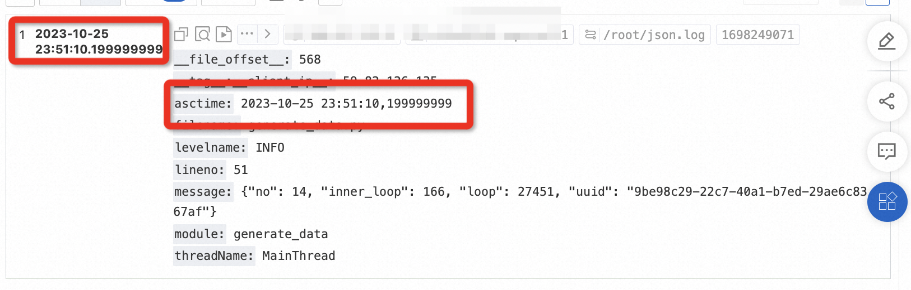

#### 步骤1：采集配置开启高级参数

同 原生插件操作步骤 步骤一

#### 步骤2：使用展开JSON字段插件进行JSON解析

处理配置新增JSON解析（processor\_parse\_json\_native），具体可参考[官方文档](https://help.aliyun.com/zh/sls/user-guide/expand-json-fields)


#### 步骤3：使用提取日志时间（strptime时间格式）插件进行时间解析

该插件需要配置时间格式，例如原始日志时间字段为`"asctime": "2022-04-29 21:37:40,251"`，`时间转换格式`
应调整为`%Y-%m-%d %H:%M:%S,%f`，其中`%f`
为秒的小数部分，精度最高支持为纳秒。时间转换格式需要与原始日志中的时间格式保持一致，完整格式参考[常见时间格式表达式](https://help.aliyun.com/document_detail/28980.html)
。该插件的具体配置说明可参考[官方文档](https://help.aliyun.com/zh/sls/user-guide/extract-log-time#section-3sq-fik-1b7)。

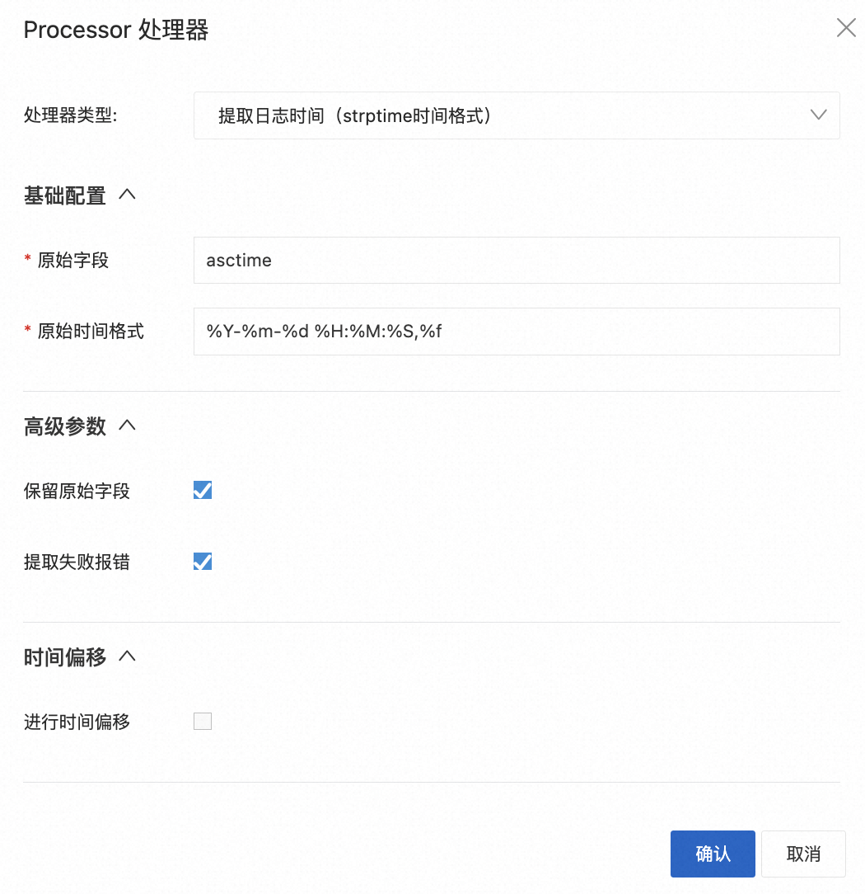

### 场景三：扩展插件提取日志时间（Go语言时间格式）操作步骤

#### 解析效果展示

```json
{
  "asctime": "2023-10-26 00:15:10,199999999",
  "filename": "generate_data.py",
  "levelname": "INFO",
  "lineno": 51,
  "module": "generate_data",
  "message": "{\"no\": 14, \"inner_loop\": 166, \"loop\": 27451, \"uuid\": \"9be98c29-22c7-40a1-b7ed-29ae6c8367af\"}",
  "threadName": "MainThread"
}
```


#### 步骤1：采集配置开启高级参数

同 原生插件操作步骤 步骤一

#### 步骤2：使用展开JSON字段插件进行JSON解析

同 扩展插件提取日志时间（strptime时间格式）操作步骤 步骤二

#### 步骤3：使用提取日志时间（Go语言时间格式）进行时间解析

该插件的时间格式需要按照golang的时间格式规范来编写。其中的格式化时间模板不是常见的`%Y-%m-%d %H:%M:%S`
，而是使用Go语言的诞生时间 `2006-01-02 15:04:05 -0700 MST`。

例如，`2023-10-25 01:36:10,199999999`对应的时间格式应该为`2006-01-02 15:04:05,999999999`

以下提供Golang官方的时间格式案例。

```go
const (
    Layout      = "01/02 03:04:05PM '06 -0700" // The reference time, in numerical order.
    ANSIC       = "Mon Jan _2 15:04:05 2006"
    UnixDate    = "Mon Jan _2 15:04:05 MST 2006"
    RubyDate    = "Mon Jan 02 15:04:05 -0700 2006"
    RFC822      = "02 Jan 06 15:04 MST"
    RFC822Z     = "02 Jan 06 15:04 -0700" // RFC822 with numeric zone
    RFC850      = "Monday, 02-Jan-06 15:04:05 MST"
    RFC1123     = "Mon, 02 Jan 2006 15:04:05 MST"
    RFC1123Z    = "Mon, 02 Jan 2006 15:04:05 -0700" // RFC1123 with numeric zone
    RFC3339     = "2006-01-02T15:04:05Z07:00"
    RFC3339Nano = "2006-01-02T15:04:05.999999999Z07:00"
    Kitchen     = "3:04PM"
    // Handy time stamps.
    Stamp      = "Jan _2 15:04:05"
    StampMilli = "Jan _2 15:04:05.000"
    StampMicro = "Jan _2 15:04:05.000000"
    StampNano  = "Jan _2 15:04:05.000000000"
)
```

该插件的具体配置说明可参考[官方文档](https://help.aliyun.com/zh/sls/user-guide/extract-log-time#section-xxl-q69-w5q)。


## 标准输出采集场景

本章节以Docker标准输出为例展示操作步骤。

### 场景一：解析容器输出时间的纳秒精度时间

#### 解析效果展示

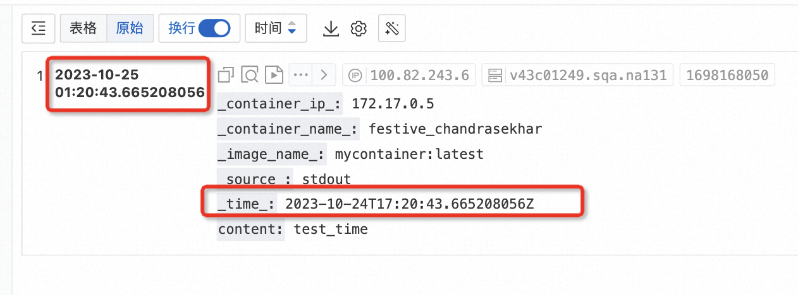

#### 步骤1：创建Docker标准输出的采集配置


#### 步骤2：采集配置开启高级参数扩展

在扩展配置中添加`"enable_timestamp_nanosecond": true`。

```json
{
  "enable_timestamp_nanosecond": true
}
```


#### 步骤3：使用提取日志时间（Go语言时间格式）插件进行时间解析


### 场景二：解析Json字段的纳秒精度时间为日志时间

#### 解析效果展示

```json
{
  "asctime": "2023-10-25 01:36:10,199999999",
  "filename": "generate_data.py",
  "levelname": "INFO",
  "lineno": 51,
  "module": "generate_data",
  "message": "{\"no\": 14, \"inner_loop\": 166, \"loop\": 27451, \"uuid\": \"9be98c29-22c7-40a1-b7ed-29ae6c8367af\"}",
  "threadName": "MainThread"
}
```

可以发现，asctime和日志时间一致。

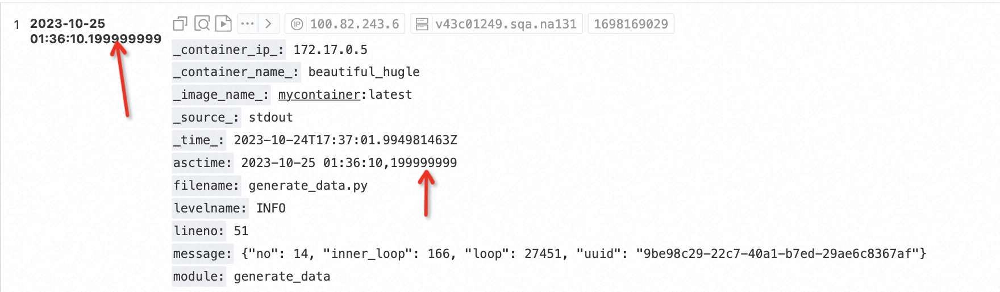

#### 步骤1：创建Docker标准输出的采集配置

同 场景一 步骤一

#### 步骤2：采集配置开启高级参数扩展

同 场景一 步骤二

#### 步骤3：使用展开JSON字段插件进行JSON解析

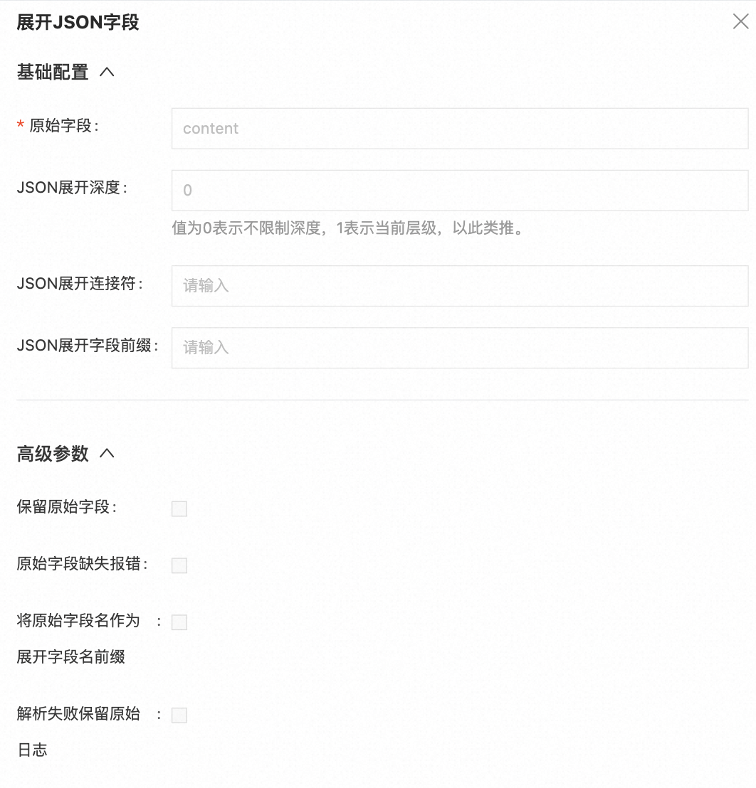

#### 步骤4：使用提取日志时间（strptime时间格式）插件进行时间解析


## 文件采集场景(旧)

本章节以旧版控制台（即将下线）的 Json模式 为例展示操作步骤。

| 场景                    | 场景描述                                        |
|-----------------------|---------------------------------------------|
| 场景一：未使用插件时，但需要提取纳秒时间。 | 不使用插件，但需要提取纳秒时间。                            |
| 场景二：使用插件时，需要提取纳秒时间。   | 需要使用插件进行数据处理，并使用processor_strptime插件进行时间提取。 |

### 场景一：未使用插件时的操作步骤

#### 解析效果展示

```json
{
  "asctime": "2023-10-24 23:47:10,999999999",
  "filename": "generate_data.py",
  "levelname": "INFO",
  "lineno": 51,
  "module": "generate_data",
  "message": "{\"no\": 14, \"inner_loop\": 166, \"loop\": 27451, \"uuid\": \"9be98c29-22c7-40a1-b7ed-29ae6c8367af\"}",
  "threadName": "MainThread"
}
```


#### 步骤1：创建Json模式的采集配置

采集配置选择Json模式，关闭系统时间。

如何配置时间格式：例如原始日志时间字段为`"asctime": "2022-04-29 21:37:40,251"`，`时间转换格式`
应调整为`%Y-%m-%d %H:%M:%S,%f`，其中`%f`
为秒的小数部分，精度最高支持为纳秒。时间转换格式需要与原始日志中的时间格式保持一致，完整格式参考[常见时间格式表达式](https://help.aliyun.com/document_detail/28980.html)。

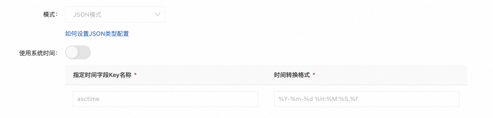

#### 步骤2：采集配置开启高级参数扩展

在扩展配置中添加`"enable_timestamp_nanosecond": true`。


```json
{
  "enable_timestamp_nanosecond": true,
  "force_multiconfig": false,
  "collect_containers_flag": false
}
```

### 场景二：使用插件时的操作步骤

#### 解析效果展示

```json
{
  "asctime": "2023-10-25 01:50:10,199999999",
  "filename": "generate_data.py",
  "levelname": "INFO",
  "lineno": 51,
  "module": "generate_data",
  "message": "{\"no\": 14, \"inner_loop\": 166, \"loop\": 27451, \"uuid\": \"9be98c29-22c7-40a1-b7ed-29ae6c8367af\"}",
  "threadName": "MainThread"
}
```

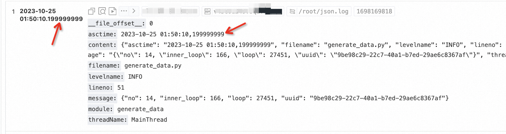

#### 步骤1：创建Json模式的采集配置

同 场景一 步骤一

#### 步骤2：采集配置开启高级参数扩展

同 未使用插件时的操作步骤 步骤二

#### 步骤3：采集配置开启processor\_strptime插件处理

开启插件处理后，SLS前端会自动生成对应的插件配置，其中processor\_strptime为日志时间提取processor插件。

需要补充修改“时间转换格式”。例如原始日志时间字段为"asctime": "2022-04-29 21:37:40,251"，“时间转换格式”应调整为%Y-%m-%d %H:
%M:%S,%f，其中%f为秒的小数部分，精度最高支持为纳秒。

注意，下图中蓝色部分需要在上方编辑框修改否则会被覆盖。


```json
{
  "global": {
    "DefaultLogQueueSize": 10
  },
  "processors": [
    {
      "type": "processor_split_log_string",
      "detail": {
        "SplitKey": "content",
        "SplitSep": ""
      }
    },
    {
      "type": "processor_json",
      "detail": {
        "SourceKey": "content",
        "ExpandConnector": "",
        "ExpandDepth": 1
      }
    },
    {
      "type": "processor_strptime",
      "detail": {
        "SourceKey": "asctime",
        "Format": "%Y-%m-%d %H:%M:%S,%f"
      }
    }
  ]
}
```

## 常见问题

#### 采集日志无法正常解析

问题原因：插件模式支持%f，但是时间格式需要与源时间内容保持一致。

* 配置采集后，发现高精度时间并未正常提取。

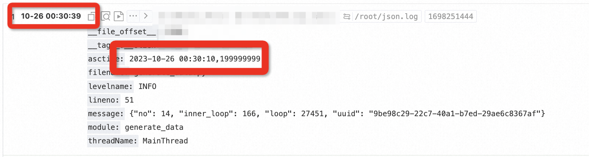

* 登录logtail机器，查看日志，发现大量STRPTIME\_PARSE\_ALARM异常日志。

```text
tail -f /usr/local/ilogtail/logtail_plugin.LOG
2023-10-26 00:30:39 [WRN] [strptime.go:164] [processLog] [##1.0##xxxx,xxx]	AlarmType:STRPTIME_PARSE_ALARM	strptime(2023-10-26 00:30:10,199999999, %Y-%m-%d %H:%M:%S %f) failed: 0001-01-01 00:00:00 +0000 UTC, <nil>
```

原始日志：`2023-10-26 00:30:10,199999999`，秒与高精度时间（这里是毫秒）之间分隔符为逗号,

解析格式：`%Y-%m-%d %H:%M:%S %f`，秒与高精度时间之间分隔符为空格 。

* 修改采集配置中时间转换格式为`%Y-%m-%d %H:%M:%S,%f`即可。