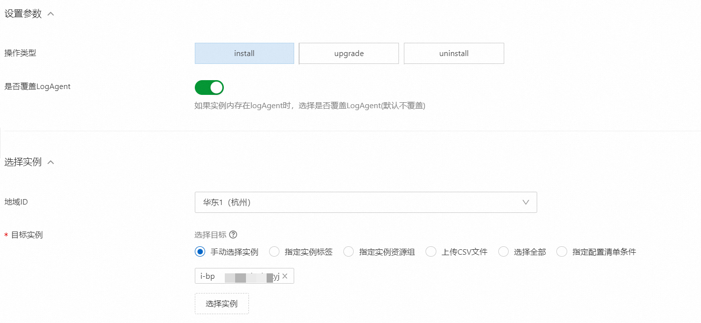

# 使用 OOS 批量安装或升级 Logtail

本文介绍如何通过阿里云运维编排服务批量安装或升级 Logtail。

## 使用场景

运维编排服务（Operation Orchestration Service，简称 OOS）是阿里云提供的自动化运维平台。您可以使用自定义模板或阿里云提供的公共模板，对 ECS、RDS、SLB、VPC 等资源进行自动化运维。更多信息，请参见 [什么是运维编排服务。](https://help.aliyun.com/document_detail/120556.html?spm=a2c4g.11186623.0.i1){target="_blank"}

当您需要在大量的阿里云 ECS 实例中安装、更新或卸载 Logtail 时，可以使用运维编排 OOS 进行批量自动操作。如果您的服务器是与日志服务属于不同账号的 ECS、其他云厂商的服务器或自建 IDC，您需要手动安装 Logtail。具体操作，请参见[安装 Logtail（Linux 系统）](https://help.aliyun.com/zh/sls/user-guide/install-logtail-on-a-linux-server?spm=a2c4g.11186623.0.i3#concept-u5y-3lv-vdb){target="_blank"}或[安装 Logtail（Windows 系统）。](https://help.aliyun.com/zh/sls/user-guide/install-logtail-on-a-windows-server?spm=a2c4g.11186623.0.i6){target="_blank"}

## 前提条件

- 至少拥有一台阿里云 ECS 服务器。

* 使用 RAM 用户操作时，该 RAM 用户需具备如下权限。
* AliyunOOSFullAccess 权限：为 RAM 用户授予 AliyunOOSFullAccess 权限的具体操作，请参见[为 RAM 用户授权。](https://help.aliyun.com/zh/ram/user-guide/grant-permissions-to-the-ram-user?spm=a2c4g.11186623.0.i11)
* 自定义权限：为 RAM 用户授予如下自定义权限时，需要先创建自定义策略并为 RAM 用户授权。具体操作，请[参见创建自定义权限策略](https://help.aliyun.com/zh/ram/user-guide/create-a-custom-policy?spm=a2c4g.11186623.0.i17){target="_blank"}、[为 RAM 用户授权](https://help.aliyun.com/zh/ram/user-guide/grant-permissions-to-the-ram-user?spm=a2c4g.11186623.0.i18){target="_blank"}。

```json
{
  "Version": "1",
  "Statement": [
    {
      "Effect": "Allow",
      "Action": [
        "ecs:DescribeTagKeys",
        "ecs:DescribeTags",
        "ecs:DescribeInstances",
        "ecs:DescribeInvocationResults",
        "ecs:RunCommand",
        "ecs:DescribeInvocations"
      ],
      "Resource": "*"
    },
    {
      "Effect": "Allow",
      "Action": [
        "oos:ListTemplates",
        "oos:StartExecution",
        "oos:ListExecutions",
        "oos:GetExecutionTemplate",
        "oos:ListExecutionLogs",
        "oos:ListTaskExecutions"
      ],
      "Resource": "*"
    }
  ]
}
```

## 操作步骤

1.  登录[运维编排 OOS 控制台](https://account.aliyun.com/login/login.htm?oauth_callback=https%3A%2F%2Foos.console.aliyun.com%2F%3Fspm%3Da2c4g.11186623.0.0.69233028xdubSL&lang=zh){target="_blank"}。
2.  在左侧导航栏中，选择自动化运维>公共模板。
3.  在公共模板页面中，搜索 LogAgent，找到批量安装日志服务插件模板，然后单击创建执行。

- 4. 在创建页面，完成如下配置。

  - a.在基本信息步骤中，保持默认配置，然后单击下一步：设置参数。
  - b.在设置参数步骤中，完成如下配置，然后单击下一步：确定。

  * 
    重要参数说明如下：

    - 是否覆盖 LogAgent：打开是否覆盖 LogAgent 开关后，如果 ECS 实例内已存在 Logtail，则将被覆盖。详细说明如下表所示。
    :::warning
      重要当 ECS 实例为 Windows 操作系统且使用 upgrade 操作时，仅支持覆盖原有的 Logtail 更新，是否覆盖 LogAgent 配置不会生效。
    :::

    | 是否覆盖 LogAgent | install（安装）                 | upgrade（更新）                                                       | uninstall（卸载） |
    | ----------------- | ------------------------------- | --------------------------------------------------------------------- | ----------------- |
    | 覆盖 LogAgent     | 卸载 Logtail，安装最新版本。    | 卸载 Logatil，安装最新版本。                                          | 卸载 Logtail      |
    | 不覆盖 LogAgent   | 返回 Logtail 已存在，不会覆盖。 | 保留原有 Logtail 配置，安装最新版本，安装完成后按照之前进度继续采集。 | 卸载 Logtail      |

    - 目标实例：选择目标 ECS 实例。更多信息，请参见[实例选取方式](https://help.aliyun.com/zh/sls/user-guide/install-logtail-on-ecs-instances?spm=a2c4g.11186623.0.i3#table-pf1-ty1-5qj){target="_blank"}。

5. 确认信息无误后，单击创建。
6. 查看执行结果。

- 您可以在执行结果区域，查看在每台 ECS 上执行 Logtail 安装命令的执行状态。
  
- 您还可以通过查看输出、日志等内容，获取 Logtail 的安装目录等信息。

是否覆盖 LogAgent：打开是否覆盖 LogAgent 开关后，如果 ECS 实例内已存在 Logtail，则将被覆盖。详细说明如下表所示。
