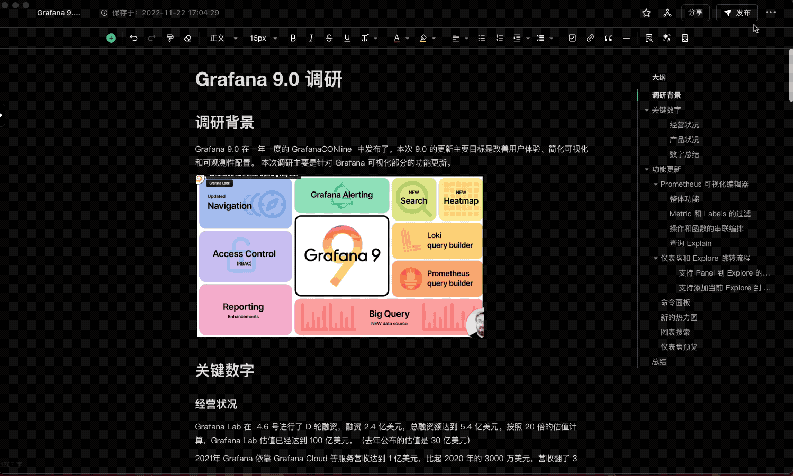
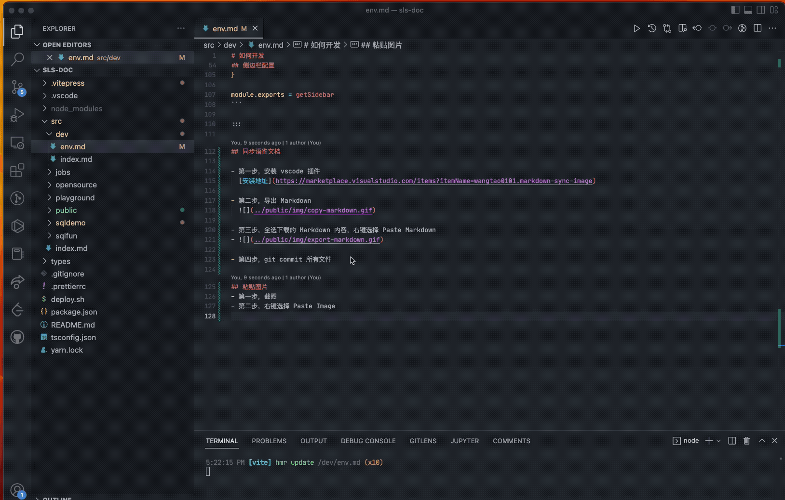

# 如何开发

## 安装 vscode

[安装地址](https://code.visualstudio.com/)

## 安装 Nodejs

[安装地址](https://nodejs.org/en/)

```bash
node -v
npm -v
```

## 安装 Yarn

```bash
npm install yarn -g --registry https://registry.npmmirror.com
yarn -v
```

## 安装依赖

```bash
yarn install --registry https://registry.npmmirror.com
```

## 开发

```bash
yarn dev
```

## 导航栏配置

文件路径：`.vitepress/nav.js`
::: details 点击查看代码

```json
{
    text: '案例',
    activeMatch: `^/(sqldemo)/`,
    items: [
    {
        items: [{ text: '查询分析案例', link: '/sqldemo/' }],
    },
    ],
},
```

:::

## 侧边栏配置

文件路径：`.vitepress/config.js`
::: details 点击查看代码

```json
{
    sidebar: {
        '/sqlfun': [
            {
            text: 'SQL函数',
            items: [{ text: '函数概览', link: '/sqlfun/index' }, ...sqlfunFiles],
            },
        ],
        '/sqldemo': getSqldemoSider(),
    },
},
```

:::
每个模块定义一个`getSiderbar`函数，放在`.vitepress/siderbars`文件夹中，参考`getSqldemoSider`
::: details 点击查看代码

```javascript
function getSidebar() {
  return [
    {
      text: '查询分析案例',
      items: [{ text: '案例总览', link: '/sqldemo/index' }],
    },
    {
      text: 'Nginx 日志分析',
      items: [
        {
          text: 'nginx今日PV与昨日对比',
          link: '/sqldemo/nginx今日PV与昨日对比',
        },
        // ...sqldemoFiles,
      ],
    },
    {
      text: '通用聚合分析',
      items: [
        {
          text: 'tomcat请求状态趋势分析',
          link: '/sqldemo/tomcat请求状态趋势分析',
        },
        // ...sqldemoFiles,
      ],
    },
  ]
}

module.exports = getSidebar
```

:::

## 同步语雀文档

- 第一步，安装 vscode 插件
  [安装地址](https://marketplace.visualstudio.com/items?itemName=wangtao0101.markdown-sync-image)

- 第二步，导出 Markdown
  

- 第三步，全选下载的 Markdown 内容，右键选择 Paste Markdown
  

- 第四步，git commit 所有文件

## 粘贴图片

- 第一步，截图
- 第二步，右键选择 Paste Image

