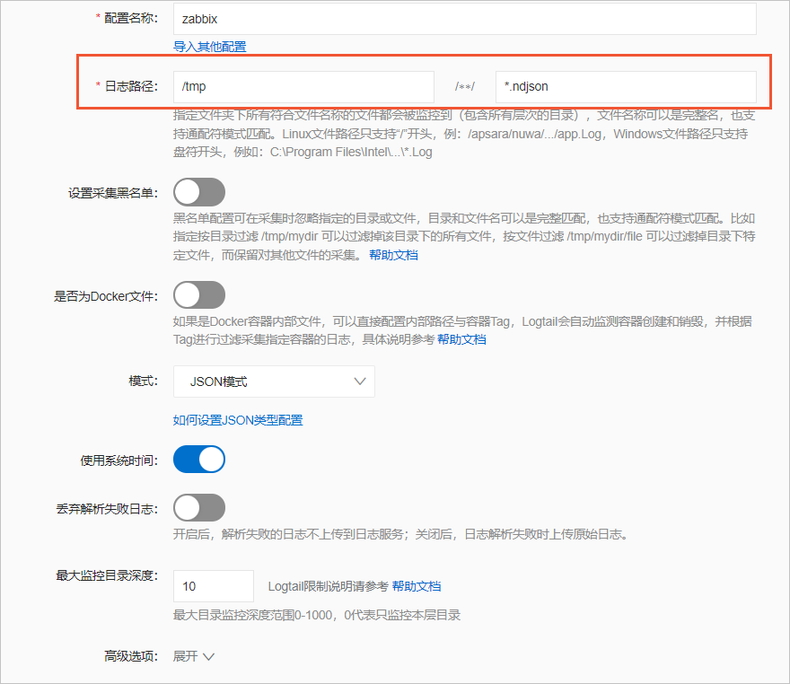

# Use Logtail to collect Zabbix data

Zabbix is a commonly used open source monitoring system. Zabbix provides a variety of alert rules for system monitoring.

## Prerequisites

- Zabbix is installed.For more information, visit [Download and install Zabbix](https://www.zabbix.com/cn/download?zabbix=5.4&os_distribution=centos&os_version=8&db=mysql&ws=nginx).(https://www.zabbix.com/cn/download?zabbix=5.4&os_distribution=centos&os_version=8&db=mysql&ws=nginx)。
- In this topic, Zabbix is installed on an Elastic Compute Service (ECS) instance.
- A project and a Logstore are created.For more information, see the [Create a project](https://help.aliyun.com/zh/sls/user-guide/manage-a-project?spm=a2c4g.11186623.0.i50#section-ahq-ggx-ndb) section of the "Manage a project" topic and the [Create a Logstore] (https://help.aliyun.com/zh/sls/user-guide/manage-a-logstore?spm=a2c4g.11186623.0.i51#section-v52-2jx-ndb)section of the "Manage a Logstore" topic.

## Step 1: Specify a data storage path

- Zabbix stores monitoring data on the machine on which Zabbix is installed. To specify the storage path for monitoring data, perform the following steps:

1. Log on to the ECS instance on which Zabbix is installed.
2. Open the zabbix_server.conf file.

```
vim /etc/zabbix/zabbix_server.conf

```

3. Specify the data storage path in the zabbix_server.conf file.

```
ExportDir=/tmp/
```

4. Restart Zabbix for the setting to take effect.

```
systemctl restart zabbix-server
```

- After the setting takes effect, Zabbix generates a file whose file name extension is .ndjson in the /tmp directory to store monitoring data.

## Step 2: Create a Logtail configuration

1. Log on to the [Simple Log Service console] by using Alibaba Cloud Account A.(https://sls.console.aliyun.com/?spm=a2c4g.11186623.0.0.29de2b96o6sz8B){target="\_blank"}.
2. In the Import Data section, click JSON - Text Log.
3. Select the project and Logstore. Then, click Next.
4. Create a machine group.
   > a. On the ECS Instances tab, select the ECS instance on which Zabbix is installed. Then, click Create.
   - For more information, see [Install Logtail on a Linux server] or [Install Logtail on a Windows server](https://help.aliyun.com/zh/sls/user-guide/install-logtail-on-ecs-instances?spm=a2c4g.11186623.0.i52#task-2561331).
   - 如果 Zabbix 是安装在自建集群或其他云厂商服务器上，需要手动安装 Logtail。更多信息，请参见[安装 Logtail（Linux 系统）](https://help.aliyun.com/zh/sls/user-guide/install-logtail-on-a-linux-server?spm=a2c4g.11186623.0.i62#concept-u5y-3lv-vdb)或[安装 Logtail（Windows 系统）](https://help.aliyun.com/zh/sls/user-guide/install-logtail-on-a-windows-server?spm=a2c4g.11186623.0.i64#concept-j22-xnv-vdb)。

> b. After Logtail is installed, click Complete Installation.
> c. In the Create Machine Group step, configure the Name parameter and click Next.

- Simple Log Service allows you to create IP address-based machine groups and custom identifier-based machine groups. For more information, see [Create an IP address-based machine group](https://help.aliyun.com/zh/sls/user-guide/create-an-ip-address-based-machine-group?spm=a2c4g.11186623.0.i65#task-wc3-xn1-ry) and [Create a custom identifier-based machine group](https://help.aliyun.com/zh/sls/user-guide/create-a-custom-identifier-based-machine-group?spm=a2c4g.11186623.0.i67#concept-gyy-k3q-zdb).

5. Select the new machine group from Source Machine Group and move the machine group to Applied Server Groups. Then, click Next.
   **Important**If you apply a machine group immediately after the machine group is created, the heartbeat status of the machine group may be FAIL. This issue occurs because the machine group is not connected to Simple Log Service. To resolve this issue, you can click Automatic Retry.
6. Create a Logtail configuration and click Next.
   > Zabbix monitoring data is of the JSON type. We recommend that you specify JSON Mode for the Mode parameter in the Logtail configuration.



7. Preview data, configure indexes, and then click Next.
   Preview data, configure indexes, and then click Next.You can also configure field indexes based on collected logs in manual mode or automatic mode. To configure field indexes in automatic mode, click Automatic Index Generation. This way, Simple Log Service automatically creates field indexes.For more information, see [Create indexes](https://help.aliyun.com/zh/sls/user-guide/create-indexes?spm=a2c4g.11186623.0.i70#task-jqz-v55-cfb).

**Important**If you want to query and analyze logs, you must enable full-text indexing or field indexing.If you enable full-text indexing and field indexing at the same time, the system uses only field indexes.
