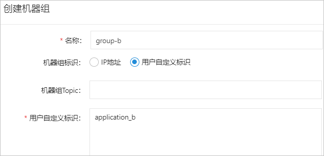
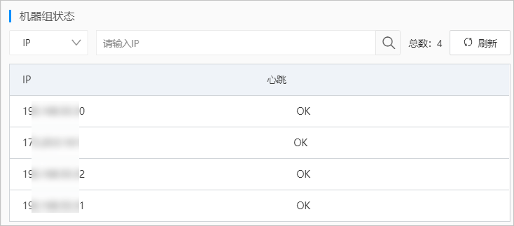
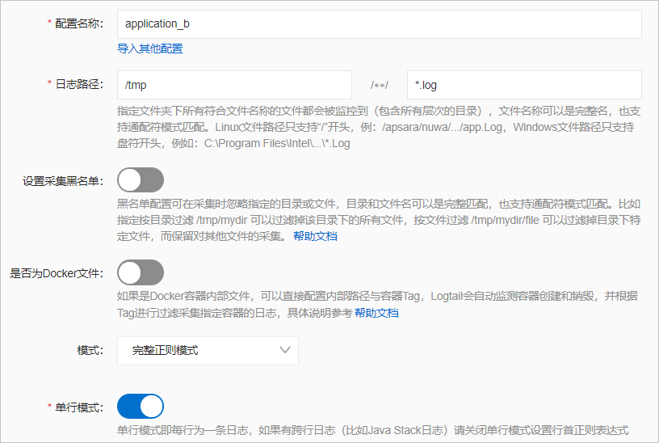

# 通过 Logtail 跨阿里云账号采集日志

本文介绍跨阿里云账号采集服务器日志的操作步骤。

## 步骤一：创建用户标识文件

1. 登录阿里云账号 B 下的 ECS 服务器。
   **重要您需要在 ECS 集群 B 的每台 ECS 服务器中创建用户标识文件。**

2. 执行如下命令创建用户标识文件。

- 您需要配置阿里云账号 A 为用户标识，即创建阿里云账号 A 的同名文件。更多信息，请参见[配置用户标识](https://help.aliyun.com/zh/sls/user-guide/configure-a-user-identifier?spm=a2c4g.11186623.0.i7#task-arl-ynt-qy){target="\_blank"}。

```
touch /etc/ilogtail/users/12****456
```

## 步骤二：创建用户自定义标识机器组

1. 在 ECS 服务器上创建机器组的自定义用户标识文件。
   **重要 您需要在 ECS 集群 B 的每台 ECS 服务器中创建机器组的用户自定义标识文件。**
   > a.登录阿里云账号 B 下的 ECS 服务器。
   > b.在指定目录下创建/etc/ilogtail/user_defined_id 文件并添加用户自定义标识。

- 例如配置用户自定义标识为 application_b，则在文件中输入 application_b，并保存。文件路径说明，请参见[创建用户自定义标识机器组](https://help.aliyun.com/zh/sls/user-guide/create-a-custom-identifier-based-machine-group?spm=a2c4g.11186623.0.i11#concept-gyy-k3q-zdb){target="\_blank"}。

2. 在日志服务控制台上创建机器组。

   > a.使用阿里云账号 A 登录日志服务控制台。
   > b.在 Project 列表区域，单击目标 Project。
   > c.在左侧导航栏中，选择资源 > 机器组。
   > d.选择机器组右侧的机器组 > 创建机器组。
   > e.在创建机器组对话框中，配置如下参数，然后单击确定。

   - 其中用户自定义标识需设置为您在步骤 1 中设置的用户自定义标识。其他参数说明，请参见[创建用户自定义标识机器组](https://help.aliyun.com/zh/sls/user-guide/create-a-custom-identifier-based-machine-group?spm=a2c4g.11186623.0.i11#concept-gyy-k3q-zdb){target="\_blank"}。

   

3. 检查机器组中的服务器心跳都为 OK。
   > a.在机器组列表中，单击目标机器组。
   > b.在机器组配置页面，查看使用了相同用户自定义标识的 ECS 服务器及其心跳状态。

- 心跳为 OK 表示 ECS 服务器与日志服务的连接正常。如果显示 FAIL 请参见[Logtail 机器组无心跳](https://help.aliyun.com/zh/sls/user-guide/create-a-custom-identifier-based-machine-group?spm=a2c4g.11186623.0.i11#concept-gyy-k3q-zdb){target="\_blank"}。



## 步骤三：采集日志

1. 使用阿里云账号 A 登录日志服务控制台。
2. 在接入数据区域，选择正则-文本日志。
3. 在选择日志空间向导中，选择目标 Project 和 Logstore，单击下一步。
4. 在创建机器组向导中，单击使用现有机器组。
5. 在机器组配置向导中，选中您在步骤二中创建的机器组，将该机器组从源机器组移动到应用机器组，单击下一步。
6. 创建 Logtail 采集配置，单击下一步。

- 具体参数说明，请参见使用完整正则模式采集日志。

> 重要:

- 默认一个文件只能匹配一个 Logtail 采集配置。此时账号 B 下的采集未停止，账号 A 下的 Logtail 采集配置无法生效，因此您需要使用如下方式使账号 A 下的 Logtail 采集配置生效。
  > 停止账号 B 下的采集，即使用账号 B 登录日志服务控制台，从目标机器组中移除 Logtail 采集配置。具体操作，请参见[应用 Logtail 采集配置](https://help.aliyun.com/zh/sls/user-guide/manage-machine-groups?spm=a2c4g.11186623.0.i0#section-gqq-rp1-ry){target="\_blank"}。
  > 在账号 A 下添加强制采集配置。更多信息，请参见如何[实现文件中的日志被采集多份](https://help.aliyun.com/zh/sls/user-guide/what-do-i-do-if-i-want-to-use-multiple-logtail-configurations-to-collect-logs-from-a-log-file?spm=a2c4g.11186623.0.i11#concept-2180900){target="\_blank"}。
- 此处创建 Logtail 采集配置成功后，请删除阿里云账号 B 下的原有 Logtail 采集配置，避免重复采集日志。如何删除，请参见[删除 Logtail 采集配置](https://help.aliyun.com/zh/sls/user-guide/manage-logtail-configurations-for-log-collection?spm=a2c4g.11186623.0.i12#section-vgw-rm1-ry){target="\_blank"}。

  

7. 预览数据及设置索引，单击下一步。

- 日志服务默认开启全文索引。您也可以根据采集到的日志，手动或者自动设置字段索引。更多信息，请参见配置索引。

## 相关操作

- 如果您需要将阿里云账号 B 下的历史数据迁移到当前的 Logstore 中，可以在原 Logstore 中创建数据加工任务，将数据复制到当前 Logstore 中。具体操作，请参见[复制 Logstore 数据](https://help.aliyun.com/zh/sls/user-guide/replicate-data-from-a-logstore?spm=a2c4g.11186623.0.i14#task-2036148){target="\_blank"}。
  > **重要:**跨账号加工数据时，需使用自定义角色或密钥方式进行授权，此处以自定义角色为例。
  > 第一个角色 ARN 用于授予数据加工任务使用该角色来读取源 Logstore 中的数据。角色权限配置说明请参见[授予 RAM 角色源 Logstore 读权限](https://help.aliyun.com/zh/sls/user-guide/access-data-by-using-a-custom-role?spm=a2c4g.11186623.0.i17#section-wms-rsm-fgd){target="\_blank"}。
  > 第二个角色 ARN 用于授予数据加工任务使用该角色将数据加工结果写入目标 Logstore。角色权限配置说明请参见[授予 RAM 角色目标 Logstore 写权限（跨账号）](https://help.aliyun.com/zh/sls/user-guide/access-data-by-using-a-custom-role?spm=a2c4g.11186623.0.i18#section-5y6-5dk-etx){target="\_blank"}。
