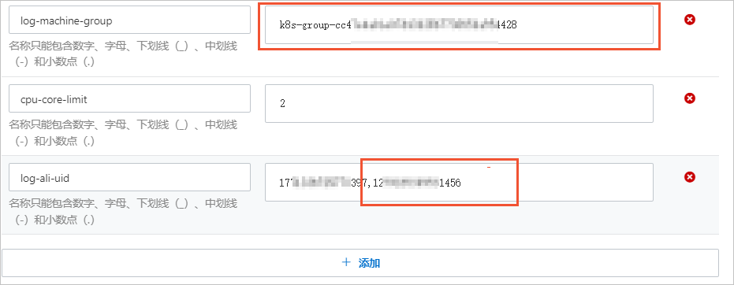
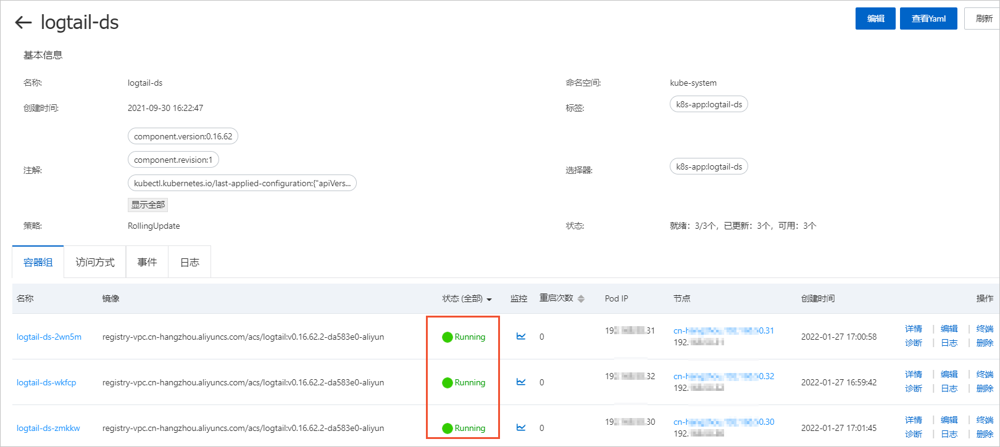
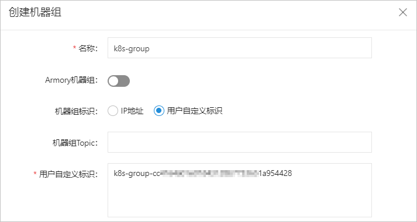
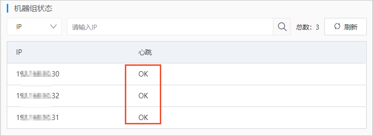

# Use Logtail to collect container logs across Alibaba Cloud accounts

This topic describes how to collect container logs from Container Service for Kubernetes (ACK) across Alibaba Cloud accounts.

## Step 1: Configure the ID of an Alibaba Cloud account as a user identifier

1. Log on to the [ACK console] by using Alibaba Cloud Account B.(https://cs.console.aliyun.com/?spm=a2c4g.11186623.0.0.490e598dKX7ysr){target="\_blank"}。
2. Configure the ID of Alibaba Cloud Account A as a user identifier.
   > In the left-side navigation pane, click Clusters.
   > On the Clusters page, find the cluster that you want to manage and click the ID of the cluster.
   > In the left-side navigation pane, choose Configurations > ConfigMaps.
   > Set the Namespace parameter to kube-system. In the ConfigMap list, find alibaba-log-configuration and click Edit in the Actions column.
   > In the Edit panel, complete the following configurations and click OK.

- Specify the ID of Alibaba Cloud Account A for the log-ali-uid parameter, and then obtain the value of the log-machine-group parameter, such as k8s-group-cc47\*\*\*\*54428. When you create a machine group, specify the value for the Custom Identifier parameter.
- Separate multiple account IDs with commas (,). Example: 17\***\*397,12\*\***456.

3. Restart logtail-ds for the settings to take effect.

   > a.In the left-side navigation pane, choose Workloads > DaemonSets.
   > b.In the DaemonSets list, find logtail-ds and click Edit in the Actions column.
   > c.In the Environment Variable section, click Add.
   > d.Add a custom variable and specify an arbitrary key-value pair.

   

> e.Click Update.

- On the details page of logtail-ds, check whether each container pod is in the Running state and whether the time when each pod is created is the same as the time when you update the settings.

# Step 2: Create a machine group

1. Log on to the [Simple Log Service console](https://account.alibabacloud.com/login/login.htm?oauth_callback=https://sls.console.aliyun.com/?spm=a2c4g.11186623.0.0.490e598dKX7ysr){target="\_blank"}。 by using Alibaba Cloud Account A.
2. In the Projects section, click the name of the project that you want to manage.
3. In the left navigation pane, choose Resource > Machine Group.
4. On the Machine Group tab, choose More > Create Machine Group.
5. In the Create Machine Group panel, configure the parameters and click OK. The following figure shows the parameters.

- In the Custom Identifier field, enter the machine group identifier that you obtained in [Step 1: Configure the ID of an Alibaba Cloud account as a user identifier](./aliyunAcountlog.md).For more information about other parameters, see [Create a custom identifier-based machine group](https://help.aliyun.com/zh/sls/user-guide/create-a-custom-identifier-based-machine-group?spm=a2c4g.11186623.0.i1#concept-gyy-k3q-zdb){target="\_blank"}.

6. Check whether the heartbeat status of each server in the machine group is OK.

   > a.In the Machine Group list, click the machine group.
   > b.On the Machine Group Configurations page, view the status of each ECS instance.
   > If the heartbeat status of an ECS instance is OK, the ECS instance is connected to Simple Log Service.If the status is FAIL, see [How do I troubleshoot an error that is related to a Logtail machine group in a host environment?].(https://help.aliyun.com/zh/sls/user-guide/troubleshoot-the-errors-related-to-logtail-machine-groups?spm=a2c4g.11186623.0.i2#concept-nfs-hs3-bfb){target="\_blank"}。

   

## Step 3: Create a Logtail configuration

1. Log on to the [Simple Log Service console](https://sls.console.aliyun.com/?spm=a2c4g.11186623.0.0.1eae598dLCgNTM) by using Alibaba Cloud Account A.
2. In the Import Data section, click Kubernetes - File.
3. Select a project and a Logstore. Then, click Next.
4. Click Use Existing Machine Groups.
5. Select the machine group that you created in [Step 2: Create a machine group], move the machine group from the Source Machine Group section to the Applied Server Groups section, and then click Next.
6. Configure the parameters for the Logtail configuration and click Next.

- For more information about the parameters, see [Use the Simple Log Service console to collect container text logs in DaemonSet mode].

  **important**

- By default, you can use only one Logtail configuration to collect each log file.The collection process of Logtail in Alibaba Cloud Account B is not stopped. In this case, the Logtail configuration of Alibaba Cloud Account A cannot take effect. To ensure that the Logtail configuration of Alibaba Cloud Account A takes effect, you can use one of the following methods:
  > Stop the collection process in Alibaba Cloud Account B. To stop the collection process, log on to the Simple Log Service console by using Alibaba Cloud Account B and remove the original Logtail configuration from the machine group.For more information, see the [Apply Logtail configurations to a machine group](https://help.aliyun.com/zh/sls/user-guide/manage-machine-groups?spm=a2c4g.11186623.0.i19#section-gqq-rp1-ry){target="\_blank"} section of the "Manage machine groups" topic.
  > Add compulsory collection settings to the Logtail configuration of Alibaba Cloud Account A.For more information, see [What do I do if I want to use multiple Logtail configurations to collect logs from a log file?](https://help.aliyun.com/zh/sls/user-guide/what-do-i-do-if-i-want-to-use-multiple-logtail-configurations-to-collect-logs-from-a-log-file?spm=a2c4g.11186623.0.i21#concept-2180900){target="\_blank"}。
- After you create the Logtail configuration, delete the original Logtail configuration of Alibaba Cloud Account B to prevent repeated collection of logs.see the [Delete Logtail configurations] section of the "Manage Logtail configurations for log collection" topic.(https://help.aliyun.com/zh/sls/user-guide/manage-logtail-configurations-for-log-collection?spm=a2c4g.11186623.0.i20#section-vgw-rm1-ry){target="\_blank"}。

7. Preview data, configure indexes, and then click Next.

- By default, the full-text indexing feature is enabled for Simple Log Service.You can configure field indexes based on the collected logs in manual mode or automatic mode.For more information, see [Create indexes](https://help.aliyun.com/zh/sls/user-guide/create-indexes?spm=a2c4g.11186623.0.i24#task-jqz-v55-cfb){target="\_blank"}.

## What to do next

If you want to migrate historical data from Alibaba Cloud Account B to the current Logstore, you can create a data transformation job in the original Logstore, and then replicate the data to the current Logstore.For more information, see [Replicate data from a Logstore].(https://help.aliyun.com/zh/sls/user-guide/replicate-data-from-a-logstore?spm=a2c4g.11186623.0.i29#task-2036148){target="\_blank"}。
**Important** If you create a data transformation job to transform data across Alibaba Cloud accounts, you must use a custom role or an AccessKey pair to grant the required permissions for the job. In this example, a custom role is used.

> The first Alibaba Cloud resource name (ARN) of the role is used to grant the custom role or AccessKey pair the required permissions to read data from a source Logstore.For more information about how to grant the required permissions to a Resource Access Management (RAM) role, see the [Grant the RAM role the permissions to read data from a source Logstore](https://help.aliyun.com/zh/sls/user-guide/access-data-by-using-a-custom-role?spm=a2c4g.11186623.0.i37#section-wms-rsm-fgd){target="\_blank"} section of the "Access data by using a custom role" topic.
> The second ARN of the role is used to grant the custom role or AccessKey pair the required permissions to write transformation results to a destination Logstore.角色权限配置说 For information about how to grant the required permissions to a RAM role, see the [Grant the RAM role the permissions to write data to a destination Logstore across Alibaba Cloud accounts](https://help.aliyun.com/zh/sls/user-guide/access-data-by-using-a-custom-role?spm=a2c4g.11186623.0.i41#section-5y6-5dk-etx){target="\_blank"} section of the "Access data by using a custom role" topic.
