# Logtail 日志采集支持纳秒精度时间戳

本文为您介绍在使用 Logtail 进行日志采集时，如何从原始日志中提取纳秒精度时间戳。

## 使用前提

已在服务器上安装 Logtail，并已经创建了包含该服务器的机器组。

> 说明：纳秒精度时间戳的提取功能需要 Linux Logtail 1.8.0 及以上版本。

## 文件采集场景

以下分了三个文件采集场景作为案例。

| 日志特点                                                                                                                                                                                                                             | 处理方式                                                                                                                      |
| ------------------------------------------------------------------------------------------------------------------------------------------------------------------------------------------------------------------------------------ | ----------------------------------------------------------------------------------------------------------------------------- |
| 场景一：分隔符日志 <br />日志样例：<br /> 2023.11.06-15.12.12.123456,10.10.\*.\*,"POST /PutData?Category=a a s d f&AccessKeyId=\*\*\*\*\*\*\*\*\*\*\*\*\*\*\*\*&Date=123&Topic=raw&Signature=123 HTTP/1.1",200,18204,aliyun-sdk-java | 使用分隔符解析插件对分隔符日志进行解析，并提取高精度时间`2023.11.06-15.12.12.123456`                                          |
| 场景二：使用拓展 Processor 进行 Json 数据处理，并使用 strptime 时间格式进行时间提取                                                                                                                                                  | 需要使用拓展 Processor 进行数据处理（例如展开 JSON 字段-processor_json 插件），然后需要使用 strptime 时间格式，进行时间提取。 |
| 场景三：使用拓展 Processor 进行 Json 数据处理，并使用 Go 语言时间格式进行时间提取                                                                                                                                                    | 需要使用拓展 Processor 进行数据处理（例如展开 JSON 字段-processor_json 插件），然后需要使用 Go 语言时间格式，进行时间提取     |

### 场景一：分隔符日志解析操作步骤

#### 解析效果展示

测试日志

```text
2023.11.06-15.12.12.123456,10.10.*.*,"POST /PutData?Category=YunOsAccountOpLog&AccessKeyId=****************&Date=Fri%2C%2028%20Jun%202013%2006%3A53%3A30%20GMT&Topic=raw&Signature=******************************** HTTP/1.1",200,18204,aliyun-sdk-java
```

解析结果

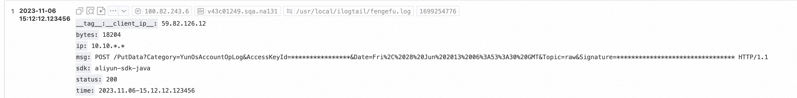

#### 步骤 1：采集配置开启高级参数

在高级参数中添加`"EnableTimestampNanosecond":true`。

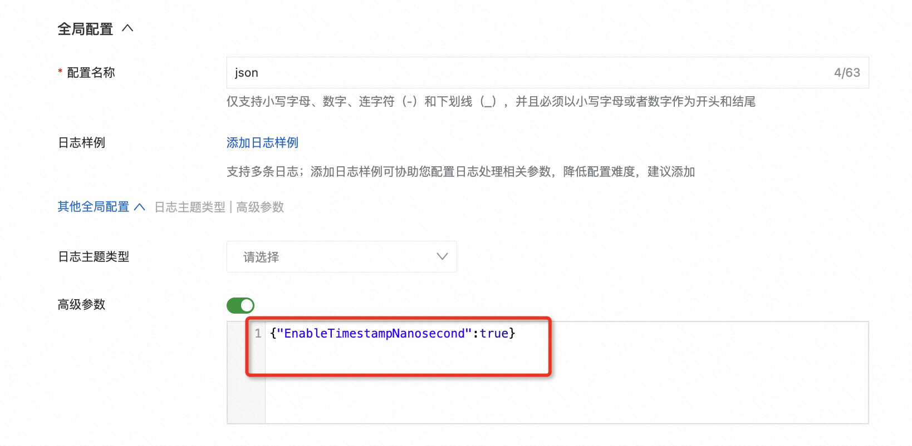

```json
{
  "EnableTimestampNanosecond": true
}
```

#### 步骤 2：使用`分隔符解析插件`进行分隔符解析

处理配置新增分隔符解析（processor_parse_delimiter_native），具体可参考[官方文档](https://help.aliyun.com/zh/sls/user-guide/separator-pattern-resolution)

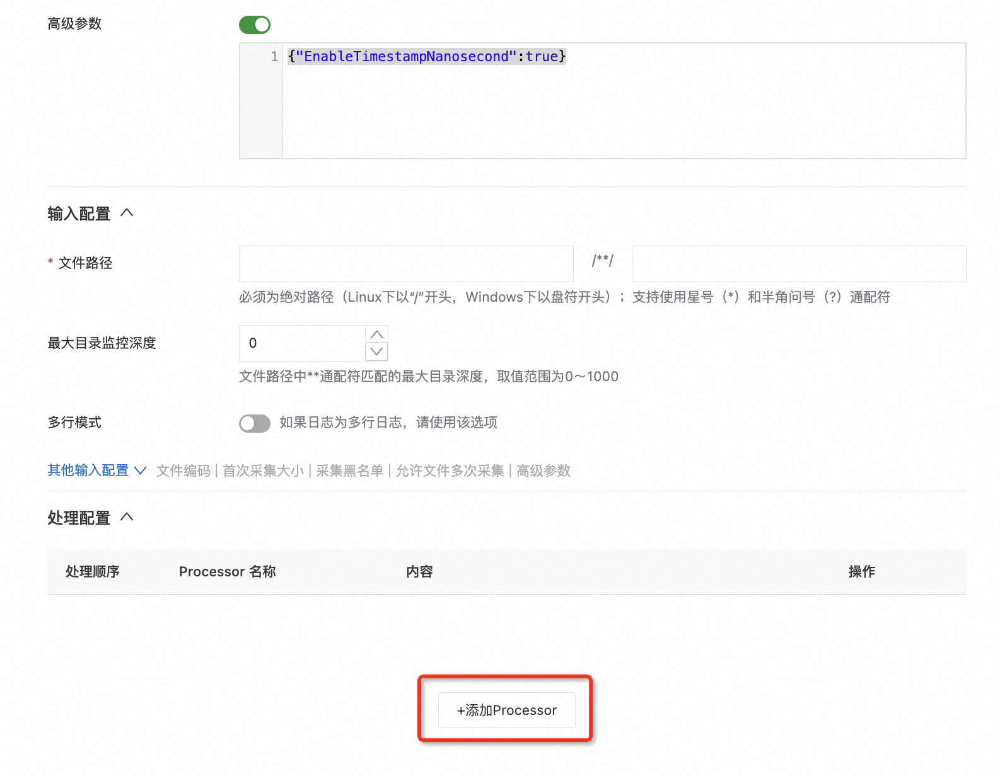

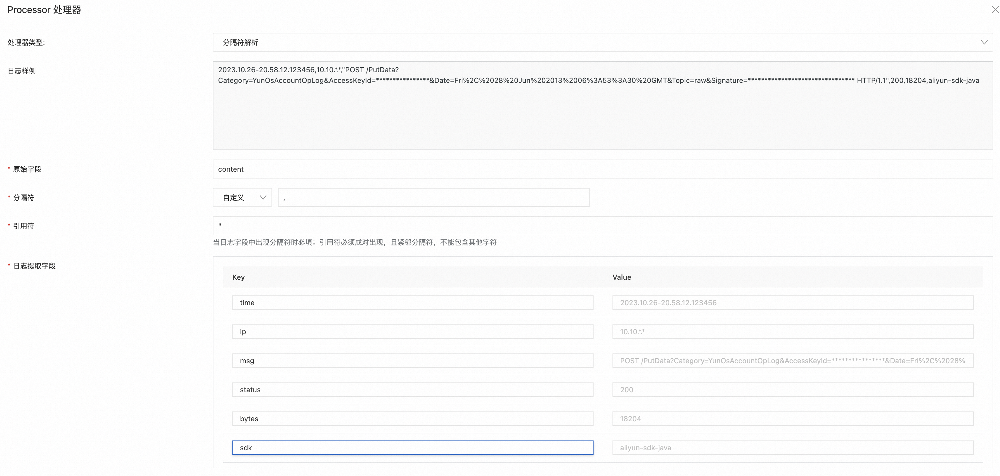

#### 步骤 3：使用`时间解析插件`进行时间解析

时间解析插件需要配置时间格式，例如分隔符插件解析后的字段`time`为`2023.10.26-20.58.12.123456`，`时间转换格式`
应调整为`%Y.%m.%d-%H.%M.%S.%f`，其中`%f`
为秒的小数部分，精度最高支持为纳秒。时间转换格式需要与原始日志中的时间格式保持一致，完整格式参考[常见时间格式表达式](https://help.aliyun.com/document_detail/28980.html)
。该插件的具体配置说明可参考[官方文档](https://help.aliyun.com/zh/sls/user-guide/time-parsing)。

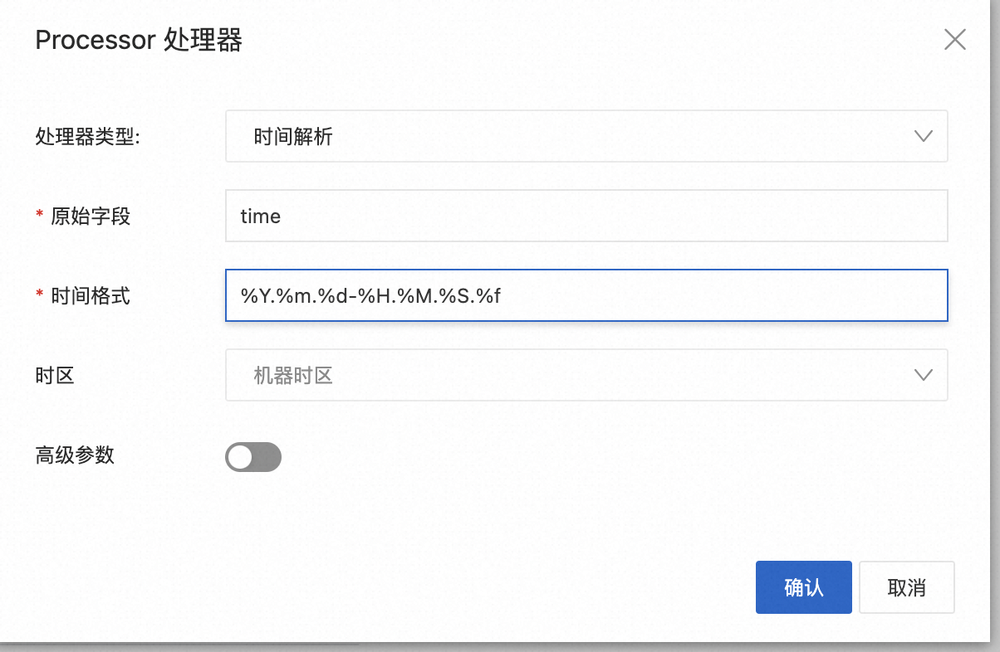

### 场景二：扩展插件提取日志时间（strptime 时间格式）操作步骤

#### 解析效果展示

源日志

```json
{
  "asctime": "2023-10-25 23:51:10,199999999",
  "filename": "generate_data.py",
  "levelname": "INFO",
  "lineno": 51,
  "module": "generate_data",
  "message": "{\"no\": 14, \"inner_loop\": 166, \"loop\": 27451, \"uuid\": \"9be98c29-22c7-40a1-b7ed-29ae6c8367af\"}",
  "threadName": "MainThread"
}
```

解析结果

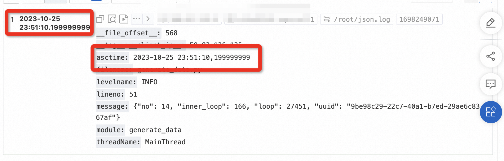

#### 步骤 1：采集配置开启高级参数

同 原生插件操作步骤 步骤一

#### 步骤 2：使用展开 JSON 字段插件进行 JSON 解析

处理配置新增 JSON 解析（processor_parse_json_native），具体可参考[官方文档](https://help.aliyun.com/zh/sls/user-guide/expand-json-fields)


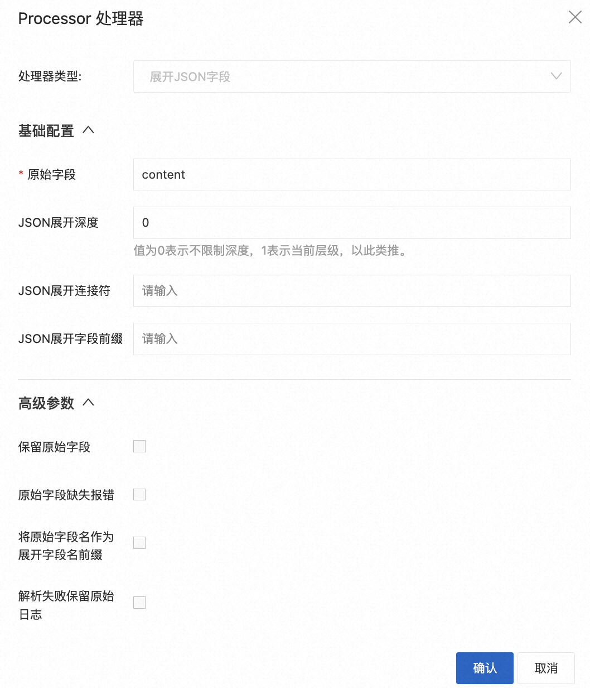

#### 步骤 3：使用提取日志时间（strptime 时间格式）插件进行时间解析

该插件需要配置时间格式，例如原始日志时间字段为`"asctime": "2022-04-29 21:37:40,251"`，`时间转换格式`
应调整为`%Y-%m-%d %H:%M:%S,%f`，其中`%f`
为秒的小数部分，精度最高支持为纳秒。时间转换格式需要与原始日志中的时间格式保持一致，完整格式参考[常见时间格式表达式](https://help.aliyun.com/document_detail/28980.html)
。该插件的具体配置说明可参考[官方文档](https://help.aliyun.com/zh/sls/user-guide/extract-log-time#section-3sq-fik-1b7)。

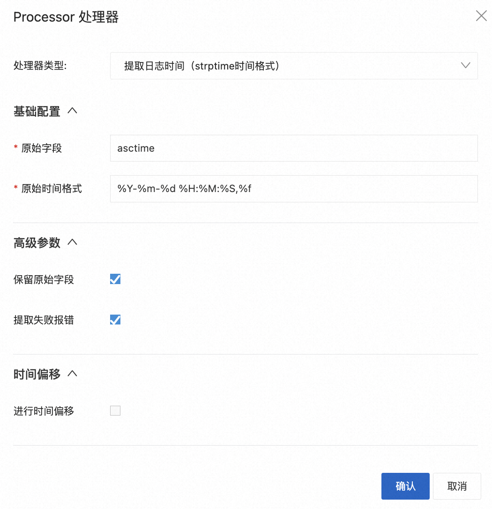

### 场景三：扩展插件提取日志时间（Go 语言时间格式）操作步骤

#### 解析效果展示

```json
{
  "asctime": "2023-10-26 00:15:10,199999999",
  "filename": "generate_data.py",
  "levelname": "INFO",
  "lineno": 51,
  "module": "generate_data",
  "message": "{\"no\": 14, \"inner_loop\": 166, \"loop\": 27451, \"uuid\": \"9be98c29-22c7-40a1-b7ed-29ae6c8367af\"}",
  "threadName": "MainThread"
}
```

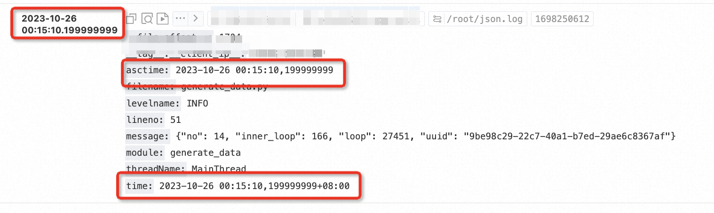

#### 步骤 1：采集配置开启高级参数

同 原生插件操作步骤 步骤一

#### 步骤 2：使用展开 JSON 字段插件进行 JSON 解析

同 扩展插件提取日志时间（strptime 时间格式）操作步骤 步骤二

#### 步骤 3：使用提取日志时间（Go 语言时间格式）进行时间解析

该插件的时间格式需要按照 golang 的时间格式规范来编写。其中的格式化时间模板不是常见的`%Y-%m-%d %H:%M:%S`
，而是使用 Go 语言的诞生时间 `2006-01-02 15:04:05 -0700 MST`。

例如，`2023-10-25 01:36:10,199999999`对应的时间格式应该为`2006-01-02 15:04:05,999999999`

以下提供 Golang 官方的时间格式案例。

```go
const (
    Layout      = "01/02 03:04:05PM '06 -0700" // The reference time, in numerical order.
    ANSIC       = "Mon Jan _2 15:04:05 2006"
    UnixDate    = "Mon Jan _2 15:04:05 MST 2006"
    RubyDate    = "Mon Jan 02 15:04:05 -0700 2006"
    RFC822      = "02 Jan 06 15:04 MST"
    RFC822Z     = "02 Jan 06 15:04 -0700" // RFC822 with numeric zone
    RFC850      = "Monday, 02-Jan-06 15:04:05 MST"
    RFC1123     = "Mon, 02 Jan 2006 15:04:05 MST"
    RFC1123Z    = "Mon, 02 Jan 2006 15:04:05 -0700" // RFC1123 with numeric zone
    RFC3339     = "2006-01-02T15:04:05Z07:00"
    RFC3339Nano = "2006-01-02T15:04:05.999999999Z07:00"
    Kitchen     = "3:04PM"
    // Handy time stamps.
    Stamp      = "Jan _2 15:04:05"
    StampMilli = "Jan _2 15:04:05.000"
    StampMicro = "Jan _2 15:04:05.000000"
    StampNano  = "Jan _2 15:04:05.000000000"
)
```

该插件的具体配置说明可参考[官方文档](https://help.aliyun.com/zh/sls/user-guide/extract-log-time#section-xxl-q69-w5q)。

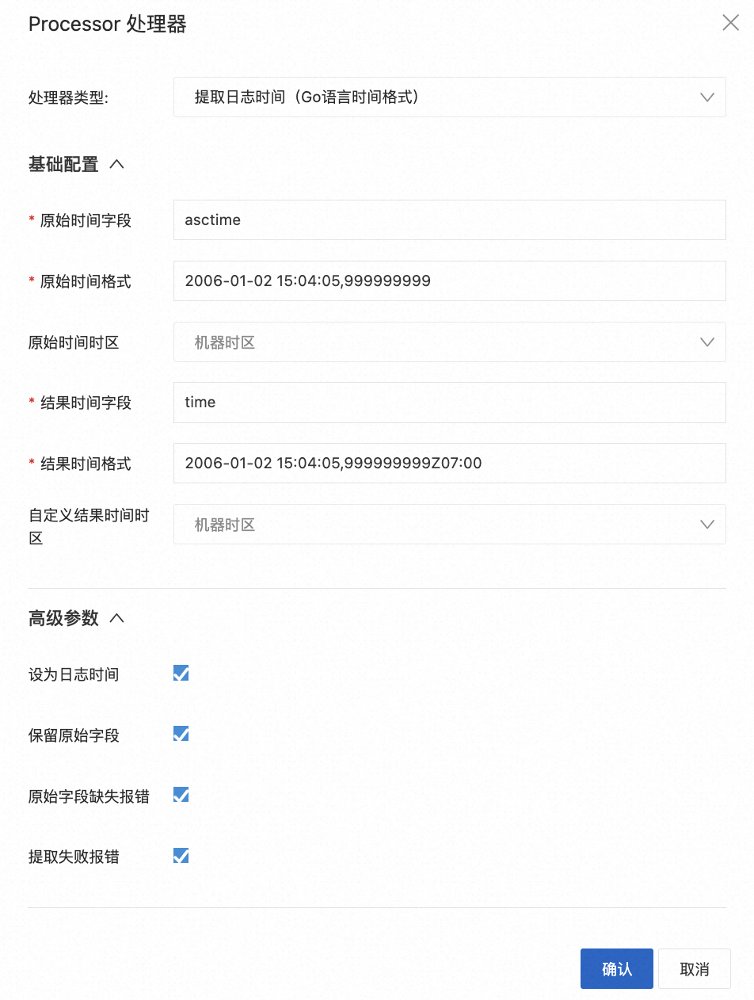

## 标准输出采集场景

本章节以 Docker 标准输出为例展示操作步骤。

### 场景一：解析容器输出时间的纳秒精度时间

#### 解析效果展示

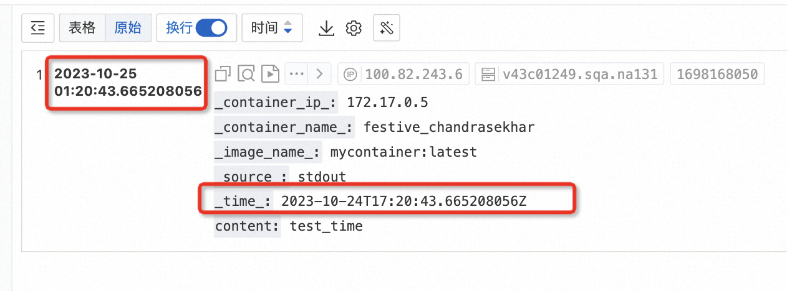

#### 步骤 1：创建 Docker 标准输出的采集配置

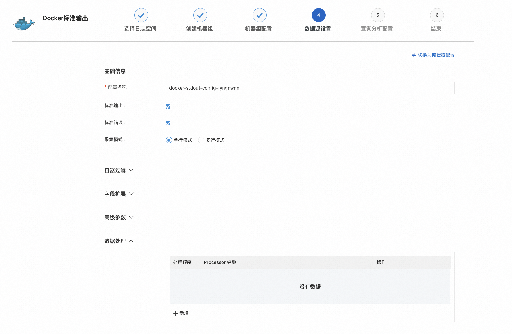

#### 步骤 2：采集配置开启高级参数扩展

在扩展配置中添加`"enable_timestamp_nanosecond": true`。

```json
{
  "enable_timestamp_nanosecond": true
}
```

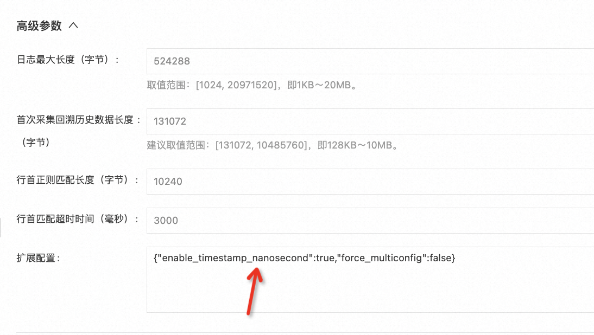

#### 步骤 3：使用提取日志时间（Go 语言时间格式）插件进行时间解析

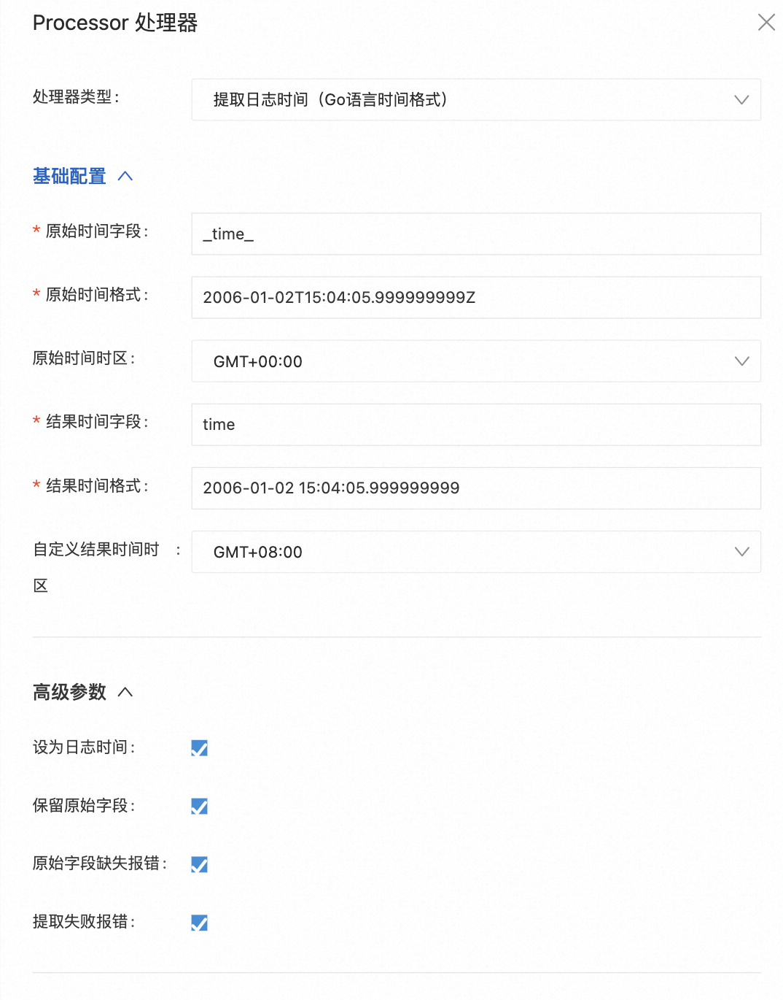

### 场景二：解析 Json 字段的纳秒精度时间为日志时间

#### 解析效果展示

```json
{
  "asctime": "2023-10-25 01:36:10,199999999",
  "filename": "generate_data.py",
  "levelname": "INFO",
  "lineno": 51,
  "module": "generate_data",
  "message": "{\"no\": 14, \"inner_loop\": 166, \"loop\": 27451, \"uuid\": \"9be98c29-22c7-40a1-b7ed-29ae6c8367af\"}",
  "threadName": "MainThread"
}
```

可以发现，asctime 和日志时间一致。

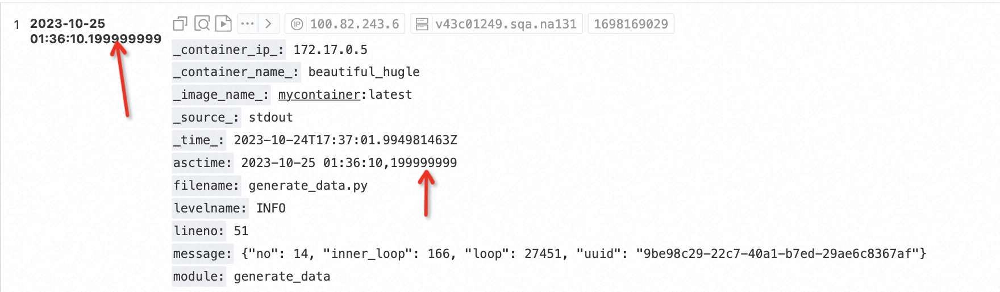

#### 步骤 1：创建 Docker 标准输出的采集配置

同 场景一 步骤一

#### 步骤 2：采集配置开启高级参数扩展

同 场景一 步骤二

#### 步骤 3：使用展开 JSON 字段插件进行 JSON 解析

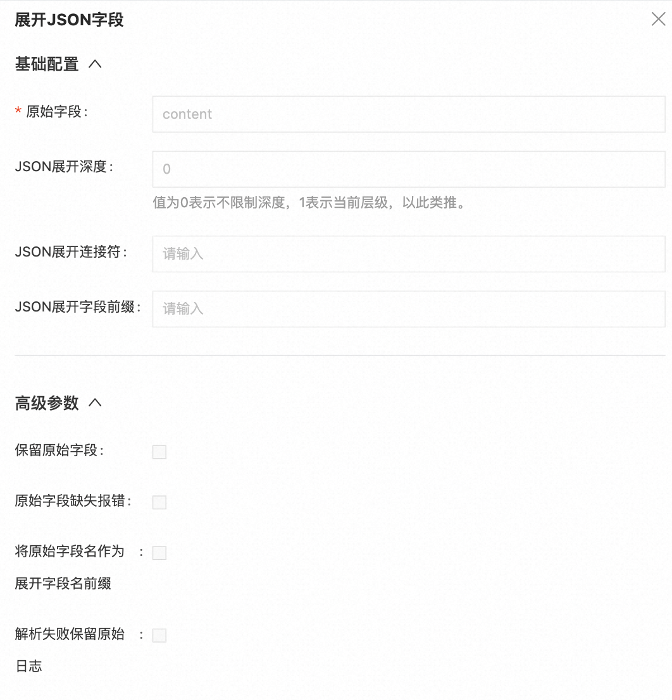

#### 步骤 4：使用提取日志时间（strptime 时间格式）插件进行时间解析

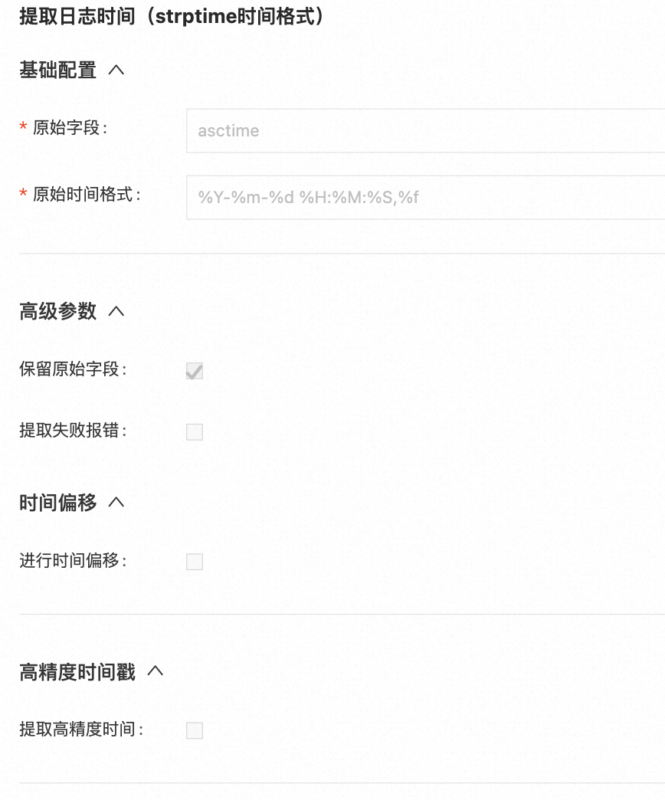
