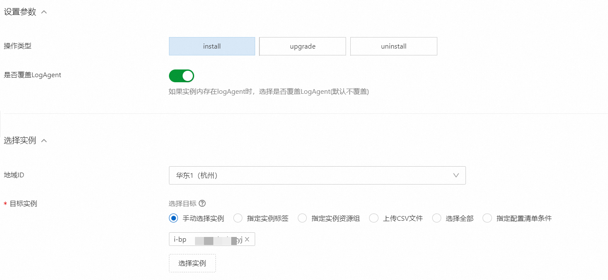
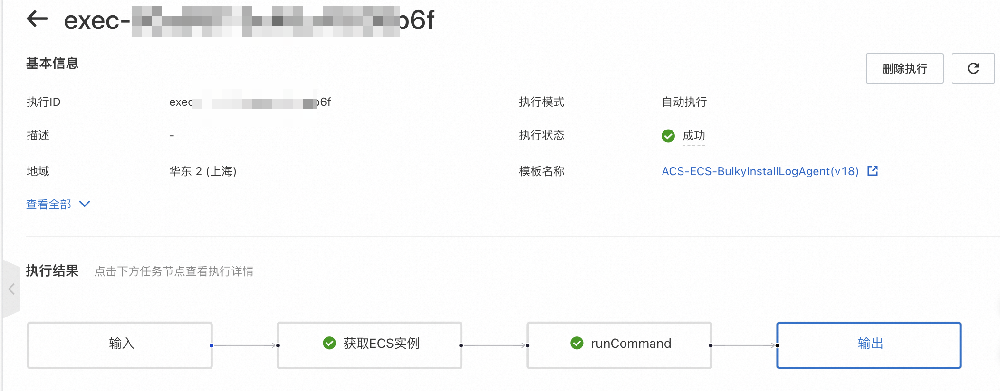

# Use OOS to install or update Logtail on multiple ECS instances at a time

This topic describes how to install or update Logtail on multiple Elastic Compute Service (ECS) instances at a time by using Alibaba Cloud CloudOps Orchestration Service (OOS).

## Prerequisites

- At least one ECS instance is deployed.

* If you install or update Logtail on ECS instances as a Resource Access Management (RAM) user, the RAM user must have the following permissions:
* AliyunOOSFullAccess permission: For more information about how to grant the AliyunOOSFullAccess permission to a RAM user, see [Grant permissions to a RAM user](https://help.aliyun.com/zh/ram/user-guide/grant-permissions-to-the-ram-user?spm=a2c4g.11186623.0.i11).
* Custom permissions: To grant the following custom permissions to a RAM user, you must create a custom policy and attach the custom policy to the RAM user.For more information, see [Create custom policies](https://help.aliyun.com/zh/ram/user-guide/create-a-custom-policy?spm=a2c4g.11186623.0.i17) and [Grant permissions to a RAM user](https://help.aliyun.com/zh/ram/user-guide/grant-permissions-to-the-ram-user?spm=a2c4g.11186623.0.i18){target="_blank"}.

```json
{
  "Version": "1",
  "Statement": [
    {
      "Effect": "Allow",
      "Action": [
        "ecs:DescribeTagKeys",
        "ecs:DescribeTags",
        "ecs:DescribeInstances",
        "ecs:DescribeInvocationResults",
        "ecs:RunCommand",
        "ecs:DescribeInvocations"
      ],
      "Resource": "*"
    },
    {
      "Effect": "Allow",
      "Action": [
        "oos:ListTemplates",
        "oos:StartExecution",
        "oos:ListExecutions",
        "oos:GetExecutionTemplate",
        "oos:ListExecutionLogs",
        "oos:ListTaskExecutions"
      ],
      "Resource": "*"
    }
  ]
}
```

## Procedure

1.  Log on to the [OOS console](https://account.aliyun.com/login/login.htm?oauth_callback=https%3A%2F%2Foos.console.aliyun.com%2F%3Fspm%3Da2c4g.11186623.0.0.69233028xdubSL&lang=zh){target="_blank"}.
2.  In the left-side navigation pane, choose Automated Task Public Template.
3.  On the Public Template page, enter LogAgent in the search box, find the ACS-ECS-BulkyInstallLogAgent template, and then click Create Execution.

- 4. On the page that appears, perform the following operations:

  - a.In the Basic Information step, retain the default parameter settings and click Next Step: Parameter Settings.
  - b.In the Parameter Settings step, configure the following parameters and click Next Step: OK.

  * 
    Key parameters:

    - Overwrite: If you turn on Overwrite, the configurations of Logtail are overwritten if Logtail is already installed on your ECS instances.The following table describes the parameter.
      :::warning
      Important If your ECS instances run a Windows operating system and you want to update Logtail that is installed on the ECS instances, only the original configurations of Logtail can be overwritten. The Overwrite parameter does not take effect.
      :::

    | Overwrite LogAgent | install                                                                                     | uninstall                                                                                                                                              |
    | ------------------ | ------------------------------------------------------------------------------------------- | ------------------------------------------------------------------------------------------------------------------------------------------------------ | ----------------- |
    | On LogAgent        | Uninstall Logtail and install the latest version.                                           | Uninstall Logtail and install the latest version.                                                                                                      | Uninstall Logtail |
    | Off LogAgent       | The system returns a message indicating that Logtail already exists and is not overwritten. | Retain the original configurations of Logtail and install the latest version. After Logtail is installed, collect logs based on the previous progress. | Uninstall Logtail |

    - TargetInstance: Select your ECS instances.For more information, see [Install Logtail on ECS instances](https://help.aliyun.com/zh/sls/user-guide/install-logtail-on-ecs-instances?spm=a2c4g.11186623.0.i3#table-pf1-ty1-5qj){target="_blank"}.

5. Confirm the preceding settings and click Create.
6. View the execution result.

- In the Execution Steps and Results section, you can view the execution status of the Logtail installation command on each ECS instance.
  
- You can obtain information such as the installation directory of Logtail on the output and Log tabs.

Overwrite: If you turn on Overwrite, the configurations of Logtail are overwritten if Logtail is already installed on your ECS instances.The following table describes the parameter.
