# Logtail日志采集支持高精度时间戳

本文为您介绍在使用Logtail进行日志采集时，如何从原始日志中提取毫秒精度时间戳。

## 方案架构
Logtail是日志服务提供的日志采集Agent，用于采集阿里云ECS、自建IDC、其他云厂商等服务器上的日志。本文介绍Logtail的功能、优势、使用限制及配置流程等信息。
文本日志采集场景下有两种形式：
> . 单一文本模式：提供单一类型文本日志的采集能力，包括极简模式、完整正则模式、分隔符模式、JSON模式等。核心处理部分由日志切分（Splitter）和日志解析（Parser）组成，根据选择的日志采集模式，把读取的文件内容切割成为一条条日志（比如单行基于换行符、多行基于行首正则），然后交由日志解析从单条日志中提取字段。由此可见，日志的采集模式固定了处理行为，比如完整正则模式要求日志必须完全符合设置的正则表达式，否则会报错。这种基于采集模式的固定行为，拥有更好的性能，但牺牲了灵活性。

 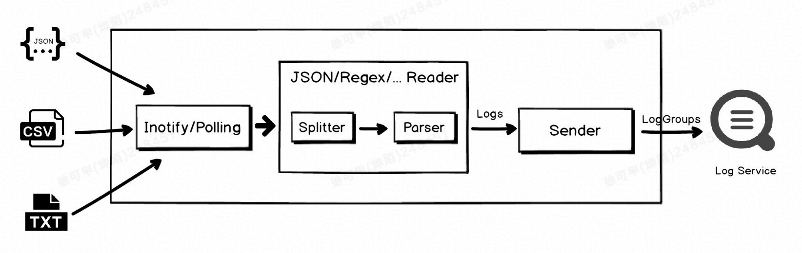

>.插件扩展模式：实际业务场景下，日志可能往往不再是单一格式，有可能同时由 JSON、分隔符等多部分组成而成。Logtail 引入了插件扩展模式，一方面借助 Logtail 完善的事件机制来保证数据读取阶段的可靠性，另一方面，依赖于插件系统丰富的插件，来加强 Logtail 对复杂日志的处理能力。该模式下，会牺牲一定的性能和计算资源来换取灵活性。如下图，Logtail 会将日志切分的结果直接提交给插件进行处理，在后者中，我们可以组合多种处理插件，来满足我们的需求。

 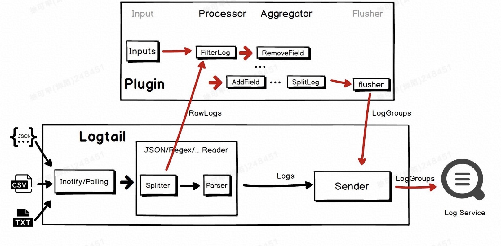

上述两种采集模式，因为实现机制上的差异，所以采集配置上也有所差异。高精度时间戳提取功能也需要支持这两种模式，并且也会稍有差异：

- .单一文本模式

 > .配置参数：采用高级参数实现功能扩展。
 > .时间转换格式：纯C++实现，因为对于毫秒/微秒/纳秒精度解析支持不友好，时间转换格式配置到秒即可。例如
%Y-%m-%d %H:%M:%S。

- .插件扩展模式

> .配置参数：因为插件扩展能力更强，所以使用processor_strptime即可完成高精度时间提取。
> .时间转换格式：Golang实现，对高精度时间天然支持，可以通过%f实现高精度时间的解析。例如，%Y-%m-%d %H:%M:%S.%f，其中%f为秒的小数部分，精度最高支持为纳秒。时间解析格式详见链接。
如何快速区分两种模式，文本采集场景下，如果采集配置勾选了启动插件处理，那么就是插件扩展模式，否则为单一文本模式。

配置参数：因为插件扩展能力更强，所以使用processor_strptime即可完成高精度时间提取。

时间转换格式：Golang实现，对高精度时间天然支持，可以通过%f实现高精度时间的解析。例如，%Y-%m-%d %H:%M:%S.%f，其中%f为秒的小数部分，精度最高支持为纳秒。时间解析格式详见链接。

如何快速区分两种模式，文本采集场景下，如果采集配置勾选了启动插件处理，那么就是插件扩展模式，否则为单一文本模式。

 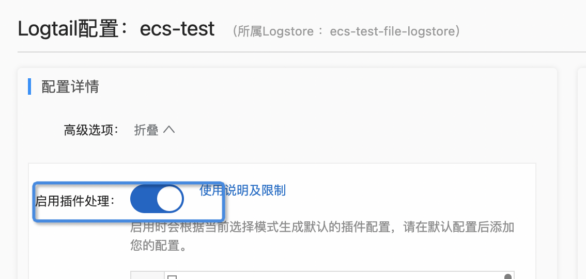

## 方案实施
本章节以JSON模式为例展示操作步骤。

### 解析效果展示
原始日志格式如下，其中t1字段为原始日志的时间戳（包含了更高时间精度）。
```json
{"t1": "2022-06-01 22:04:56.344754012", "t2": "2022-06-01 22:04:56", "a":"b","c":2,"d":1, "seq": 11}
```

处理后的效果如下。其中，__time__为SLS时间戳，继续是秒级精度，precise_timestamp为从t1提取出毫秒精度时间戳。

 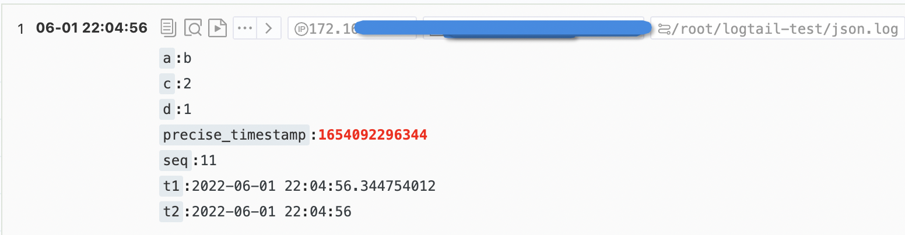

## 使用前提
已在服务器上安装Logtail，并已经创建了包含该服务器的机器组。
说明：高精度时间戳提取功能需要Linux Logtail 1.0.32及以上版本，Window Logtail 1.0.0.32及以上版本。

### 场景一：单一文本模式操作步骤
### 步骤1：创建JSON模式的采集配置
采集配置选择JSON模式，关闭系统时间，设定“指定时间字段Key名称”为t1，“时间转换格式”设定为%Y-%m-%d %H:%M:%S。时间转换格式需要与原始日志中的时间格式保持一致，完整格式参加常见时间格式表达式，因为单一文本模式仅支持秒级精度格式化解析，所以时间格式只需配置到秒，无需配置毫秒、微秒等信息。

 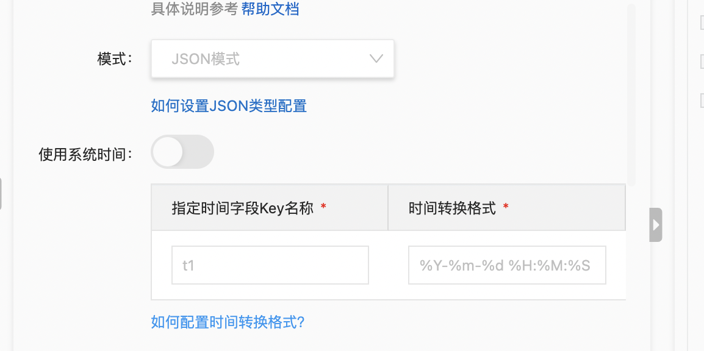

### 步骤2：采集配置开启高级参数扩展
在扩展配置中添加"enable_precise_timestamp": true。

 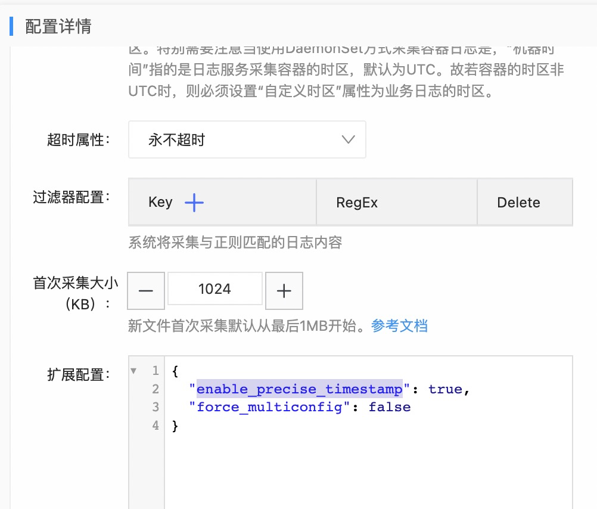

### 步骤3：调整高精度时间字段或单位（可选）
如果默认高精度字段名和毫秒的精度无法满足实际需求，可以通过precise_timestamp_key自定义高精度时间戳字段名，通过precise_timestamp_unit参数调整高精度时间戳的时间精度。

 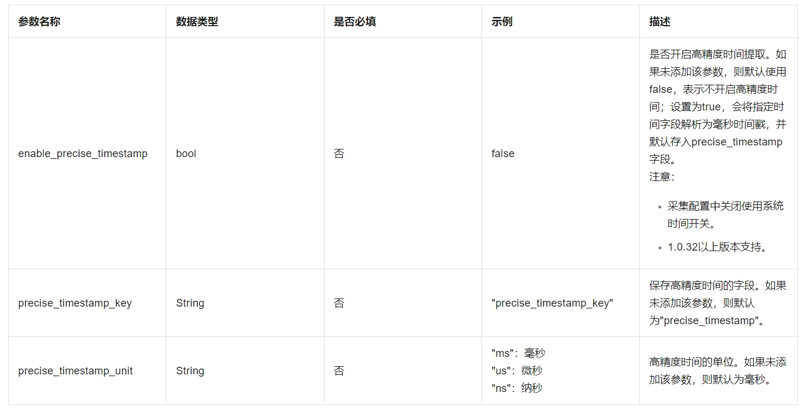

 例如，如下配置可以实现微秒级的时间精度提取，并将结果存入precise_timestamp_new字段。

 ```json
 {
  "enable_precise_timestamp": true,
  "precise_timestamp_key": "precise_timestamp_new",
  "precise_timestamp_unit": "us"
}

 ```

### 场景二：模式操作步骤
### 步骤1：创建JSON模式的采集配置
同纯Logtail模式操作中的步骤一。
### 步骤2：启动插件处理
开启插件处理后，SLS前端会自动生成对应的插件配置，其中processor_strptime为日志时间提取processor插件。
编辑插件配置，开启高精度时间配置，如下图红框部分，Format需要根据实际的时间格式配置。

```json
    {
      "detail": {
        "SourceKey": "t1",
        "Format": "%Y-%m-%d %H:%M:%S.%f",
        "EnablePreciseTimestamp": true
      },
      "type": "processor_strptime"
    }
```
### 步骤3：调整高精度时间字段或单位（可选）

如果默认高精度字段名和毫秒的精度无法满足实际需求，可以通过配置[可选参数] (https://help.aliyun.com/document_detail/196161.html?spm=a2c4g.26937906.0.0.6c923b52v9rEdh#section-r4r-ukg-8b1)控制。

### 方案验证
上述采集配置完成后，可以到Logstore查询页面发现高精度时间戳已经存入precise_timestamp字段。

 针对precise_timestamp创建索引后，可以实现过滤、大小比较、排序等功能。
  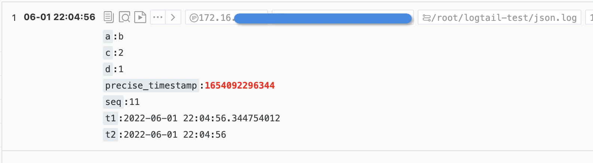


## 常见问题
### 问题1
原因：纯Logtail模式时间精度解析，不支持%f。
发现日志并未正常解析。
> .发现日志并未正常解析。
 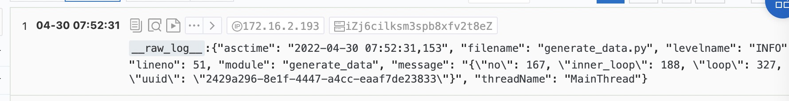

> .可以在对应logstore下点击诊断按钮进行分析。发现存在时间格式解析异常PARSE_TIME_FAIL_ALARM，因为单一文本模式仅支持到秒级精度的极细，所以不支持提示中的%f。完整格式支持请参考常见时间格式表达式。
 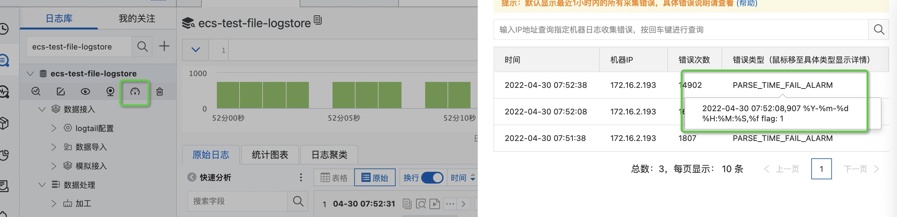

 ### 问题2
原因：插件扩展模式支持%f，但是时间格式需要与源时间内容保持一致。
配置采集后，发现高精度时间并未正常提取。
 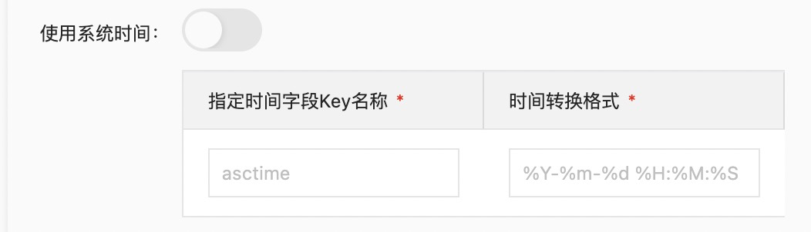

> .登录logtail机器，查看日志，发现大量STRPTIME_PARSE_ALARM异常日志。
```
tail -f /usr/local/ilogtail/logtail_plugin.LOG
2022-04-30 08:10:45 [WRN] [strptime.go:163] [processLog] [##1.0##yemo-test-hongkong$bigdata-config,ecs-test-file-logstore] AlarmType:STRPTIME_PARSE_ALARM strptime(2022-04-30 08:10:45,873, %Y-%m-%d %H:%M:%S %f) failed: 0001-01-01 00:00:00 +0000 UTC, <nil>
```

原始日志：2022-04-30 08:10:45,873，秒与高精度时间（这里是毫秒）之间分隔符为,。
解析格式：%Y-%m-%d %H:%M:%S %f，秒与高精度时间（这里是毫秒）之间分隔符为。
修改采集配置中时间转换格式为%Y-%m-%d %H:%M:%S,%f即可。


