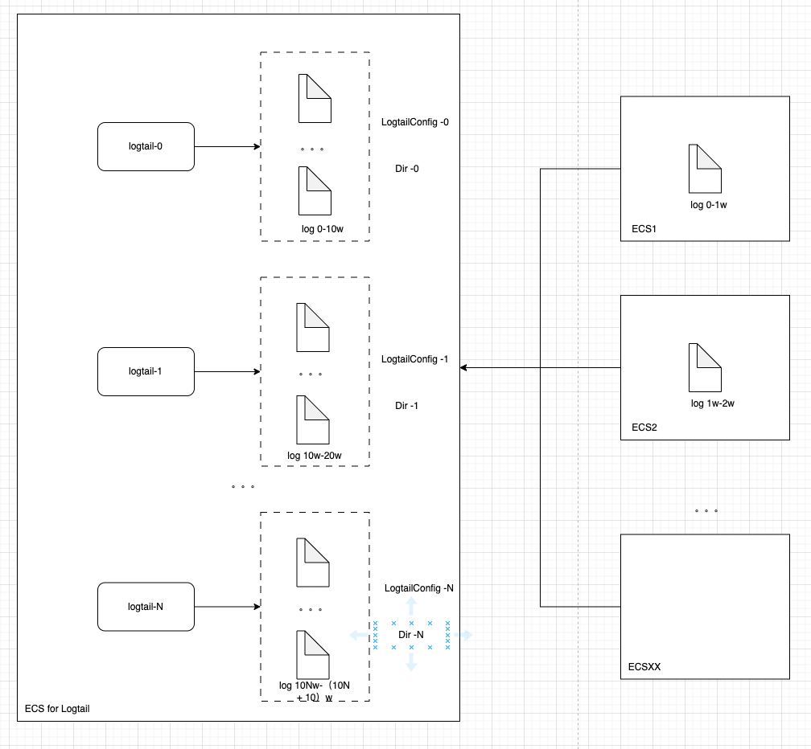
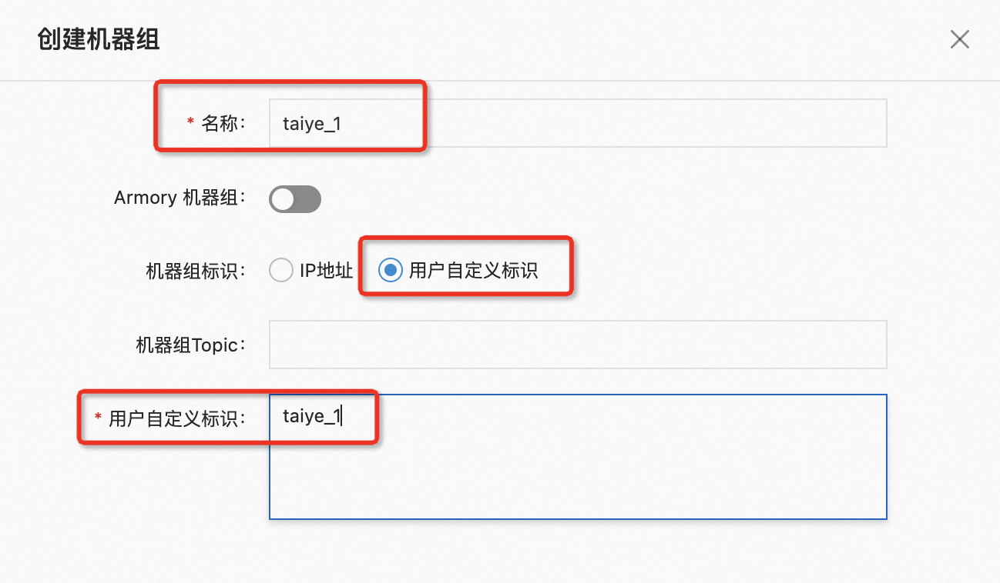
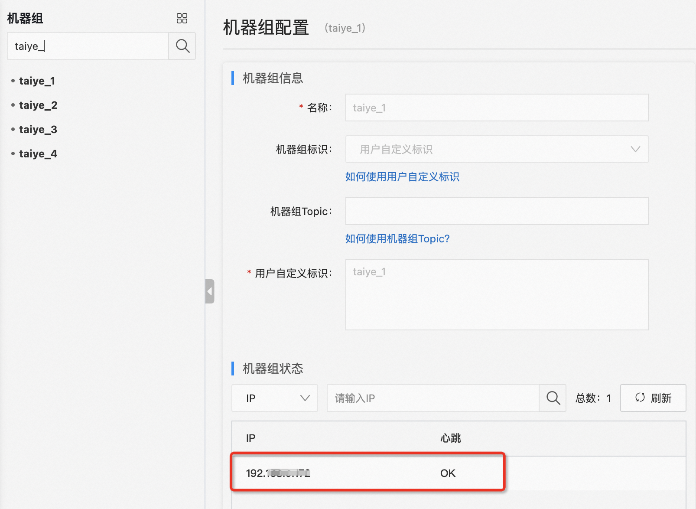
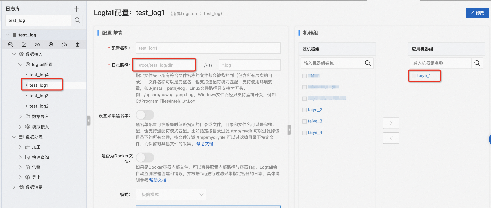
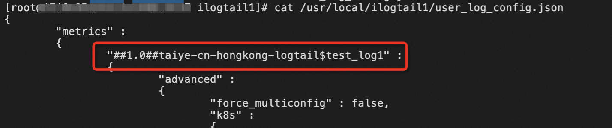
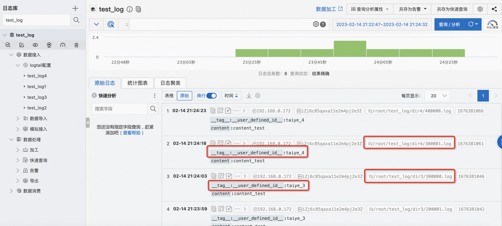

# 主机场景下如何使用ilogtail采集超大规模文件

## 方案架构

单个Logtail实例的对于采集文件/文件夹的数量有一定的限制，参考文档, 内存2G的情况下

 > 最大监控目录总数：10W（目录不包含Logtail采集配置中指定的目录黑名单）。
 > 最大监控目录和文件总数：100W（目录不包含Logtail采集配置中指定的目录黑名单，文件包含未被Logtail采集配置匹配的文件）。
 > 单个采集配置监控目录和文件总数：10W（目录不包含Logtail采集配置中指定的目录黑名单，文件包含未被Logtail采集配置匹配的文件）。
 > 单个目录中被监控的子目录和文件总数：10W（目录包含Logtail采集配置中指定的目录黑名单，文件包含未被Logtail采集配置匹配的文件）。

   

 > 因此考虑使用多实例的方式，来进行能力拓展，具体架构如下：
 > 将要采集的文件划分在不同的文件夹下
 > 在一台服务器上，启动多个logtail实例
 > 通过自定义机器组标识的方式，区分多个实例
 > 针对不同的实例，配置不同的采集配置，分别采集不同的文件夹（不通采集配置之间要采集的文件路径不要有重叠）

## 方案实施
下面我们模拟一个场景：
一台机器上共有40w个文件需要采集
### 前提条件
- 机器拥有足够的资源配置
  > 内存2G可以支持10w个文件采集，40w个文件就需要启动4个Logtail实例，一共需要8G内存（业务进程所需的资源不包含在内）
  > [参考文档](https://help.aliyun.com/document_detail/32278.htm?spm=a2c4g.26937906.0.0.48aa39f3fxgcOu#concept-sdg-czb-wdb)，除去文件数量的限制，CPU和内存还需要根据采集速率进行一定的预估，比如每个实例的采集速率都达到了40MB/s，那么4个logtail实例就一共需要16G内存+16核CPU
  > 机器的open files的设置要足够大，查看命令是: ulimit -a

- 开通阿里云日志服务

### 操作步骤
1. 在日志服务器上划分好文件夹，满足logtail采集限制
由于Logtail的采集配置可以通过文件路径来划定采集单个采集配置的采集范围，因此，在日志文件生成的时候，需要有一定的规划。本案例中，40w个文件，以最简单的方式，划分了4个文件夹。
```
/root/test_log/
├── dir1
│   ├── 1.log
│   ├── ...
│   └── 100000.log
├── dir2
│   ├── 100001.log
│   ├── ...
│   └── 200000.log
├── dir3
│   ├── 200001.log
│   ├── ...
│   └── 300000.log
└── dir4
    ├── 300001.log
│   ├── ...
    └── 400000.log

```
 2. 启动多个logtail实例
   - ilogtail正常安装部署命令分为三部分（下面的安装命令以中国香港地域为例，用户操作的时候，需要替换成自己的地域）

```
   // 1. 下载安装脚本
   wget http://logtail-release-cn-hongkong.oss-cn-hongkong-internal.aliyuncs.com/linux64/logtail.sh -O logtail.sh
   // 2. 给脚本授权
   chmod 755 logtail.sh
   // 3. 执行安装命令
  ./logtail.sh install cn-hongkong
```
为了启动多个logtail实例，其中第三步的安装命令需要添加如下参数

```
./logtail.sh install cn-hongkong -s ${自定义后缀名}
```

为了启动4个Logtail实例，我们将自定义后缀名分别指定为1，2，3，4

```
./logtail.sh install cn-hongkong -s 1
./logtail.sh install cn-hongkong -s 2
./logtail.sh install cn-hongkong -s 3
./logtail.sh install cn-hongkong -s 4
```

然后查看进程我们会发现有8个进程启动起来（每个Logtail实例包含一个守护进程和一个主进程）

```
# ps -ef | grep logtail
root     1935015       1  0 Feb13 ?        00:00:00 /usr/local/ilogtail1/ilogtail
root     1935017 1935015  0 Feb13 ?        00:16:23 /usr/local/ilogtail1/ilogtail
root     1935823       1  0 Feb13 ?        00:00:00 /usr/local/ilogtail2/ilogtail
root     1935825 1935823  0 Feb13 ?        00:16:15 /usr/local/ilogtail2/ilogtail
root     1936165       1  0 Feb13 ?        00:00:00 /usr/local/ilogtail3/ilogtail
root     1936166 1936165  0 Feb13 ?        00:16:14 /usr/local/ilogtail3/ilogtail
root     2007431       1  0 20:32 ?        00:00:00 /usr/local/ilogtail4/ilogtail
root     2007432 2007431  1 20:32 ?        00:00:03 /usr/local/ilogtail4/ilogtail
```
- 每个实例的运行目录分别在/usr/local/ilogtail1，/usr/local/ilogtail2，/usr/local/ilogtail3，/usr/local/ilogtail4目录下
- Logtail的相关的目录也分别对应了4个实例：
- 控制命令目录（对应原来的/etc/init.d/ilogtaild）：
```
 ll /etc/init.d/
-rwxr-xr-x  1 root root  4564 Feb 13 20:32 ilogtaild1
-rwxr-xr-x  1 root root  4564 Feb 13 20:32 ilogtaild2
-rwxr-xr-x  1 root root  4564 Feb 13 20:32 ilogtaild3
-rwxr-xr-x  1 root root  4564 Feb 14 20:32 ilogtaild4
```
标识文件目录（对应原来的/etc/logtail）:
```
# ll /etc/
drwxr-xr-x   8 root root     4096 Feb 13 20:32 ilogtail1
drwxr-xr-x   8 root root     4096 Feb 13 20:32 ilogtail2
drwxr-xr-x   8 root root     4096 Feb 13 20:32 ilogtail3
drwxr-xr-x   8 root root     4096 Feb 14 20:32 ilogtail4
```
记录文件目录（对应原来的/tmp/logtail_check_point）:
```
# ll /tmp/
-rw-r--r-- 1 root root 1494166 Feb 14 20:47 logtail_check_point1
-rw-r--r-- 1 root root 1484264 Feb 14 20:48 logtail_check_point2
-rw-r--r-- 1 root root 1484264 Feb 14 20:48 logtail_check_point3
-rw-r--r-- 1 root root 1484264 Feb 14 20:47 logtail_check_point4
```
到这里，4个Logtail实例就启动好了
 3. 对每个logtail实例配置自定义机器组标识以及创建机器组
 正常情况下，主机场景，Logtail通常使用IP型机器组来进行统一的配置管理。但是现在的场景下，IP型机器组显然无法使用，因此需要使用[标识型机器组](https://help.aliyun.com/document_detail/28983.html?spm=a2c4g.26937906.0.0.48aa7674Zh0s0O)。

为Logtail1创建自定义标识：taiye_1

```
# touch /etc/ilogtail1/user_defined_id
# echo "taiye_1" >> /etc/ilogtail1/user_defined_id
# cat /etc/ilogtail1/user_defined_id
taiye_1
```
为Logtail2，Logtail3，Logtail4也分别创建自定义标识taiye_2, taiye_3, taiye_4创建好之后，我们在SLS的页面上，分别创建4个机器组

   

创建好之后，分别查看每个机器组的状态，可以看到机器组的心跳已经正常了
   
4. 对每个实例配置采集配置
   

如图所示，采集配置test_log1，只使用taiye_1的机器组（里面只包含了Logtail1的实例），采集的日志路径里，也只配置了/root/test_log/dir1的路径。以此类比，创建采集配置test_log2，test_log3，test_log4。

5. 验证配置效果
通过查看每个Logtail实例下的user_log_config.json文件，可以确认采集配置被正确下发了。
 

 通过日志查询，可以看到每个实例下的日志都被采集上来了。
  

## 注意事项
> 采用本方案启动多个Logtail实例，不能使用IP型机器组，否则相同的采集配置会下发到每个实例中，浪费资源。
> 如果该主机之前已经有过Logtail实例，且为IP型机器组，那么需要把原来的IP型机器组删除，确保没有之前的采集配置遗留。

## 参考
　> 使用Logtail自定义插件采集数据：https://help.aliyun.com/document_detail/65064.html
  > SLS（日志服务）云原生观测分析平台：https://www.aliyun.com/product/sls
  > 欢迎扫群加入阿里云-日志服务（SLS）技术交流或关注公众号, 获得第一手资料与支持：
 


