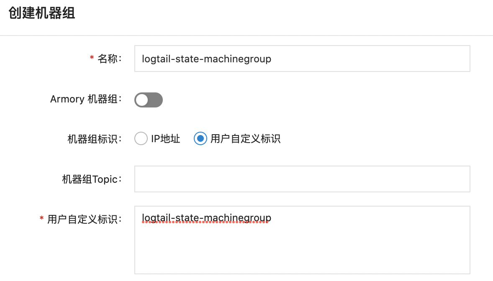
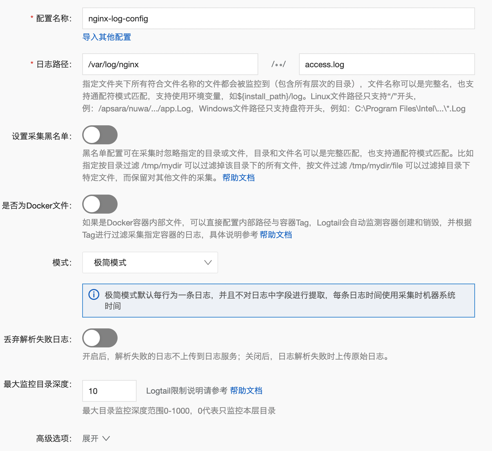
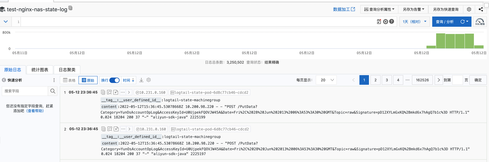
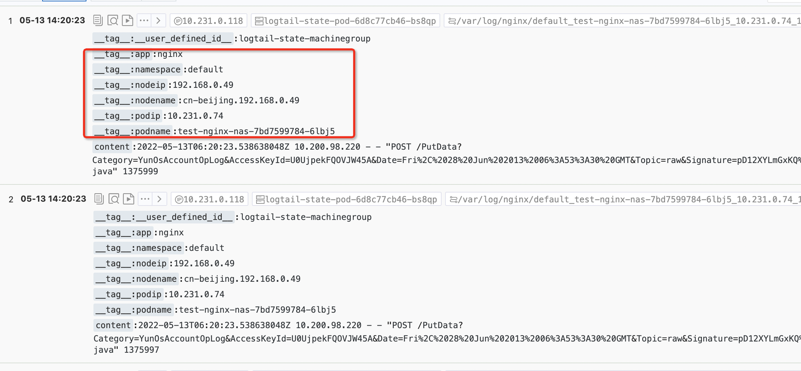

# K8s挂载PVC日志采集“轻量级”玩法
本文介绍一种使用K8s挂载PVC日志采集时的轻量级部署方式。

##　目标读者

数字化系统开发运维（DevOps）工程师、稳定性工程师（SRE）、可观测平台运维人员等。

## 使用场景

随着K8s和云的普及，越来越多的公司将业务系统部署到云上，并且使用K8s来部署应用。日志采集是K8s应用中非常重要的运维工具，日志服务提供了[Daemonset和Sidecar](https://help.aliyun.com/document_detail/66654.html?spm=a2c4g.26937906.0.0.7bc35f68ZZQyyT){target="_blank"} 两种针对K8s的采集方式，对于K8s应用的日志采集提供了极大的便捷性。当日志目录挂载PVC时，可以使用[Sidecar方式共享数据卷](https://developer.aliyun.com/article/691428?spm=a2c4g.26937906.0.0.7bc357ea2m4uBN)的方式采集，这种方式需要每个业务容器伴随一个logtail容器，具有非常高的采集性能，另一方面也需要更多的资源开销。
本文提供一种相对Sidecar部署更轻量级的采集方式，只需要部署少量的Logtail容器，即可采集不同业务容器的日志。主要场景如下：

### 场景1：业务容器用PVC挂载日志目录

K8s的CSI插件支持用户可以指定多种存储服务，很多用户也选择用PVC的方式挂载日志目录，在这种方式下Daemonset的采集方式不适合（Daemonset默认通过采集容器映射到宿主机的目录来采集日志）；

业务pod由于各种原因崩溃的时候，如果业务容器的日志没有保存在持久化的存储上，可能会有日志的丢失，使用PVC将业务容器的日志目录挂载在持久化存储比如网盘中，这样可以保证业务容器的日志最大限度的保存。

### 场景2：Logtail容器使用PVC挂载checkpoint目录

对于Node宕机的情况，业务容器的日志和Logtail的本身的checkpoint信息如果都是保存在宿主机的文件系统，可能也会造成一定程度的丢失。这时除了将业务容器的日志使用PVC挂载，也可以将Logtail的持久化目录进行PVC挂载，保证Checkpoint的持久化。

## 相关概念
### Logtail

Logtail是日志服务提供的日志采集Agent，用于采集阿里云ECS、自建IDC、其他云厂商等服务器上的日志。本文介绍Logtail的功能、优势、使用限制及配置流程等信息。

### PVC

全称：PersistentVolumeClaim，PersistentVolumes是用户在不知道特定云环境的细节的情况下，实现持久化存储的一种方式。使得开发人员可以不需要关心背后存储的情况下，直接指定相应的存储需求。PVC与PV的关系类似接口与实现的关系。

## 方案架构
本方案主要通过业务容器和Logtail容器共享同样的PVC来实现日志采集，同时一定程度上避免了Sidecar的开销。
  


## 方案优势

通过将业务容器的日志目录通过PVC的方式挂载到持久化的网盘或者NAS中，这样可以最大程度的保证无论是Pod崩溃还是Node（物理机节点或者虚拟机节点）崩溃的情况下，日志得以持久化到网盘或者NAS中；同时Logtail的持久化配置也可以借助NAS来进行持久化保存，以保证采集过程中的日志的连续性。

其中Logtail持久化方案可以参考[《K8s采集专题-稳定性：iLogtail容器重启数据可靠性探讨》](https://developer.aliyun.com/article/901257?spm=a2c4g.26937906.0.0.7bc357ea2m4uBN)


## 方案实施
### 前提条件

   > 开通阿里云日志服务，并创建相应的Project，Logstore。
   > K8s集群已创建对应NAS存储卷的PVC，具体操作可以参考容器服务Kubernetes集群中使用阿里云NAS存储卷。

## 操作步骤
   以下步骤中假设已经创建好的资源如下：
    > 日志服务，已创建好的北京地域的Project和Logstore
    > PVC名称为：nas-pvc
    > 业务容器模拟日志输出到文件

### 步骤一：创建业务容器并将日志目录挂载PVC

创建业务pod，yaml为内容如下，其中volumeMounts中的subPathExpr为了区分不同的容器输出的日志目录，也可以根据自己的业务进行调整

```
apiVersion: apps/v1
kind: Deployment
metadata:
  labels:
    app: mock-nginx-test
  name: mock-nginx-test
  namespace: default
spec:
  replicas: 4
  selector:
    matchLabels:
      app: mock-nginx-test
  template:
    metadata:
      labels:
        app: mock-nginx-test
    spec:
      containers:
        - args:
            - '--log-type=nginx'
            - '--stdout=false'
            - '--stderr=true'
            - '--path=/var/log/nginx/access.log'
            - '--total-count=1000000000'
            - '--logs-per-sec=100'
          command:
            - /bin/mock_log
          image: 'registry.cn-hangzhou.aliyuncs.com/log-service/docker-log-test:latest'
          imagePullPolicy: Always
          name: mock-nginx-test
          # 在env中提取相关容器信息
          env:
            - name: POD_NAMESPACE
              valueFrom:
                fieldRef:
                  fieldPath: metadata.namespace
            - name: NODE_NAME
              valueFrom:
                fieldRef:
                  fieldPath: spec.nodeName
            - name: NODE_IP
              valueFrom:
                fieldRef:
                  fieldPath: status.hostIP
            - name: POD_IP
              valueFrom:
                fieldRef:
                  fieldPath: status.podIP
            - name: POD_NAME
              valueFrom:
                fieldRef:
                  fieldPath: metadata.name
          resources:
            requests:
              cpu: 250m
              memory: 512Mi
          # subPathExpr设置跟容器相关的路径，便于后续Topic提取
          volumeMounts:
            - mountPath: /var/log/nginx
              name: volume-nas-pvc
              subPathExpr: test-nginx-nas/$(POD_NAMESPACE)_$(POD_NAME)_$(POD_IP)_$(NODE_IP)_$(NODE_NAME)
      restartPolicy: Always
      volumes:
        - name: volume-nas-pvc
          persistentVolumeClaim:
            claimName: nas-pvc
```

### 步骤二：创建Logtail采集容器

> .replicas设置1，不需要启动多个容器
> .ALIYUN_LOGTAIL_USER_ID：填写阿里云账号ID
> .ALIYUN_LOGTAIL_USER_DEFINED_ID：填写自定义的机器组标识，本例以logtail-state-machinegroup为例
> .user_config_file_path、docker_file_cache_path、check_point_filename、buffer_file_path记录logtail持久化的信息。相关配置参考强烈建议阅读《[K8s采集专题-稳定性：iLogtail容器重启数据可靠性探讨](https://developer.aliyun.com/article/901257?spm=a2c4g.26937906.0.0.7bc357ea2m4uBN){target="_blank"}》。
>.与业务容器公用pvc：nas-pvc
>.volumeMounts包含业务容器的目录和logtail本身持久化信息的目录

```
apiVersion: apps/v1
kind: Deployment
metadata:
  labels:
    app: logtail-state-pod
  name: logtail-state-pod
  namespace: default
spec:
  replicas: 1
  selector:
    matchLabels:
      app: logtail-state-pod
  template:
    metadata:
      labels:
        app: logtail-state-pod
    spec:
      containers:
        - env:
            - name: ALIYUN_LOGTAIL_USER_ID
              value: '${your_aliyun_user_id}'
            - name: ALIYUN_LOGTAIL_USER_DEFINED_ID
              value: '${your_machine_group_user_defined_id}'
            - name: ALIYUN_LOGTAIL_CONFIG
              value: /etc/ilogtail/conf/${your_region}/ilogtail_config.json
            - name: user_config_file_path
              value: /etc/ilogtail/checkpoint/user_log_config.json
            - name: docker_file_cache_path
              value: /etc/ilogtail/checkpoint/docker_path_config.json
            - name: check_point_filename
              value: /etc/ilogtail/checkpoint/logtail_check_point
            - name: check_point_dump_interval
              value: '60'
            - name: buffer_file_path
              value: /etc/ilogtail/checkpoint
          image: 'registry.cn-beijing.aliyuncs.com/log-service/logtail:latest'
          imagePullPolicy: Always
          name: logtail-state-pod
          resources:
            requests:
              cpu: 250m
              memory: 512Mi
          volumeMounts:
            - mountPath: /var/log/nginx
              name: volume-nas-pvc
              subPath: test-nginx-nas
            - mountPath: /etc/ilogtail/checkpoint
              name: volume-nas-pvc
              subPath: logtail_checkpoint
      volumes:
        - name: volume-nas-pvc
          persistentVolumeClaim:
            claimName: nas-pvc

```

参数说明如下：

|参数|说明|

|${your_region}|该参数由日志服务Project所在Region以及网络类型决定，请根据网络类型输入正确的格式。包括：

公网：region-internet。例如，华东一为cn-hangzhou-internet。

阿里云内网：region。例如，华东一为cn-hangzhou。

其中，region为 表一，请根据Project地域选择正确的参数。|


|${your_aliyun_user_id}|用户标识，请替换为您的阿里云主账号用户ID。主账号用户ID为字符串形式，如何查看ID请参考用户标识配置中的2.1节。|

|${your_machine_group_user_defined_id}|Logtail的机器组自定义标识。需确保该标识在您的日志服务所在Region内唯一。详细内容可参考创建用户自定义标识机器组。|

### 步骤三：在日志服务控制台创建自定义标识机器组

1. 登录日志服务控制台。
2. 在Project列表区域，单击目标Project。
3. 在左侧导航栏中，单击机器组。
4. 选择机器组右侧的
   

> 创建机器组。

- 在创建机器组对话框中，配置如下参数，单击确定。以下以logtail-state-machinegroup为例创建机器组，logtail-state-machinegroup对应步骤二中的${your_machine_group_user_defined_id}。需要保持一致。
  

### 步骤四：创建Logtail采集配置

1. 登录[日志服务控制台](https://sls.console.aliyun.com/?spm=a2c4g.26937906.0.0.7bc357ea2m4uBN)。
2. 选择目标Project和Logstore，点开logstore菜单，选择数据接入->logtail配置，点击+号，选择单行-文本日志。
3. 下一步选择机器组时，选择使用现有机器组，选择在步骤三中创建的机器组。然后将该机器组从源机器组移动到应用机器组中。
4. Logtail配置选择，极简模式，默认关闭Docker文件开关（不要打开），日志路径使用业务容器和logtail容器都挂载的/var/log/nginx

  
6. 下一步，点击完成。

### 步骤五：查询采集后的日志
1. 登录[日志服务控制台](https://sls.console.aliyun.com/?spm=a2c4g.26937906.0.0.7bc357ea2m4uBN)。
2. 选择目标Project和Logstore，点开logstore菜单，选择放大镜按钮，查询分析，即可查询采集到的日志。

  

### 步骤六：设置Topic生成方式（可选）
1. 登录[日志服务控制台](https://sls.console.aliyun.com/?spm=a2c4g.26937906.0.0.7bc357ea2m4uBN)。
2. 选择目标Project和Logstore，点开logstore菜单，选择数据接入->logtail配置，进入配置详情

  

3. 修改Topic生成方式为文件路径正则，输入自定义正则（该正则根据需要修改）：
\/var\/log\/(?P<app>.*?)\/(?P<namespace>[^_]+?)_(?P<podname>[^_]+?)_(?P<podip>[\d\.]+?)_(?P<nodeip>[\d\.]+?)_(?P<nodename>[^_]+?)\/access.log
4. 进入查询分析，可以看到查到数据有了相关的tag。

  

## 常见问题
 > .采集过程中业务pod的元信息丢失了，不像daemonset或者sidecar中可以获取到业务pod的信息？
 > .主要是由于该方案中Logtail作为一个单独的容器部署，通过挂载共享NAS的方式采集日志，Logtail无法获取原始容器的信息，可以通过如下方式实现：
 > .可以设置业务容器的挂载目录的subPathExpr，来将pod信息注入到路径中，通过文件路径正则的方式，将pod信息写入tag中。
 > .对于只需要区分不同的业务的日志，可以直接将业务容器的目录subPath设置成固定的几个，比如app1，app2，这样同一个业务的pod的日志输出到同一个共享文件中，采集时可以通路径简单区分不同业务。
 > .整个集群是否只能部署一份Logtail容器？
 > .对于同一个文件使用单独的一个Logtail容器部署；不同类型的业务Pod也可以部署对应的logtail采集容器，本质上，需要logtail容器中可以看到被采集的业务容器的共享名录。

## 参考

> .K8s采集专题-稳定性：iLogtail容器重启数据可靠性探讨：https://developer.aliyun.com/article/901257
> .Kubernetes 文件采集实践：Sidecar + hostPath 卷：https://developer.aliyun.com/article/801162
> .使用Logtail采集Kubernetes上挂载的NAS日志：https://developer.aliyun.com/article/691428
> .日志主题设置：https://help.aliyun.com/document_detail/60069.html#section-os0-j2r-cvx
> .SLS（日志服务）云原生观测分析平台：https://www.aliyun.com/product/sls
> .欢迎扫群加入阿里云-日志服务（SLS）技术交流或关注公众号, 获得第一手资料与支持:
  


​