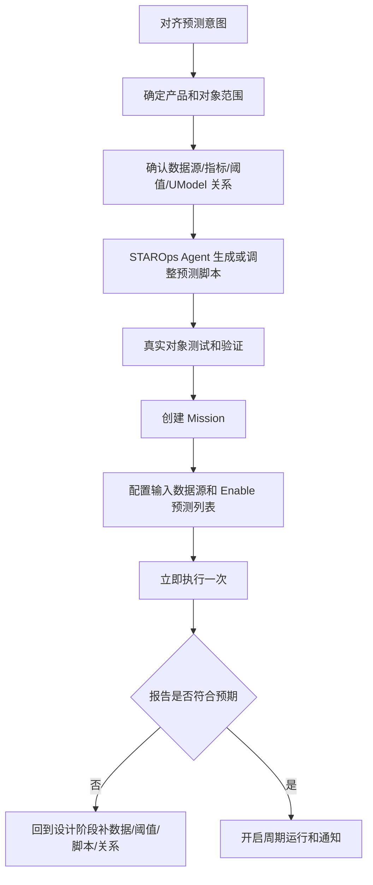

  <a href="/doc/starops/starops.html">STAROps</a> / 主动巡检

# 饱和度评估与风险预测

  分类 · 主动巡检

> 对话回放：[discovery 与能力边界](/playground/capacity-risk-prediction-operator-replay.html) ｜ [Runtime Skill 构建](/playground/capacity-risk-prediction-replay.html) ｜ [Mission 执行与报告](/playground/capacity-risk-prediction-mission-replay.html)

容量风险预测用于在资源触达阈值前识别风险，并把预测结果转成可运营的容量事件。它关注未来窗口：按当前趋势、季节性和业务增长速度，哪些对象会触达阈值，哪些业务链路会被共同上升的负载拖入风险。

在 STAROps 中设计并部署容量风险预测 Mission，需要先完成 Mission 设计，明确预测意图、产品范围、数据源、阈值和预测脚本；再部署 Mission，配置输入数据源和启用的预测列表，首次运行后检查报告是否符合预期。

数值预测交给 SLS 时序算法执行。容量风险预测应使用 `series_describe` 判断序列质量、连续性、稳定性、周期性和显著趋势，使用 `series_forecast` 生成未来窗口预测值、预测上界、预测下界和错误信息。STAROps 负责把预测事实关联到业务、服务、资源和 UModel 关系，形成可复核、可通知、可持续运营的风险报告。

## 适用场景

| 场景 | 适用性 | 说明 |
|---|---|---|
| CPU、内存、磁盘、IOPS、连接数等有百分比水位的资源 | 适用 | 可配置 Warning / Critical 阈值，计算预测上界和触阈时间。 |
| OSS 流量、SLS 写入量、网关 QPS、消息堆积等绝对数值指标 | 适用 | 需要先确认配额、规格、预算或人工阈值，再进入风险判断。 |
| 业务应用 QPS 上涨 | 适用，需多信号组合 | QPS 需要结合延迟、错误率、CPU、内存、线程池、队列等压力信号判断。 |
| 多个产品或中间件在同一时间窗同步上升 | 适用 | STAROps 可按业务、服务、时间窗或 UModel 关系归并成同一个容量风险事件。 |
| 已经发生故障或告警 | 建议进入 RCA 流程 | 本实践面向故障前预测；故障发生后应进入告警根因分析或业务可靠性诊断流程。 |
| 只有当前水位表，暂不需要未来窗口预测 | 暂不适用 | 普通阈值巡检即可满足当前检查需求。 |
| 历史数据不足、阈值来源缺失且无法补齐 | 暂不适用 | 先补数据、权限、阈值或业务归属信息。 |

## 实践收益

完成配置后，容量运营可以从当前水位报表升级为长期预测 Mission。团队定期得到以下结果：

| 结果 | 用途 |
|---|---|
| 周期性容量风险报告 | 按固定 Profile 运行，避免每次临场选择指标、窗口和阈值。 |
| 触阈时间和预测上下界 | 判断剩余响应窗口，区分缓慢增长和短期逼近。 |
| 单对象风险事件 | 识别实例、服务、队列、bucket 或 Logstore 的独立触阈风险。 |
| 跨产品共振事件 | 把同一业务链路上多个对象的共同上升合并成一个容量事件。 |
| 影响业务和责任域 | 沿 UModel 关系定位受影响应用、接口和业务。 |
| 上涨原因下钻 | 对需要解释的风险事件下钻 route、tenant、caller、namespace、bucket 等候选维度。 |
| 支撑证据、反证和缺口 | 保留人工复核依据，避免把弱关联写成确定结论。 |
| 通知与归档 | Normal 静默归档，Warning / Critical 或共振事件通知。 |

## 前提条件

创建容量风险预测 Mission 前，先准备以下信息。STAROps Agent 可以辅助 discovery、脚本编写和验证，但每个对象最终都要有可用、降级或排除结论。

| 输入项 | 需要准备的内容 | 不满足时的处理 |
|---|---|---|
| 预测对象 | 资源、实例、服务、接口、队列、bucket、Logstore、业务计数等 | 标注排除原因或待补对象归属。 |
| 产品范围 | ECS、RDS、Redis、K8s、网关、OSS、SLS、消息队列、业务服务等 | 只启用本次 Mission 可验证的产品和对象。 |
| 数据源 | MetricStore、Prometheus、Logstore、APM、云产品 API、业务指标表 | 标注不可读、缺权限或字段不可用。 |
| 序列构造口径 | 查询语句、时间粒度、历史窗口、聚合方式 | 标注序列不可构造，不进入预测。 |
| 阈值来源 | 百分比水位、产品配额、人工阈值、预算、业务 SLO | 保留预测结果，但不直接升级为 Critical。 |
| UModel 与归属关系 | 服务、接口、业务、上下游依赖、候选维度 | 影响面和上涨原因下钻降级为已有维度分析。 |
| 运行策略 | 预测窗口、调度频率、Normal 静默、Warning / Critical 通知 | 未配置前不进入长期任务。 |

容量指标的阈值来源不同，报告必须标清来源。

| 类型 | 示例 | 阈值策略 | 风险判断 |
|---|---|---|---|
| 百分比水位 | CPU、内存、磁盘、IOPS 使用率、RDS 连接使用率、Redis 内存使用率 | 产品推荐阈值、团队 SLO 或历史容量红线 | 预测上界触达 Warning / Critical，计算剩余时间。 |
| 绝对数值 | OSS 流量、SLS 写入量、网关 QPS、消息堆积、Logstore 日志量 | 人工配置、产品 API 配额、官网规格、账单预算或运维经验阈值 | 预测值触达配额、预算、告警阈值或历史上限。 |
| 业务应用水位 | 业务 QPS、p95 延迟、错误率、应用 CPU/内存、线程池、队列长度 | 业务基线和多信号组合 | QPS 上涨同时伴随延迟、错误率、CPU/内存或队列恶化时标为容量压力。 |

## 整体流程

容量风险预测 Mission 分为两个阶段。

1. Mission 设计阶段：对齐预测意图，确定产品和对象范围，确认数据源、指标、阈值和 UModel 关系，让 STAROps Agent 生成或调整预测脚本 / Runtime Skill，并用真实对象测试验证。
2. Mission 部署与首次运行阶段：创建长期 Mission，配置输入数据源和启用的预测列表，立即执行一次，检查报告、通知和降级行为，再打开周期调度。

:::: details 查看整体流程图

::::

## 阶段一：Mission 设计

设计阶段要完成三件事：通过 discovery 确认对象、数据源、阈值和关系；沉淀 Mission Profile，作为长期任务每次运行的输入契约；让 STAROps Agent 生成或调整预测脚本 / Runtime Skill，并用真实对象验证 Profile 与执行逻辑是否匹配。

| 步骤 | 目标 | 输出 |
|---|---|---|
| 对齐预测意图 | 明确本次 Mission 要提前发现什么容量风险，以及希望报告回答哪些问题 | 预测目标、预测窗口、通知原则和报告口径。 |
| 确定产品和对象 | 选择要纳入容量预测的产品、服务、中间件和业务指标 | 对象清单、启用列表和排除理由。 |
| 发现数据源 | 为每个对象找到 MetricStore、Logstore、Prometheus、APM 或产品 API | 数据源清单、访问状态、字段和指标可用性。 |
| 收集阈值来源 | 记录百分比阈值、配额、规格、预算、人工阈值或业务 SLO | 阈值表、阈值缺口和确认人。 |
| 编写或调整预测脚本 | 让 STAROps Agent 根据 Profile 生成或调整脚本 / Runtime Skill | 可测试的预测协议，包含 `series_describe` 和 `series_forecast`。 |
| 测试和验证 | 用真实对象验证取数、序列质量、阈值计算、风险归并和报告结构 | 验证记录、缺口清单和可部署结论。 |

设计阶段需要给每个对象输出三类结论：

- 可运行：数据源可读，序列可构造，阈值来源明确。
- 降级运行：预测可做，但缺少部分维度、拓扑或阈值，需要在报告中标注。
- 暂不纳入：缺少历史数据、关键字段未索引、权限不足或阈值无人确认。

预测脚本或 Runtime Skill 只有通过真实对象验证后，才能进入 Mission 部署。未验证的脚本可以作为设计产物保留，不能作为生产 Mission 的当前可用能力展示。

### Profile 与 Skill

Mission Profile 不是 discovery、create skill 或验证过程的总称。它是长期 Mission 的配置契约，承接 discovery 的结果，约束 Runtime Skill 或预测脚本每次怎么运行，并在验证后被修正。

三者关系如下：

| 对象 | 职责 | 产物 |
|---|---|---|
| discovery | 调查和确认背景，找出可预测对象、数据源、指标、阈值、权限、UModel 关系和候选维度 | 对象清单、数据源清单、阈值表、可运行/降级/排除结论。 |
| Mission Profile | 固化 Mission 每次运行的输入契约 | 对象范围、启用列表、数据源、序列口径、阈值来源、候选维度、调度和通知规则。 |
| create / adjust Runtime Skill | 让 STAROps Agent 根据 Profile 生成或调整可执行预测逻辑 | 可运行的脚本或 Runtime Skill，包含取数、序列构造、SLS 预测、风险归并和报告输出。 |
| Skill 验证 | 用真实对象检查 Profile 与 Runtime Skill 是否匹配 | 验证记录、失败原因、Profile 修正项、脚本修正项和可部署结论。 |

执行顺序可以按下面的方式理解：

1. 先做 discovery，确认本次 Mission 想管哪些产品、对象和风险。
2. 根据 discovery 结果形成 Mission Profile 初稿。
3. 让 STAROps Agent 根据 Profile 生成或调整预测脚本 / Runtime Skill。
4. 用真实对象运行一次或多次测试，验证取数、序列质量、预测结果、风险归并、影响面、报告和通知。
5. 根据验证结果修正 Profile、脚本、启用列表、阈值和候选维度。
6. Profile 与 Runtime Skill 都通过验证后，再进入 Mission 部署。

验证失败时，要先判断问题落在哪一层：

| 失败现象 | 处理方式 |
|---|---|
| 数据源不可读 | 修正权限或 Profile 中的数据源配置。 |
| 指标不存在 | 回到 discovery，修正对象清单、指标名或排除该对象。 |
| 序列点不足 | 调整历史窗口、时间粒度，或将对象标记为暂不纳入。 |
| 阈值缺失 | 补充阈值来源、确认人或降级规则。 |
| 脚本不支持某类对象 | 调整 Runtime Skill 或预测脚本。 |
| 风险归并不符合业务理解 | 修正 UModel 关系、候选维度或归并规则。 |
| 通知过多或过少 | 调整启用列表、静默规则、通知阈值或接收人。 |

## 阶段二：部署与首跑

部署阶段把设计阶段的 Profile 变成长期任务。创建 Mission 时，重点检查两类配置：输入数据源和启用的预测列表。输入数据源决定 Mission 能读取哪些 Store、指标、日志和业务计数；启用列表决定本次长期任务实际覆盖哪些产品、对象和风险类型。

| 步骤 | 配置重点 | 通过标准 |
|---|---|---|
| 创建 Mission | 绑定数字员工、预测脚本 / Runtime Skill、运行频率和通知策略 | Mission 可以按 Profile 启动，权限保持只读。 |
| 配置输入数据源 | 选择 MetricStore、Prometheus、Logstore、APM、产品 API 或业务指标表 | 每个启用对象都有可读、降级或排除结论。 |
| 配置 Enable 预测列表 | 只启用本次已验证的产品、对象和风险类型 | 启用范围与设计阶段对象清单一致。 |
| 立即执行一次 | 在创建后手动触发一次运行 | 报告展示预测值、上下界、触阈时间、风险归并和缺口。 |
| 检查通知策略 | 验证 Normal 静默、Warning / Critical 或共振事件通知 | 通知范围、接收人和归档策略符合预期。 |
| 打开周期调度 | 首次运行通过后进入长期运营 | 周期报告稳定生成，缺口进入迭代清单。 |

Mission 创建后，不建议直接进入无人值守周期运行。先立即执行一次，检查数据读取、序列质量、预测结果、风险归并、UModel 影响面、Investigation handoff、报告结构和通知策略是否符合预期。首次运行发现数据源、阈值、启用列表或脚本问题时，回到设计阶段修正。

## 影响面下钻

曲线预测由 SLS 的 `series_describe` 和 `series_forecast` 完成。STAROps 通过 UModel 的多维数据关联，在某个 RDS 实例、K8s workload、网关路由、Logstore 或 OSS bucket 被预测为触阈风险时，继续定位受影响业务、关联服务和接口、共同业务链路，以及上涨主要由哪些维度推动。

UModel 在容量风险预测中承担三类工作：

| 工作 | 说明 | 报告体现 |
|---|---|---|
| 对象归一 | 将资源、服务、接口、日志对象和存储对象绑定到同一业务或责任域 | 风险事件按业务或责任域组织，而非按产品清单堆叠。 |
| 影响面定位 | 当资源预测触阈时，沿关系查找受影响应用、接口和业务 | 报告给出影响业务、影响服务和建议响应时限。 |
| 解释范围约束 | 将 InvestigationAgent 的下钻范围限制在相关服务、调用链、维度和变更窗口内 | 报告输出主贡献维度、支撑证据、反证和证据缺口。 |

上涨原因下钻需要结合候选维度和只读查询。例如业务 QPS 上涨时，Agent 可以检查 route、tenant、caller、namespace、region、bucket 等维度；资源指标上升时，Agent 可以沿 UModel 关系检查同一业务链路上的网关、应用、数据库、缓存、日志写入和对象存储趋势。

## 周期运行环节

周期运行按 Mission Profile 执行，不重新临场猜数据源、指标或阈值。

Runtime Skill 或预测脚本每次运行按以下顺序执行：

1. 读取 Mission Profile，确认预测对象、启用列表、时间窗口、粒度、阈值来源和通知策略。
2. 从 MetricStore、Prometheus、Logstore、APM、产品 API 或业务指标表取数。
3. 构造等间隔时间序列，记录不可构造对象及原因。
4. 调用 `series_describe` 判断序列质量、连续性、稳定性、周期性和显著趋势。
5. 调用 `series_forecast` 生成未来窗口预测值、预测上界、预测下界和错误信息。
6. 结合阈值来源计算风险等级、预计触阈时间和剩余响应窗口。
7. 按业务、服务、资源、时间窗或 UModel 关系归并风险。
8. 对既有路径无法充分解释的风险事件交给 InvestigationAgent，补充影响面、主贡献维度、支撑证据、反证和缺口。
9. 生成 Mission 报告，Normal 归档，Warning / Critical 或共振事件通知。

触发 InvestigationAgent 的典型条件包括：

- 预测上界在近期触达 Warning / Critical。
- 同一业务链路上多个对象同步上升。
- 业务 QPS 上涨同时伴随延迟、错误率、CPU、内存或队列恶化。
- 阈值来源不完整，需要确认产品配额、规格或业务容量目标。
- 预测结论和业务认知冲突，需要补证据和反证。

InvestigationAgent 用于既有 Skill、脚本或 Mission 路径无法覆盖的情况。它负责开放调查、补证规划和未知路径探索，不替代确定性预测脚本的常规路径，也不在证据不足时强行给唯一结论。

## 共振归并

容量风险经常表现为同一业务动作在多个系统上留下共同趋势。例如网关 QPS、应用 CPU、RDS IOPS、Redis 命中率、OSS 访问量、SLS 写入量在同一时间窗一起上升。单看每个产品可能只是 Warning，合起来就是一次业务增长或异常流量引发的容量风险事件。

共振识别按三步执行：

1. 对所有预测结果对齐到同一时间粒度，保留预测值、上界、触阈时间和序列描述。
2. 按共享业务、服务、region、namespace 或调用关系归并上升趋势。
3. 对同步上升、多点逼近阈值且既有路径无法充分解释的事件启动 InvestigationAgent，补充维度、变更、拓扑和日志证据。

共振必须有共享业务、实体关系、时间窗或维度组合支撑。报告不能为了制造跨域结论强行拼接无关资源。

## 报告结构

容量风险预测报告按风险事件组织。一个风险事件可以包含多个产品的预测结果。

| 模块 | 内容 | 读法 |
|---|---|---|
| 风险摘要 | 风险等级、预计触阈时间、影响业务、建议响应时限 | 先判断是否需要立即响应。 |
| 预测证据 | 当前值、预测值、预测上界/下界、序列描述、算法错误信息 | 判断风险是否来自可复核预测事实。 |
| 阈值来源 | 产品百分比阈值、人工阈值、产品配额、文档规格、历史基线或业务 SLO | 判断风险等级是否有可靠依据。 |
| 共振证据 | 同一时间窗同步上升的产品、服务、维度组合 | 判断是否应作为一个业务容量事件处理。 |
| Agent 调查 | 主贡献维度、支撑证据、反证、证据缺口、置信度 | 判断证据是否闭合，是否需要继续调查。 |
| 处置建议 | 扩容、限流、错峰、优化、配额调整、缓存、降噪、后续验证 | 进入人工确认后的变更流程。 |

报告需要区分事实、解释和建议：

- 事实来自 SLS 预测结果、阈值来源、序列质量和真实取数。
- 解释来自 InvestigationAgent 对 UModel 关系、候选维度、拓扑、日志、变更和反证的综合判断。
- 建议进入客户自己的变更流程，由用户确认后执行。

## 降级与边界

容量风险预测宁可降级，也不能把缺口写成成功。

| 情况 | 处理方式 |
|---|---|
| 序列点不足 | 标注历史数据不足，不运行预测。 |
| 预测函数返回错误 | 保留错误信息和对象上下文，不写成预测成功。 |
| 阈值缺失 | 保留预测结果和补阈值建议，不升级为 Critical。 |
| 数据源不可读 | 在 Mission Profile 中标注排除或待补权限。 |
| UModel 关系缺失 | Investigation 降级为维度贡献分析，并给出补关系建议。 |
| 多信号证据冲突 | 保留反证和缺口，进入人工复核或开放调查。 |

实施边界：

- 全流程只读，不执行扩容、限流、配置修改或生产变更。
- SLS 函数可用性、参数约束、历史窗口长度和序列数量上限以目标实例实际支持为准。
- 没有阈值来源的绝对数值只能标为待配置或需确认，不能直接给出 Critical。
- 单个 QPS 上升不能直接判为业务容量风险，必须结合延迟、错误率、资源水位、队列或业务基线等信号。
- 跨产品共振必须有共享业务、实体关系、时间窗或维度组合支撑。
- 处置建议需要人工确认后执行。
- 涉及用户、订单、金额、AK、IP 等敏感信息时，只展示脱敏标识和聚合统计。

## 上线验收

上线前至少完成以下检查：

| 验收项 | 通过标准 |
|---|---|
| Mission Profile | 包含预测对象、产品范围、数据源、序列构造口径、阈值来源、候选维度、启用列表、调度和通知规则。 |
| 设计阶段 discovery | 每个对象都有可用、降级或排除结论；缺阈值对象不得直接进入 Critical。 |
| 预测脚本 / Runtime Skill | 使用 `series_describe` 和 `series_forecast`，并通过真实对象验证，不使用大模型做数值外推。 |
| 首次运行 | Mission 创建后立即执行一次，报告能展示预测值、上下界、序列质量、触阈时间、风险归并和缺口。 |
| 风险归并 | 至少一个样例能把多个对象的共同上升归并成一个风险事件，或明确证明当前无共振。 |
| 影响面与上涨原因下钻 | 风险事件能给出受影响业务、服务、接口和候选维度分析；关系缺失时明确降级。 |
| Investigation handoff | 既有路径无法处理的风险事件把预测结果、实体、时间窗、阈值来源和候选维度交给 InvestigationAgent。 |
| 报告与通知 | Normal 归档，Warning / Critical 或共振事件通知；报告保留支撑证据、反证和缺口。 |

## 安装 Skill

本实践落地两份 Skill，职责不同，不能互相替代。`capacity-risk-prediction-sop`（Guide）支持本地 Agent 与 STAROps 控制台两种安装；`capacity-risk-prediction`（Runtime）仅支持 STAROps 控制台上传 tar.gz，本地 Agent 不支持。本地 Agent 走 [`npx skills`](https://www.npmjs.com/package/skills)，STAROps 数字员工下载 tar.gz 后在控制台「技能管理 → 上传技能」上传。

| Skill | 作用 | 本地 Agent（npx） | STAROps 控制台（tar.gz） |
|---|---|---|---|
| `capacity-risk-prediction` | Runtime Skill：执行 9 步预测流水线，按 Mission Profile 对 MetricStore / Prometheus / CloudMonitor / LogStore 构造等间隔时序，调用 `series_forecast` / `series_describe` 输出结构化风险报告。 | 仅 STAROps 控制台（本地 Agent 不支持） | [capacity-risk-prediction.tar.gz](https://starops-demo.oss-cn-beijing.aliyuncs.com/starops/demo/starops-best-practice/capacity-risk-prediction/docs/capacity-risk-prediction.tar.gz) |
| `capacity-risk-prediction-sop` | 引导 Skill：教 Agent 按 Mission 设计、部署、首跑、周期运行和上线验收完成容量风险预测 Mission。 | `npx skills add aliyun-sls/sls-doc-skills --skill capacity-risk-prediction-sop` | [capacity-risk-prediction-sop.tar.gz](https://starops-demo.oss-cn-beijing.aliyuncs.com/starops/demo/starops-best-practice/capacity-risk-prediction/docs/capacity-risk-prediction-sop.tar.gz) |

## 相关入口

- [返回 STAROps 最佳实践首页](/starops/starops.html)
- [打开 STAROps Playground](/playground/staropsdemo.html)
- [进入 STAROps 控制台](https://starops.console.aliyun.com)
