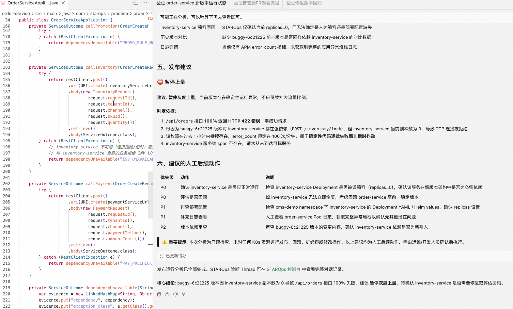
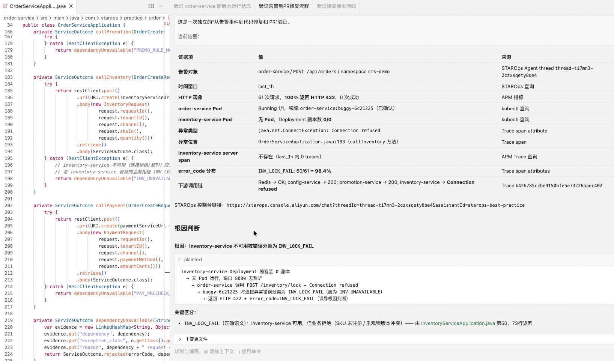
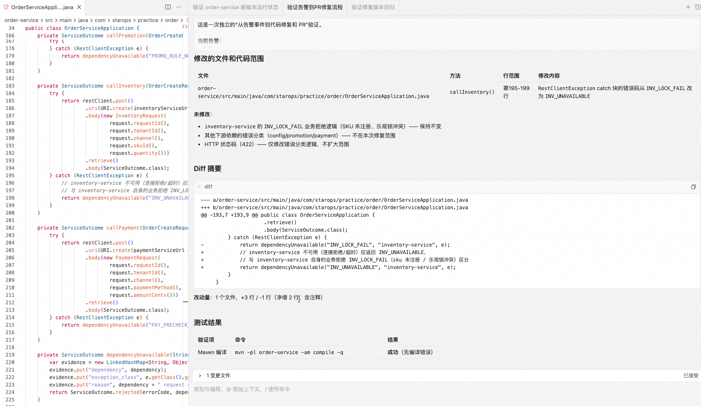
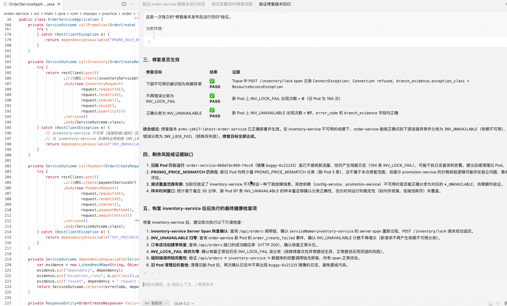
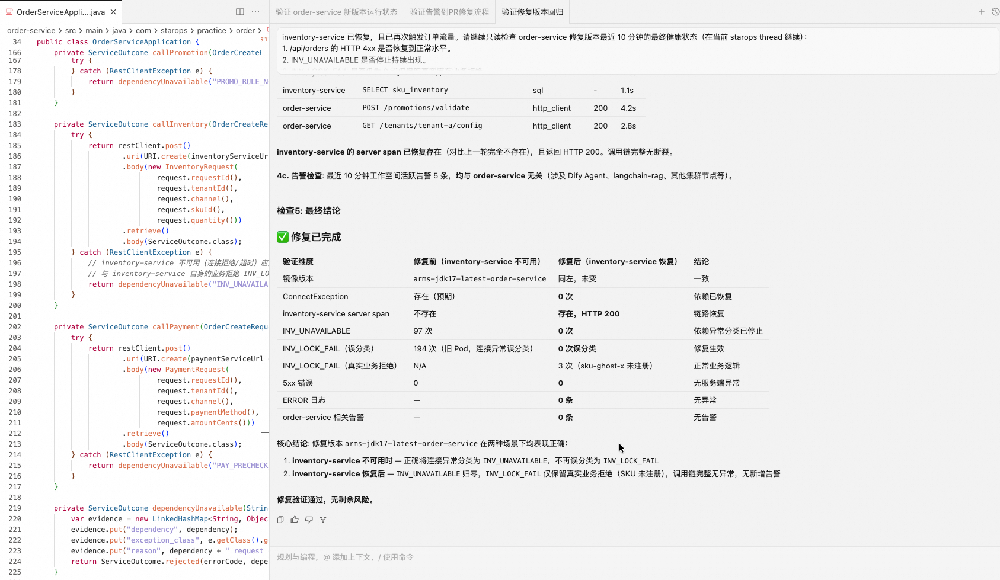

<div class="sls-starops-article-crumb">
  <a href="/doc/starops/starops.html">STAROps</a> <span class="sep">/</span> <span>协作闭环</span>
</div>

# 一个 Agent 入口完成 DevOps 闭环

<div class="sls-starops-article-meta">
  <span>分类 · 协作闭环</span>
</div>

> 对话回放：[发布后运行检查](/playground/coding-agent-devops-loop-release-runtime-check-replay.html) ｜ [告警到代码修复](/playground/coding-agent-devops-loop-alert-to-fix-replay.html) ｜ [修复版运行回归](/playground/coding-agent-devops-loop-fix-regression-replay.html)

DevOps 任务经常从代码开始，却在发布、告警、日志、Trace 和运行环境之间中断。开发者需要在不同平台重复确认版本、对象、时间范围和诊断结论，Agent 也难以保留一条任务的完整上下文。

本实践以 Coding Agent 作为统一入口。Coding Agent 负责阅读代码、修改、测试和组织交付；STAROps 负责查询运行状态、分析告警、组织证据和观察回归；代码平台与 CI/CD 继续按原有权限完成提交、评审、发布和回滚。Skill 将各系统的结果带回同一个 Agent 任务，使发布后的检查和告警后的修复能够连续进行。

本文包含两项实践：发布后运行检查，以及从告警事件到代码修复和 PR 草稿。二者使用同一份代码、发布和运行上下文，但验证记录严格分开保存。

## 系统职责

| 系统 | 职责 |
| --- | --- |
| Coding Agent | 接收任务，保存代码、版本、发布和运行上下文，阅读代码、形成修复并运行本地验证。 |
| STAROps | 查询应用、实例、依赖、告警、日志、指标和 Trace，说明影响面、证据、判断和待确认事项。 |
| UModel | 关联服务、实例、制品、发布、代码仓库和负责人，使运行问题可以追溯到代码与版本。 |
| 代码平台与 CI/CD | 按既有权限完成构建、提交、评审、发布、暂停、回滚和审计。 |

Qoder 是当前的 Plugin 集成样本。`starops-qoder` 以 Plugin 形式加载 STAROps Skill；其他支持 Skill 的 Coding Agent 可以按各自的加载方式接入兼容实现。Plugin 或 Skill 只提供能力入口，不改变代码平台、CI/CD 和 STAROps 的权限边界。

## 数据与接入前提

开始前确认以下信息可用：

| 类别 | 最低要求 |
| --- | --- |
| 运行数据 | 目标服务的应用、实例、依赖、告警、指标、日志和 Trace 已接入 STAROps workspace。 |
| 发布信息 | 可确认发布版本、目标环境、目标实例和发布时间；进行灰度时还应能区分新旧实例和批次。 |
| 开发信息 | 可确认代码仓库、分支、commit、制品、发布与服务之间的映射。 |
| Agent 接入 | Coding Agent 能加载 STAROps Skill，并可访问目标仓库、执行本地验证和形成待评审变更。 |
| 权限 | STAROps 具有诊断权限；代码提交、PR、发布、暂停和回滚分别沿用对应系统的权限与人工确认。 |

UModel 的最小关系如下。关系缺失时，STAROps 应明确缺口，而不是推断代码范围。

```text
告警事件 -> 服务或实例
服务或实例 -> 发布版本 -> 制品
制品 -> commit -> 代码仓库
服务 -> 代码仓库 -> 负责人
```

## 实践一：版本发布后的运行检查

发布完成不代表运行结果已经收敛。将发布版本、目标环境、目标实例和发布时间带入同一个 Coding Agent 任务后，Agent 可以立即调用 STAROps 检查新版本的实际运行状态。

### 输入

- 发布版本或镜像标识。
- 目标服务、环境和目标实例。
- 发布时间与观察窗口。
- 关键接口、指标和停止继续发布的条件。

### 执行步骤

1. 发布系统完成当前范围的部署，并返回目标版本、实例和发布时间。
2. 在 Coding Agent 中调用 STAROps，按目标实例和时间窗口查询请求结果、告警、错误日志、异常 Trace 及依赖状态。
3. 对比发布前基线和新版本数据，确认异常是否集中在新实例，依赖是否可用，以及是否存在新的失败分支。
4. 将运行事实返回当前任务。结果正常时按既定流程继续；发现异常时保持当前范围，给出暂停、回滚或进入代码修复的建议。
5. 后续发布或回滚完成后，继续用同一组对象和验证条件观察运行结果。

### 已验证案例

本次验证中，错误版本部署到目标环境后，依赖服务被停用。Qoder 在独立的发布后检查任务中调用 STAROps，确认目标服务请求在观察窗口内全部失败、依赖实例为零，并据此建议停止继续发布。

:::: details 查看图 1：发布后运行检查


图 1：Coding Agent 调用 STAROps 完成发布后运行检查，发现目标服务请求失败且下游依赖不可用。
::::

这证明 Coding Agent 可以在发布后将版本、实例和运行事实放在同一个任务里完成检查。该案例没有保留 stable/canary 并存的流量模型，也没有验证分批上量、CI/CD 暂停、继续或回滚动作，因此不能把本结果表述为完整灰度发布验证。

### 判断结果

| 观察结果 | 下一步 |
| --- | --- |
| 新版本运行正常 | 按既定发布流程继续，并在下一观察窗口重复检查。 |
| 异常集中在新版本或新实例 | 保持当前发布范围，人工确认后暂停、回滚或进入代码修复。 |
| 异常与依赖或环境相关 | 保留运行证据，先恢复依赖或环境，再重新检查。 |
| 证据不足 | 补充时间范围、版本映射、依赖数据或扩大调查，不推进生产动作。 |

## 实践二：从告警事件到代码修复和 PR 草稿

告警负责提示服务出现异常，STAROps 负责判断异常的性质和影响。Coding Agent 获得诊断结论后，再将运行事实落到具体代码范围，形成可评审的修复。

### 告警与诊断分工

本次使用 ARMS 的 HTTP 4xx 告警作为触发条件：目标服务的指定接口在 10 分钟窗口内出现异常请求。该告警只说明接口异常，不直接说明业务错误分类是否正确。

STAROps 随后查询日志和 Trace，区分真实业务拒绝与下游依赖不可用，并检查依赖服务端 Span 是否存在。告警触发与根因判断分属两个阶段，不能用 HTTP 状态告警替代错误分类诊断。

:::: details 查看图 2：告警后的 STAROps 诊断


图 2：HTTP 4xx 告警触发调查后，STAROps 通过日志和 Trace 确认下游依赖不可用。
::::

### 输入

- 告警事件、服务和接口。
- 告警发生时间与目标 workspace。
- 当前发布版本或目标实例。
- 代码仓库和本地验证命令。

### 执行步骤

1. 在 Coding Agent 中提供告警事件和时间范围，并调用 STAROps。
2. STAROps 确认影响对象、异常比例、错误日志、Trace、依赖状态和相关发布版本；同时列出尚不能确认的事实。
3. 通过 UModel 关系关联服务、制品、发布、commit 和代码仓库。
4. Coding Agent 根据证据读取相关代码，只修改被当前证据支持的处理分支，并执行本地构建或测试。
5. Agent 生成包含诊断证据、修改原因、测试结果和回归条件的 PR 草稿；提交、创建 PR、合并和发布由人工按代码平台与 CI/CD 的流程确认执行。
6. 修复版部署后，STAROps 使用原始问题条件重新观察，确认错误分类、依赖状态和业务处理是否符合预期。

### 已验证案例

本次验证中，ARMS HTTP 4xx 告警指向目标服务接口。STAROps 在独立的告警诊断任务中发现：下游依赖不可用时出现连接拒绝，依赖服务端 Span 缺失，但调用方将该情况归为业务拒绝。

Qoder 根据返回的运行上下文定位到调用下游服务的异常处理分支，仅调整依赖不可用的错误分类，保留真实业务拒绝的原有分类；随后完成 Maven 构建校验并生成 PR 草稿。代码提交、镜像构建和部署由人工沿既有交付流程完成。

:::: details 查看图 3：依据诊断形成最小修复


图 3：Coding Agent 根据 STAROps 诊断上下文形成最小修复，并完成 Maven 编译校验与 PR 草稿。
::::

### 修复后的两阶段回归

回归任务与前两项任务独立保存，分为两个条件：

| 回归条件 | 观察结果 | 结论 |
| --- | --- | --- |
| 修复版运行、依赖仍不可用 | 连接拒绝仍然存在，依赖服务端 Span 仍缺失；新实例不再出现原业务拒绝分类，而是返回依赖不可用分类。 | 修复改变了错误分类，没有掩盖真实依赖故障。 |
| 修复版运行、依赖恢复 | 连接拒绝消失，依赖服务端 Span 恢复，未出现新的告警、错误 Trace 或错误日志。少量业务拒绝均能追溯到真实业务原因。 | 原始分类问题已收敛，真实业务拒绝仍被保留。 |

:::: details 查看图 4：依赖仍不可用时的修复回归


图 4：依赖仍不可用时，修复版保留真实连接异常，但不再将其归类为业务拒绝。
::::

:::: details 查看图 5：依赖恢复后的运行回归


图 5：依赖恢复后，调用链恢复正常；保留的业务拒绝均可追溯到真实业务原因。
::::

该回归证明的是错误分类修复及依赖恢复后的运行状态。最终观察窗口未单独保留成功下单的 HTTP 200 样本，因此不把它扩大表述为完整业务成功路径验证。

## 实践验收

| 项目 | 通过标准 |
| --- | --- |
| Agent 接入 | Coding Agent 能调用 STAROps Skill，并在同一任务中保留代码、发布和运行上下文。 |
| 发布后检查 | 能按版本、实例和时间窗口查询运行数据；异常时能给出停止继续发布、回滚或修复建议。 |
| 告警诊断 | 能说明告警对象、影响面、关键日志和 Trace、当前判断及证据缺口。 |
| 代码交接 | 能将运行对象关联到代码范围，形成最小修复和本地构建或测试结果。 |
| 回归观察 | 能在修复条件和依赖恢复条件下分别观察原问题，并区分收敛、持续、证据不足和新增影响。 |
| 生产动作 | 提交、PR、发布、暂停和回滚均经过原系统的权限和人工确认。 |

## 边界说明

- 当前真实验证覆盖 Qoder + STAROps 的发布后运行检查，以及告警诊断、修复、人工交付和两阶段运行回归。
- Qoder 是本实践的接入样本。其他 Agent 需要按自身 Skill 机制验证安装、权限、上下文保留和结果交接。
- 发布成功只表示版本已进入目标环境；是否收敛仍应由 STAROps 依据运行数据确认。

## 相关入口

- [返回 STAROps 最佳实践首页](/starops/starops.html)
- [打开 STAROps Playground](/playground/staropsdemo.html)
- [进入 STAROps 控制台](https://starops.console.aliyun.com)
