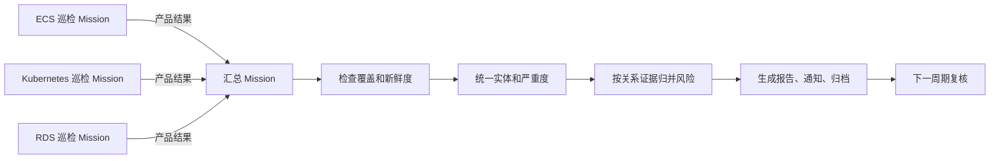

<div class="sls-starops-article-crumb">
  <a href="/doc/starops/starops.html">STAROps</a> <span class="sep">/</span> <span>主动巡检</span>
</div>

# 跨产品巡检汇总最佳实践

<div class="sls-starops-article-meta">
  <span>分类 · 主动巡检</span>
</div>

> 对话回放：[ECS 主机巡检](/playground/cross-product-inspection-summary-ecs-replay.html) ｜ [Kubernetes 集群巡检](/playground/cross-product-inspection-summary-k8s-replay.html) ｜ [RDS 数据库巡检](/playground/cross-product-inspection-summary-rds-replay.html) ｜ [跨产品汇总 Mission](/playground/cross-product-inspection-summary-summary-replay.html)

很多团队在进行云产品巡检时，通常先从单一产品开始，但随着云产品接入的越来越多，还会遇到后续问题：

- 本轮哪些产品已经完成巡检，哪些产品缺失、过期或只完成了一部分。
- 多份报告里的异常是否指向同一个资源、同一条业务链路或同一个责任范围。
- 某个产品报告正常时，是否可以代表整体环境正常。
- 多个产品同时告警时，应该通知几次，由谁统一复核。
- 上一周期未恢复的问题，在下一周期是否持续、恢复或扩大。

多产品融合巡检要处理的是这些值班判断。产品 Mission 继续保留各自的专业检查深度，汇总 Mission 在产品巡检之后读取结果，检查覆盖和时效，按实体关系归并风险，生成统一报告、通知和下一周期复核项。这样可以把分散报告组织成可复核、可扩展的 AgenticOps 运维机制。

本实践以 ECS、Kubernetes 和 RDS 为示例，适用于已经具备多个周期巡检任务，希望统一风险视图、减少重复通知并持续跟踪未恢复问题的 SRE、平台运维和云资源治理团队。

## 适用范围

| 场景 | 建议 |
|---|---|
| 已有多个产品巡检 Mission | 使用汇总 Mission 消费各产品结果，形成统一报告和通知。 |
| 产品巡检口径差异较大 | 保留产品 Mission 的独立检查逻辑，汇总层只处理检查结果。 |
| 报告命名或格式不一致 | 使用显式允许列表和报告适配器接入，记录来源、窗口和解析结果。 |
| 需要识别同一风险在多个产品中的表现 | 使用实体、时间窗口和 UModel 关系证据归并风险事件。 |
| 只有单产品巡检 | 继续使用单产品报告，暂不增加汇总层。 |
| 需要自动变更资源或配置 | 进入客户既有变更流程；本实践只读，不执行生产变更。 |

## 整体设计思路

跨产品巡检不建议把所有检查项塞进一个大型巡检任务。产品之间的数据形态、阈值、异常解释路径和修复建议差异明显。更稳妥的做法是让每个产品 Mission 产出可信事实，再由汇总 Mission 做覆盖检查、口径统一和关系归并。

| 过程 | 做法 | 结果 |
|---|---|---|
| 产品巡检 | 每个产品由独立 Mission 调用对应巡检 Skill。 | 保留产品级检查深度和专业结论。 |
| 结果交接 | 产品 Mission 输出稳定结果，兼容阶段可由适配器读取 Markdown 报告。 | 汇总层能知道结果来源、数据窗口、完成状态和异常实体。 |
| 覆盖检查 | 汇总 Mission 按允许列表检查产品结果是否齐全、新鲜、可解析。 | 缺失、过期、部分完成和契约不兼容不会被当作健康。 |
| 风险归并 | Agent 使用实体、时间窗口和 UModel 关系证据识别同一风险。 | 同一资源或同一链路上的异常合并为风险事件，证据不足时保持分列。 |
| 报告通知 | 汇总 Mission 输出统一报告、发送高风险通知并归档。 | 值班和运维团队获得一份可复核的跨产品视图。 |
| 周期复核 | 下一周期继续检查持续、恢复、新增风险和覆盖缺口。 | 巡检结果进入持续复核，而不是停留在一次性报告。 |

:::: details 查看汇总流程图



::::

首期产品数量较少时，ECS、Kubernetes 和 RDS 可以平铺运行，汇总 Mission 在约定截止时间之后执行。产品数量增加、周期不同或产品域需要独立管理时，可以增加分类汇总 Mission，再由总汇总 Mission 消费分类结果。

## 单产品巡检策略

每个产品 Mission 独立负责本产品的对象范围、取数口径、异常判断和产品级追因。产品 Mission 不需要理解其他产品的报告，也不需要承担跨产品归并。

产品 Mission 应输出以下内容：

- 巡检对象和数据范围。
- 运行批次、数据窗口、开始时间和完成时间。
- 运行状态、跳过范围、失败范围和数据新鲜度。
- 异常实体、严重度、事实证据、影响说明和建议动作。
- 原始报告、历史归档和支撑证据入口。

ECS Mission 可以检查主机资源、设备、挂载点和系统状态；Kubernetes Mission 可以检查集群、节点、工作负载、网络和存储；RDS Mission 可以检查数据库健康事件、慢 SQL、连接、空间和锁等待。汇总 Mission 消费这些结果，不重新实现产品检查项。

## 巡检结果交接策略

产品 Mission 与汇总 Mission 之间需要稳定的结果交接方式。首期可以兼容已有 Markdown 报告，长期建议收敛到统一 JSON 契约。

| 接入方式 | 使用场景 | 要求 |
|---|---|---|
| Markdown 报告兼容 | 已有产品巡检 Skill 只能生成可读报告。 | 通过允许列表定位产品 Mission，由适配器读取当日报告并提取固定语义。 |
| 统一 JSON 契约 | 新增产品或长期规模化运行。 | 产品 Mission 直接输出机器可读结果，汇总 Mission 先做契约校验再汇总。 |

适配器必须记录来源 Mission、原始报告、数据窗口、解析结果和失败原因。命名差异只能由适配器承接，不能让报告静默跳过。Markdown 和 HTML 只作为阅读与发布产物，不承担长期的跨 Mission 解析契约。

每份产品结果至少包含以下信息：

| 信息组 | 必要内容 | 汇总用途 |
|---|---|---|
| 来源 | 产品、Mission、Skill、运行批次、契约版本 | 确认生产方和解释口径。 |
| 范围 | 实体范围、地域、环境、数据窗口 | 判断本轮覆盖对象。 |
| 完成情况 | 开始时间、完成时间、运行状态、数据新鲜度 | 判断结果是否可用于本轮汇总。 |
| 摘要 | 总体状态、异常数量、最高严重度 | 支撑覆盖总览和风险排序。 |
| 异常 | 实体、严重度、事实证据、影响、建议、证据缺口 | 支撑产品明细和跨产品归并。 |
| 追溯 | 原始报告、历史归档、证据入口 | 支撑复核和后续调查。 |

统一 JSON 结果和汇总报告应使用可解析的稳定命名。文件名至少携带产物类型、产品或汇总范围、批次键和数据窗口。

```text
最新产品结果：inspection-result-<product>-latest.json
历史产品结果：inspection-result-<product>-<batch-key>-<window-start>-<window-end>.json
产品可读报告：inspection-report-<product>-<batch-key>-<window-start>-<window-end>.md
汇总报告：inspection-summary-<batch-key>-<window-start>-<window-end>.{json,md,html}
```

批次键由调度周期、数据窗口和运行身份共同确定。同一次重跑沿用同一批次键。汇总 Mission 必须校验结果内容中的产品、批次和窗口；三者不一致时拒绝纳入本轮汇总。

## 汇总 Mission 执行策略

汇总 Mission 消费各产品已经形成的结果，并整理成一份可判断、可追溯、可复核的跨产品报告。

汇总过程按以下顺序执行：

1. 按允许列表读取本轮应参与汇总的产品结果。
2. 检查运行批次、数据窗口、完成状态、新鲜度、覆盖范围和契约版本。
3. 统一产品名称、实体标识、严重度和证据表达。
4. 使用实体、依赖、挂载、调用、地域、业务链路等关系证据形成候选风险事件。
5. 输出覆盖情况、跨产品风险、产品明细、证据缺口、行动项和原始报告索引。
6. 发送通知并归档结果，把未恢复问题带入下一周期复核。

显式允许列表是正式汇总的入口。自动枚举可以用于发现新增报告，但不能让未知报告直接进入正式汇总。这样可以明确本轮预期覆盖哪些产品，也便于审计缺失和越权读取。

## 本轮结果可用性判断

汇总 Mission 先确认结果是否可用于本轮汇总，再进入风险解释。

| 检查项 | 判断方式 |
|---|---|
| 产品覆盖 | 允许列表中的产品是否都提交了结果。 |
| 时间窗口 | 结果是否属于本轮约定窗口。 |
| 完成状态 | 产品巡检是否完整结束，是否存在跳过或失败范围。 |
| 数据新鲜度 | 数据是否达到汇总要求，是否存在过期结果。 |
| 契约版本 | 必要字段是否齐全，契约版本是否兼容。 |
| 重复运行 | 同一产品和批次是否重复，重跑结果是否按幂等规则处理。 |
| 严重度映射 | 产品级严重度是否能映射到统一口径。 |

缺失、过期、部分完成、失败和契约不兼容都属于覆盖风险。汇总报告必须显示这些缺口，不能因为没有读到异常就输出全局健康结论。

## 跨产品风险归并策略

通过覆盖检查的异常进入 Agent 解释过程。Agent 先保留产品 Mission 给出的事实，再判断不同产品异常之间是否存在关系。

可用于归并的证据包括：

- 同一资源、节点、实例、设备、挂载点或持久卷。
- 同一业务链路、服务依赖、上下游调用或共享中间件。
- 时间窗口重叠，并且异常变化方向一致。
- 产品报告已经携带的 UModel 实体或关系。
- 汇总 Mission 按需查询到的 UModel 关系。

证据充分时，汇总 Mission 将多个产品异常整理为一个风险事件，并保留支持证据、反证、影响面和责任范围。证据不足时，异常保持产品级分列，并在报告中列出需要补充的指标、日志、调用、变更或实体关系。

UModel 在汇总层承担关系查询和影响面识别。产品 Mission 可以在各自巡检中使用 UModel 识别产品对象和资源关系；汇总 Mission 复用这些实体事实，并在需要时继续查询业务、服务、依赖、地域和负责人关系。

## 缺失与失败处理策略

产品 Mission 可以按各自数据准备时间错峰运行。汇总 Mission 使用明确截止时间和数据水位线，截止后按截止时可用结果生成本轮报告。

| 情况 | 处理方式 | 报告表达 |
|---|---|---|
| 产品结果缺失 | 截止前重试，截止后继续汇总可用结果。 | 标记未覆盖产品和缺失原因。 |
| 结果过期 | 不与本轮新结果混用。 | 标记最后成功时间和陈旧风险。 |
| 产品巡检部分失败 | 保留已完成项和失败范围。 | 同时展示有效证据和未检查范围。 |
| 契约不兼容 | 停止解析该结果。 | 标记生产方、契约版本和修复责任。 |
| 重复运行 | 使用同一批次键幂等生成。 | 更新本批次结果，保留运行记录。 |
| 通知失败 | 报告和归档保持成功状态，通知单独重试。 | 标记投递状态，不重复执行产品巡检。 |

## 汇总报告结构

统一报告不应只是把多份产品报告拼在一起。它需要帮助值班和运维团队回答本轮应做的判断。

| 问题 | 报告内容 |
|---|---|
| 本轮巡检是否完整 | 本轮应检、已检、缺失、过期、失败和部分完成范围。 |
| 当前最高风险是什么 | 最高严重度、风险数量、待处理问题和持续未恢复问题。 |
| 哪些异常属于同一风险 | 关联异常、关系证据、反证、影响面、责任范围和建议动作。 |
| 哪些问题仍然只在产品视角成立 | 各产品专业事实、原始报告入口和未归并原因。 |
| 哪些信息还不够 | 未覆盖对象、缺失关系、不完整窗口和不兼容结果。 |
| 下一步谁处理什么 | 负责人、建议动作、下一周期需要确认的变化。 |
| 如何回到原始证据 | 参与本轮汇总的产品报告、运行批次和归档入口。 |

没有足够关系证据时，跨产品风险事件可以为空，产品异常明细仍然有效。统一报告不追求把所有异常合并成一个结论。

## 通知和周期复核

产品 Mission 可以保留各自通知策略。汇总 Mission 负责面向值班视角发送高风险汇总通知，减少同一风险被多个产品重复触达。

下一周期运行时，汇总 Mission 按实体、风险类型、时间窗口和处理状态识别风险变化。

| 状态 | 判断方式 | 报告处理 |
|---|---|---|
| 持续风险 | 同一实体或关联实体继续命中同类风险。 | 保留风险事件，更新持续时间和最新证据。 |
| 已恢复风险 | 本轮覆盖完整，原异常实体未再命中对应风险。 | 标记恢复，并保留上一轮处置记录。 |
| 新增风险 | 当前窗口首次出现，或风险范围、严重度扩大。 | 标记新增，进入本轮行动项。 |
| 覆盖缺口 | 产品结果缺失、过期、部分完成或解析失败。 | 持续保留缺口，直到完整结果进入汇总。 |

## 升级调查条件

以下情况升级 InvestigationAgent：

- 多个产品异常时间接近，但现有关系无法判断是否同源。
- 产品报告结论冲突，需要扩大证据范围。
- 关键关系缺失，需要规划补充哪些指标、日志、调用或变更数据。
- 异常形态超出已有产品 Skill 和汇总规则。

InvestigationAgent 负责开放调查和补证规划，不替代产品巡检 Skill，也不绕过结果契约改写产品结论。调查仍不能闭合时，输出证据缺口和下一步动作。

## 部署验收

创建汇总 Mission 后，执行一次完整汇总，确认任务分工、结果交接、缺失处理、命名差异和证据不足等情况。

| 检查项 | 通过标准 |
|---|---|
| 产品结果读取 | 允许列表中的每个产品结果均可读取，来源、批次和时间窗口可追溯。 |
| 报告兼容 | 不同命名方式的报告可按产品来源和内容识别；无法解析的结果明确显示。 |
| 覆盖判断 | 汇总报告能够区分当前结果、过期结果、缺失结果和部分完成结果。 |
| 风险归并 | 具有共同实体或关系证据的异常能够归并；证据不足的异常保持产品级分列。 |
| 报告交付 | Markdown、HTML 或客户约定格式均可生成，并能回到对应产品的原始报告。 |
| 周期复核 | 后续周期能够识别持续、恢复、新增风险和覆盖缺口。 |
| 只读边界 | 运行过程不执行资源、应用或产品配置变更。 |

## 运行边界

本实践默认只读。汇总 Mission 读取巡检结果、查询 UModel 和观测数据、生成报告、通知和归档，不自动扩缩容、不修改阈值、不重启资源，也不执行产品配置变更。

跨 Mission 消费只能读取允许列表中的报告产物。报告进入通知和归档前，应清理账号、workspace、thread、Token、内部请求标识和其他敏感信息。

## 安装 Skill

本实践落地一份 Guide Skill，仅支持在 STAROps 运行时运行。汇总 Mission 依赖 STAROps workspace、产品 Mission 结果和 UModel 关系数据，本地 Agent 不支持独立运行。STAROps 数字员工下载 tar.gz 后在控制台「技能管理 → 上传技能」上传。汇总 Runtime Skill 仍处于待打包验证状态，待包、权限、Mission 运行和发布证据完成后再纳入生产。

| Skill | 作用 | STAROps 控制台 |
|---|---|---|
| `cross-product-inspection-summary-sop` | 引导 Skill：指导产品 Mission 设计、允许列表、汇总 Mission 配置、测试执行和验收。 | [cross-product-inspection-summary-sop.tar.gz](https://starops-demo.oss-cn-beijing.aliyuncs.com/starops/demo/starops-best-practice/cross-product-inspection-summary/docs/cross-product-inspection-summary-sop.tar.gz) |

## 相关入口

- [返回 STAROps 最佳实践首页](/starops/starops.html)
- [打开 STAROps Playground](/playground/staropsdemo.html)
- [进入 STAROps 控制台](https://starops.console.aliyun.com)
