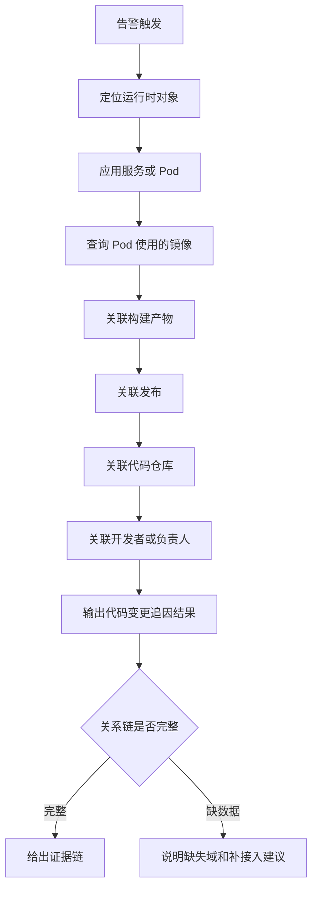

  <a href="/doc/starops/starops.html">STAROps</a>
  /
  协作闭环

# 使用 UModel 接入 DevOps 数据并追因到代码变更

> 对话回放：[查看对话回放内容演示](/playground/devops-code-to-runtime-replay.html)

告警诊断通常先定位到运行时对象，例如应用服务、接口、Pod、云资源或调用链。要继续判断哪次发布、哪个代码仓库、哪位负责人和本次异常相关，还需要把 DevOps 域数据纳入运行时上下文。

本文介绍如何通过 UModel 接入 DevOps 数据，将代码仓库、发布、构建产物、容器镜像、Pull Request 和开发者等对象建模为可追因关系，让 STAROps 能从告警和运行时对象沿链回到代码变更。

DevOps 是外部工程域的代表场景。客户的 Git 平台、制品库、CI/CD、项目管理系统和组织流程各不相同，不适合统一内置到 STAROps 运行时域。推荐做法是保留 STAROps 已有运行时观测能力，通过参考实现把客户侧 DevOps 数据接入 UModel，再由 STAROps Agent 沿 UModel 关系链组织证据。

## 适用范围

本实践适用于以下场景：

- 已能通过 STAROps、ARMS/APM、K8s 或云资源数据定位运行时异常对象。
- 希望从告警追到服务、Pod、镜像、构建产物、发布、代码仓库和开发者。
- 使用 GitLab、Codeup、ACR 等系统，希望将代码域和制品域数据接入 UModel。
- 需要把客户自有工程系统沉淀成长期可复用的追因上下文。

本实践不适用于以下场景：

- 只需要一次性查询 MR、pipeline、job log 或 issue 等研发上下文。此类按需补证更适合通过 MCP 接入。
- 期望自动生成 commit 级完整追溯。当前主线是 release 级追因，commit 级采集属于扩展方向。
- 期望所有 DevOps 对象都已具备真实数据采集。参考模型包含 17 个 EntitySet 和 36 个 EntitySetLink，其中部分实体为 schema-only。

## 追因范围和当前覆盖

本实践将 DevOps 数据分成三层事实面。

| 层 | 含义 | 用途 |
|---|---|---|
| 核心追因链 | 应用服务、Pod、镜像、构建产物、发布、代码仓库、开发者 | 支撑告警到代码变更的主链路 |
| 参考模型 | 17 个 EntitySet 和 36 个 EntitySetLink | 定义完整 DevOps 域建模框架 |
| 当前采集范围 | 已有采集程序支持的实体和已确认的追因路径 | 决定当前可实际采集和追因的范围 |

核心追因链是官方文档和诊断体验的主线。参考模型用于说明 DevOps 域如何完整进入 UModel。当前采集范围用于说明哪些对象已经具备真实采集能力，哪些对象仍需要客户补充数据源 adapter。

## 建模范围

UModel 已经覆盖运行时域和可观测域，例如应用服务、Pod、云资源、指标、日志和调用链。本实践只补运行时追因缺失的 DevOps 域，不重复建模已有运行时对象。

| 建模层 | 对象 | 来源 | 当前状态 |
|---|---|---|---|
| 运行时域 | 应用服务、Pod、Deployment、云资源 | STAROps 既有 UModel、ARMS/APM、K8s、CMS workspace | 已有能力 |
| 核心 DevOps 链 | 开发者、代码仓库、发布、Pull Request、构建产物、容器镜像 | GitLab、Codeup、ACR | 参考实现已有采集程序 |
| 扩展 DevOps 模型 | 组织、项目、工作项、里程碑、流水线、流水线运行、Helm Chart、二进制包、NPM 包、单测用例、部署记录 | Jira、CI、appstack、制品库、组织系统等 | schema-only，待 adapter |
| 跨域关系 | 服务、Pod、镜像、构建产物、发布、仓库、开发者之间的追因路径 | UModel 关系 | 核心链路优先验证 |

参考实现 `aliyun-sls/umodel-devops-reference` 已提供 17 个 EntitySet 和 36 个 EntitySetLink。36 条关系由 29 条 DevOps 设计关系和 7 条跨域关系组成，跨域关系连接到 APM 服务和 K8s 工作负载。

其中，当前已有采集程序支持的对象包括用户、代码仓库、发布、Pull Request、构建产物和容器镜像。其余扩展对象用于定义完整 DevOps 模型，需要客户根据自己的 Jira、CI、部署系统、制品库或组织系统补充 adapter 后再进入生产追因。

## 运行闭环

:::: details 运行闭环流程

::::

落地过程分为两类动作。

| 动作 | 说明 | 产物 |
|---|---|---|
| 建模落地 | 选择 Git provider，接入代码域和制品域，建立跨域关系，按阶段检查数据完整性 | UModel 实体、关系和检查记录 |
| 运行时追因 | 告警触发后，STAROps Agent 沿 UModel 关系链查询镜像、发布、仓库和责任人 | 代码变更追因结果 |

Guide Skill 用于指导接入、配置和验证。运行时诊断消费 UModel 关系链。验证 Skill 用于分阶段检查数据完整性，不代表长期运行的 STAROps Runtime Skill。

## 数据前提

开始接入前，需要确认以下数据和权限。

| 项 | 要求 |
|---|---|
| STAROps workspace | 已创建可写入实体和关系数据的 workspace |
| 运行时数据 | workspace 中已有应用服务、Pod、K8s 或云资源等运行时对象 |
| Git provider | 可读取目标代码仓库、发布、成员和 Pull Request |
| 镜像仓库 | 可读取容器镜像、镜像 tag 和镜像元数据 |
| 跨域映射 | 能建立仓库、发布、镜像和运行时对象之间的关联规则 |
| 权限边界 | 只读采集优先，生产变更不在本实践范围内 |

如果客户希望把工作项、流水线、部署记录或组织结构纳入追因链，需要额外准备对应系统的数据源和 adapter。

## 接入流程

### 1. 明确追因对象

先确定告警后需要追到哪些对象。最小可用链路包括：

服务 / Pod → 镜像 → 构建产物 → 发布 → 代码仓库 → 开发者或负责人。

如果客户还需要追到工作项、流水线、部署记录或审批信息，应将这些对象作为扩展模型处理，并单独验证数据来源。

### 2. 接入代码域

代码域接入 Git provider。当前参考实现覆盖 GitLab 和 Codeup。接入后应能获得代码仓库、开发者、发布和 Pull Request 等对象。

不同 Git provider 的认证方式、可见仓库范围和 API 返回字段可能不同。参考实现通过 adapter 屏蔽平台差异，将结果写入统一 UModel 结构。客户切换 Git provider 时，应优先保持 UModel 对象和关系语义稳定。

### 3. 接入制品域

制品域接入容器镜像仓库。当前参考实现以 ACR 为主要来源，采集镜像、镜像 tag 和构建产物信息。

发布与镜像的关联应来自真实版本规则或显式映射。不同团队的仓库名、release tag 和 image tag 命名方式不一定一致，不能依赖自然语言推断自动拼接关系。

### 4. 建立跨域关系

跨域关系应优先覆盖核心追因链。

| 关系方向 | 说明 |
|---|---|
| 代码仓库 → 发布 | 识别发布来自哪个仓库 |
| 发布 → 构建产物 / 镜像 | 识别发布产生或关联的制品 |
| Pod → 镜像 | 识别运行时对象使用的镜像 |
| 开发者 / 负责人 → 仓库 | 识别仓库或发布责任归属 |
| 应用服务 / Pod → DevOps 对象 | 支撑告警从运行时域回到 DevOps 域 |

关系必须由真实数据或明确配置产生。缺少映射时，应在验证结果和追因输出中说明缺口。

### 5. 执行分阶段验证

数据接入后，需要按阶段验证，不应只用一次查询结果判断全链路可用。

| 阶段 | 验证目标 |
|---|---|
| 资源准备 | Git provider、镜像仓库、workspace、运行时数据可访问 |
| workspace 对齐 | 实体和关系写入目标 workspace |
| 数据刷新 | 当前已有采集程序支持的实体和关系刷新成功 |
| 可见性检查 | CMS workspace 中能看到 DevOps 域实体 |
| 字段检查 | 关键字段值符合目标平台和映射规则 |
| 失败诊断 | 写入失败、不可见或字段异常时定位 workspace、权限或数据源问题 |

## 追因结果包含什么

代码变更追因结果应包含以下内容：

| 模块 | 内容 |
|---|---|
| 运行时对象 | 告警关联的应用服务、Pod、资源或接口 |
| 制品证据 | Pod 使用的镜像、镜像 tag、构建产物 |
| 发布证据 | 发布版本、发布时间、发布来源 |
| 代码证据 | 代码仓库、分支或 Pull Request |
| 责任归属 | 开发者、仓库负责人或发布负责人 |
| 证据缺口 | 缺失的数据源、关系、字段或权限 |
| 后续建议 | 需要补接入的 adapter、映射或验证步骤 |

当关系链完整时，STAROps 可以给出从告警到代码变更的证据链。当关系链不完整时，输出应明确缺失哪一段关系，不能把缺数据解释成没有风险。

## 当前可追因范围

参考实现中，发布版本镜像已具备从运行时对象追到代码仓库和负责人的路径。客户验收时应从运行时对象出发，沿 UModel 关系逐段检查实体可见、关系可遍历，并确认关系缺失时能够说明原因。

| 验证对象 | 链路读法 | 通过标准 |
|---|---|---|
| 发布版本镜像 | Pod → 镜像 → 构建产物 → 发布 → 代码仓库 → 负责人 | 能给出每一段关系证据，最终闭环到仓库和负责人 |
| 测试或构建 tag 镜像 | Pod → 镜像 → 构建产物，缺少发布记录时停在发布前 | 明确说明缺少对应 release，不把测试 tag 硬连到某个发布版本 |
| 参考模型扩展对象 | 工作项、流水线、部署记录、组织结构等对象进入 schema | 只有补齐采集程序并完成验证后，才能进入生产追因结论 |

当前可用路径覆盖以下关键关系：

- Pod 使用的镜像可以和 DevOps 域镜像对象对齐。
- 镜像可以关联到构建产物。
- 构建产物可以关联到发布版本。
- 发布版本可以关联到代码仓库。
- 代码仓库可以关联到负责人。

生产使用时，应优先选择发布版本镜像作为端到端验收样本。对于测试 tag、分支 tag 或临时构建镜像，如果客户没有在发布系统中生成对应 release，STAROps 应把结果停在构建产物或发布缺口处，并提示补齐发布记录或映射规则。

## Guide Skill 与验证 Skill

本实践包含 1 个 Guide Skill 和 6 个分阶段验证 Skill。Guide Skill 用于指导 DevOps 数据接入、配置和验证；验证 Skill 用于按阶段检查数据完整性和 workspace 可见性。

| Skill | 定位 | 用途 | 本地 Agent | STAROps 控制台 |
|---|---|---|---|---|
| `devops-code-to-runtime-sop` | Guide Skill | 引导用户理解参考模型、准备数据源、接入代码域和制品域、建立跨域关系并完成端到端验证 | 不支持（诊断流程依赖 STAROps 运行时工具与 workspace 数据） | [devops-code-to-runtime-sop.tar.gz](https://starops-demo.oss-cn-beijing.aliyuncs.com/starops/demo/starops-best-practice/devops-code-to-runtime/docs/devops-code-to-runtime-sop.tar.gz) |
| `verification-resource-readiness` | 验证 Skill | 检查 Git provider、镜像仓库、workspace 和运行时数据是否可访问 | `npx skills add aliyun-sls/sls-doc-skills --skill verification-resource-readiness` | 不适用 |
| `verification-workspace-alignment` | 验证 Skill | 确认配置指向目标 workspace 和对应数据写入面 | `npx skills add aliyun-sls/sls-doc-skills --skill verification-workspace-alignment` | 不适用 |
| `verification-workspace-refresh` | 验证 Skill | 执行真实刷新路径，记录实体和关系写入结果 | `npx skills add aliyun-sls/sls-doc-skills --skill verification-workspace-refresh` | 不适用 |
| `verification-cms-visibility` | 验证 Skill | 检查 DevOps 域实体在 CMS workspace 中是否可见 | `npx skills add aliyun-sls/sls-doc-skills --skill verification-cms-visibility` | 不适用 |
| `verification-cms-field-check` | 验证 Skill | 检查关键字段、provider 差异和映射结果 | `npx skills add aliyun-sls/sls-doc-skills --skill verification-cms-field-check` | 不适用 |
| `verification-cms-sls-diagnose` | 验证 Skill | 在刷新或可见性异常时定位 workspace、权限或数据源问题 | `npx skills add aliyun-sls/sls-doc-skills --skill verification-cms-sls-diagnose` | 不适用 |

验证 Skill 用于分阶段检查数据完整性，不声明可配置给数字员工长期运行的 Runtime Skill 能力。

## 实践验收

### 当前核心链路

完成接入后，应至少满足以下标准：

1. Git provider 认证接入成功，代码仓库、发布、开发者和 Pull Request 等核心对象可采集。
2. 镜像仓库数据可采集，镜像与发布或构建产物之间能建立真实关联。
3. workspace 中能看到当前已有采集程序支持的 DevOps 实体，关键字段正确。
4. 给定运行时对象，STAROps 能沿服务 / Pod / 镜像 / 构建产物 / 发布 / 仓库 / 开发者链路输出追因证据。
5. 发布版本镜像可以闭环到代码仓库和负责人。
6. 测试 tag、分支 tag 或临时构建镜像缺少 release 记录时，输出明确提示缺失项。
7. 镜像与发布的匹配使用明确版本规则或映射关系，不依赖松散名称拼接。
8. 采集和验证过程不依赖通用 mock 数据。

### 扩展模型

如果客户要使用 17/36 完整参考模型，还应满足以下标准：

1. 17 个 EntitySet 和 36 个 EntitySetLink 已上传到目标 workspace。
2. 已有采集程序支持的 6 个实体完成数据刷新、可见性检查和字段检查。
3. 11 个 schema-only 实体在文档和检查记录中标注为待 adapter。
4. 29 条 DevOps 设计关系和 7 条跨域关系按当前采集范围分层验证。
5. Jenkins、GitHub Actions、Argo、Tekton、工作项、部署记录和 commit 级采集等能力未接入前，不写成已验证能力。

## 边界与降级

- 当前主线是 release 级追因，commit 级追溯需要额外扩展。
- schema-only 实体只能说明参考模型已有结构，不能说明生产数据已采集。
- Git provider 的可见仓库范围取决于客户提供的认证和权限。
- 镜像与发布的关联必须来自真实版本规则或显式映射。
- DevOps 实体和关系需要持续刷新。数据过期、映射缺失或权限不足时，追因链路可能在中间节点停止。
- 同一镜像仓库存在多个访问端点或别名时，应在接入阶段完成归一化，避免 Pod 侧镜像和制品侧镜像无法对齐。
- 测试 tag、分支 tag 或临时构建镜像没有对应 release 记录时，应输出发布缺口，不应推断为某个正式发布。
- 工作项、流水线、部署记录、组织结构等扩展对象需要对应数据源 adapter。
- 如果 workspace 中缺少运行时对象、镜像数据或 DevOps 关系，STAROps 应输出证据缺口和补接入建议。

## 临时补证和长期建模怎么选

GitLab MCP 适合在一次诊断中按需读取 MR、pipeline、job log 或 issue 等研发上下文。DevOps UModel 建模适合把长期复用的代码、发布、镜像和责任关系沉淀成运行时可追因上下文。

如果某类研发信息只是偶尔补证，可以先通过 MCP 接入。如果它会被多个告警、巡检或长期任务反复使用，应评估进入 UModel 建模。

## 相关入口

- [返回 STAROps 最佳实践首页](/starops/starops.html)
- [打开 STAROps Playground](/playground/devops-code-to-runtime-replay.html)
- [进入 STAROps 控制台](https://starops.console.aliyun.com)
- [DevOps UModel 参考实现](https://github.com/aliyun-sls/umodel-devops-reference)
