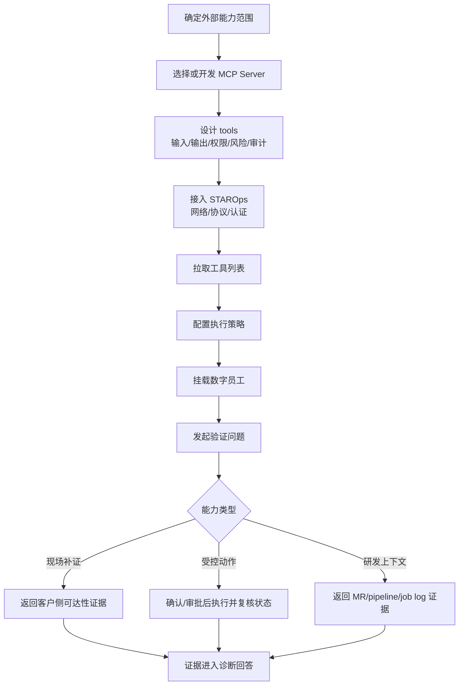

  <a href="/doc/starops/starops.html">STAROps</a> / 经验固化

# MCP 能力扩展与工具治理

  分类 · 经验固化

> [查看对话回放内容演示](/playground/mcp-integration-replay.html)

STAROps 通过指标、日志、APM、Trace、Events 和 UModel 组织运行时证据。生产排障中还有一类能力来自客户侧外部系统，例如客户网络位置的主动探测、Kubernetes 操作面、GitLab 变更上下文、CMDB、工单、审批和内部发布平台。这些能力不是单纯的数据查询，通常涉及客户侧执行位置、操作权限、组织流程或动作后验证，不宜全部内置到 STAROps 核心。

MCP 提供外部能力接入边界。客户将外部系统能力封装为 MCP tools 后，STAROps 负责意图理解、工具选择、证据组织和诊断输出。本文通过三类 MCP 集成说明 STAROps 外部能力扩展方式：通过现场补证 MCP 获取客户侧主动探测结果，通过 K8s MCP 接入受控操作面，通过 GitLab MCP 补充研发流程上下文。三类集成也沉淀了客户自研 MCP 的设计方法：tool 按运维动作设计，权限和风险显式分层，输出能够进入 STAROps 证据链。

## 适用场景

| 场景 | 典型对象 | 扩展目标 |
|---|---|---|
| 私有系统查询 | CMDB、工单、堡垒机、内部发布平台、私有 GitLab | 让数字员工按需获取客户侧事实 |
| 现场主动补证 | DNS、TCP、HTTP、TLS、客户侧探测点 | 从客户网络位置发起可达性探测 |
| 受控运维动作 | K8s 扩缩容、rollout、重启、配置更新、回滚确认 | 把生产动作纳入权限、确认、审计和动作后验证 |
| 研发流程上下文 | MR、commit、pipeline、job log、issue、代码搜索 | 将变更证据补入诊断链路 |
| 组织流程接入 | 审批、变更单、发布窗口、工单回写 | 让 AgenticOps 流程进入客户既有运营制度 |

MCP 接入用于当前会话需要按需补证、客户系统差异较大、或动作权限必须留在客户环境内的场景。基础观测数据仍应优先使用 STAROps 既有能力，包括指标、日志、APM、Trace 和 UModel。需要长期复用的实体、关系、拓扑和追因链，应评估沉淀到 UModel，而非长期依赖一次性 MCP 查询。

## 能力归属

接入 MCP 前，需要判断外部能力应归属哪一层。归属判断会影响 tool 粒度、权限配置和验证标准。

| 判断项 | 处理路径 |
|---|---|
| 已有指标、日志、Trace 或 APM 能覆盖 | 使用 STAROps 既有观测和 UModel 能力 |
| 需要长期复用的实体关系 | 进入 UModel 建模 |
| 观测数据已有异常信号，但需要主动探测或外部流程查询 | 通过 MCP tool 按需执行 |
| 涉及生产变更 | 通过 MCP tool 暴露受控动作，并配置确认、审批、审计和动作后验证 |
| 涉及客户私有流程 | 由客户侧封装 MCP Server，保留本地权限和流程控制 |

阿里云场景下，优先检查阿里云官方 MCP、OpenAPI MCP Server 或产品线 MCP 是否已经覆盖目标能力。客户私有系统、内部流程、特殊探测点和私有代码平台，再由客户侧自研或二次封装。

## 数据前提

MCP 集成不是替代观测数据。外部 tools 进入 STAROps 前，需要先确认运行时证据、外部系统访问和权限边界都具备基础条件。

| 前提 | 要求 | 用途 |
|---|---|---|
| STAROps 运行时数据 | 指标、日志、APM、Trace、UModel 实体和关系已可用于诊断 | 作为主诊断链和外部证据的关联对象 |
| MCP Server 可达性 | 端点、协议、认证方式、网络路径已确认 | 支撑工具发现和调用 |
| tool 描述 | 每个 tool 具备用途、输入、输出、权限、风险和错误语义 | 让数字员工正确选择工具 |
| 权限模型 | 查询、分析、变更和高风险动作分权控制 | 防止外部系统被过度暴露 |
| 审计与脱敏 | 调用人、目标、参数摘要和结果可追踪；凭证和敏感数据不回显 | 支撑生产审计和对外发布 |
| 动作后验证 | 变更类 tool 配套状态、事件、日志或回滚条件检查 | 形成操作闭环 |

如果 MCP tool 返回的是原始日志、大段命令输出、明文凭证或未结构化异常文本，STAROps 难以稳定综合结论。生产接入前应将输出收敛为结构化证据、错误摘要、影响对象和后续处理动作。

## 落地形态

STAROps MCP 扩展采用数字员工 + MCP Server + tool 执行策略的组合。

| 组成 | 职责 |
|---|---|
| 数字员工 | 理解用户意图，选择 MCP tools，合并外部证据并输出诊断结论 |
| MCP Server | 封装客户外部系统能力，声明 tool 输入、输出、权限、风险和审计语义 |
| 外部系统 | 保留真实资源状态、账号权限、系统侧审计和组织流程 |
| 执行策略 | 对查询、分析、变更、高风险动作设置自动、谨慎、询问或审批策略 |
| Guide Skill | 固化 MCP 评估、接入、验证、上线检查和失败降级流程 |

客户自研 MCP Server 时，不应直接暴露底层 API、通用 shell、通用 YAML apply 或无限制扫描能力。tool 应表达明确的运维动作，例如 `tcp_connect`、`pods_log`、`get_job_log`。变更类能力需要配套确认、审计、动作后验证和回滚条件。

## 部署与配置流程

MCP 能力进入 STAROps 前，需要先在客户环境完成 MCP Server 部署，再在 STAROps 控制台完成服务接入、工具发现、策略配置和数字员工验证。以下流程适用于官方 MCP、产品线 MCP、第三方 MCP 和客户自研 MCP。

### 1. 确认能力归属

先判断目标能力属于观测数据、长期关系、按需补证、受控动作还是组织流程。指标、日志、APM、Trace、Events 和已有 UModel 关系继续走 STAROps 主诊断链；代码仓库、发布、镜像、Pod、负责人等长期关系优先进入 UModel；客户侧探测、K8s 操作面、研发流程查询和内部审批流程通过 MCP 暴露为 tools。

### 2. 部署 MCP Server

MCP Server 应部署在能够访问目标外部系统的位置。公网可访问的 MCP Server 可使用直连方式；私有系统、K8s 集群、GitLab、CMDB、工单系统和内部发布平台应优先部署在客户网络或 VPC 内，并通过受控网络路径接入 STAROps。

部署前至少确认以下信息：

| 配置项 | 要求 |
|---|---|
| 网络位置 | 能访问目标外部系统，且 STAROps 能访问 MCP Server |
| 协议 | 优先使用 HTTP MCP endpoint；需要兼容历史实现时再评估 SSE |
| 认证 | 使用 Bearer Token、用户级 OAuth 或客户侧统一身份认证 |
| 权限 | MCP Server 使用最小权限访问外部系统 |
| 日志 | 记录 tool 名称、目标对象、参数摘要、调用结果和错误摘要 |

### 3. 设计 tool 边界

每个 tool 都要先写清用途、输入、输出、权限、风险和失败语义。查询类 tool 可以返回状态、日志、事件、MR、pipeline 或 job log；变更类 tool 必须说明确认要求、审计字段、动作后验证方式和回滚条件；高风险 tool 默认不开放。

推荐将 tool 设计成运维动作：

| 场景 | 推荐 tool 粒度 | 不推荐形态 |
|---|---|---|
| 可达性补证 | `dns_resolve`、`tcp_connect`、`http_probe`、`tls_handshake` | 任意扫描参数、漏洞扫描套件 |
| K8s 只读诊断 | `pods_log`、`events_list`、`resources_get` | 通用命令执行入口 |
| K8s 受控动作 | `resources_scale`、`rollout_status`、`helm_install` | 通用 YAML apply、通用 delete |
| GitLab 上下文 | `list_merge_requests`、`list_commits`、`get_job_log` | 直接暴露底层 API passthrough |

### 4. 接入 STAROps

在 STAROps 中添加 MCP 服务时，需要填写服务名称、访问端点、传输协议和认证方式。服务名称应能表达外部系统或能力域，避免多个 MCP Server 的 tools 在数字员工侧难以区分。访问端点应与 MCP Server 暴露的协议一致；认证凭证不应写入文档、Prompt 或公开配置文件。

接入后执行工具发现，确认 `tools/list` 返回的工具名称、描述、输入和输出符合预期。如果工具描述只包含底层接口名、缺少风险说明或输出不稳定，应先修改 MCP Server，再进入数字员工验证。

### 5. 配置执行策略

STAROps 应按 tool 风险配置执行策略，而不是按 MCP Server 统一放开。

| tool 类型 | 策略 |
|---|---|
| 查询类 | 自动执行或谨慎执行 |
| 分析类 | 谨慎执行，结果进入证据链 |
| 变更类 | 每次询问或审批后执行 |
| 高风险类 | 默认关闭，确需启用时单独审批 |

同一个 MCP Server 内可以同时存在多类 tools。例如 GitLab MCP 的 commit、MR、pipeline、job log 查询可以自动执行；触发 pipeline、合并 MR、创建 issue 等写操作应默认隐藏或进入确认。K8s MCP 的 Pod 查询和日志查看可进入诊断链；扩缩容、配置更新、安装组件需要确认；删除资源、执行命令、运行临时 Pod 默认关闭。

### 6. 挂载数字员工并验证

将 MCP tools 挂载到目标数字员工后，应使用新会话完成验证。验证问题要覆盖工具发现、正确选择、结果综合、失败降级和策略拦截。验证通过后，数字员工才能在 RCA、巡检、容量分析、变更追因或长期 Mission 中使用该 MCP 能力。

建议至少验证以下问题：

| 能力 | 验证问题 |
|---|---|
| K8s 只读诊断 | 查询指定 namespace 的 Pod 列表、Pod 日志或事件 |
| K8s 受控动作 | 对测试工作负载执行扩缩容，并验证新状态 |
| K8s 高风险拦截 | 尝试删除测试 Pod，确认触发确认、审批或权限拒绝 |
| GitLab 上下文 | 查询当前用户、项目 MR、commit、pipeline 和 job log |
| 失败降级 | 使用无权限对象或不存在对象，确认数字员工说明证据缺口 |

## 集成流程总览

三类 MCP 集成共用同一条落地流程：先确定能力归属，再设计 tools 和策略，最后在 STAROps 中验证工具发现、调用、综合和降级。

:::: details 查看执行流程图

::::

该流程验证的是 MCP 能否成为 STAROps 的外部能力扩展面，而不是单个工具是否能独立运行。工具独立运行成功，只说明 MCP Server 可用；数字员工能够选择工具、解释结果、处理失败并保持权限边界，才说明该能力已经进入 STAROps 诊断链路。

## 三类能力验证

MCP 集成验证应先明确能力范围、启用边界和通过标准。本文以现场补证、受控动作和研发上下文三类能力为例，说明外部 MCP Server 接入 STAROps 后，需要验证哪些能力允许被数字员工调用，哪些能力必须关闭或进入确认流程，以及工具结果如何进入诊断证据链。

| 能力边界 | MCP 对象 | STAROps 扩展的能力 | MCP 开发要点 | 通过标准 |
|---|---|---|---|---|
| 现场补证 | 受限版 `reachability-mcp` | 从客户侧位置验证 DNS、TCP、HTTP、TLS 和服务入口可达性 | 只保留可达性 probe；限制目标和端口；关闭 fuzz、漏洞扫描、爆破、抓包、提权和数据提取 | 能返回结构化可达性证据；目标、端口和结果均可审计且已脱敏 |
| 受控动作 | `containers/kubernetes-mcp-server` | 查询 K8s 实时状态，并接入扩缩容、配置更新、Helm 安装等受控动作 | 区分只读、变更和高风险 tools；启用 RBAC、审计、确认和动作后验证；默认关闭删除、执行命令和通用 apply | 只读查询可进入诊断链；变更动作触发确认或审批；动作后能复核资源状态、事件和日志 |
| 研发上下文 | `yoda-digital/mcp-gitlab-server` | 查询代码、commit、MR、issue、pipeline 和 job log，补充变更证据 | 团队共享部署使用用户级授权；优先启用 read-only；写 tools 默认不可见或需单独确认 | 研发证据能按需进入诊断链；写操作不会绕过确认和权限控制 |

三类集成共同体现 MCP 的能力扩展边界：外部系统负责真实资源和权限，MCP Server 负责把能力封装成结构化 tools，STAROps 负责意图理解、工具选择、证据组织和诊断输出。现场补证类 MCP 不承载安全测试流程；K8s 类 MCP 只补操作面能力，工作负载、Pod、Service、Deployment、事件和资源关系仍优先由 UModel、指标、日志和 APM 支撑；GitLab 类 MCP 用于当前会话补充变更证据，需要长期跨场景追因的代码、发布、镜像、Pod 和开发者关系应进入 UModel 建模。

## MCP 开发准则

MCP Server 的 tool 设计直接决定 STAROps 是否能稳定使用外部能力。tool 应围绕运维动作设计，而不是围绕底层接口或命令设计。

| 设计点 | 要求 | 推荐形态 |
|---|---|---|
| 动作命名 | 名称表达运维动作，不表达底层接口 | `tcp_connect`、`pods_log`、`get_job_log` |
| 输入收敛 | 参数限定目标、时间、范围和身份 | 白名单域名、namespace、project、time range |
| 输出稳定 | 返回状态、证据、错误摘要和后续处理动作 | 结构化结果供 STAROps 综合 |
| 权限清楚 | tool 描述里说明所需权限和不可执行范围 | 只读、变更、危险动作分层 |
| 审计可追踪 | 记录调用人、数字员工、目标、参数摘要和结果 | 不记录 Token、Secret 和明文凭证 |
| 动作后验证 | 变更类 tool 必须配套验证 tool | 执行后检查资源状态、事件、日志和回滚条件 |

执行策略应按风险分层配置：

| 风险层 | 典型能力 | STAROps 执行策略 |
|---|---|---|
| 查询类 | 查询配置、状态、日志、事件、MR、pipeline、job log | 可自动或谨慎自动执行 |
| 分析类 | 结构化探测、聚合查询、健康检查、差异比对 | 可谨慎自动执行，结果进入证据链 |
| 变更类 | 扩缩容、rollout、重启、配置更新、触发 pipeline | 每次询问或审批后执行 |
| 高风险类 | 删除资源、执行命令、抓包、漏洞扫描、批量变更 | 默认关闭；确需启用时进入单独审批和回滚闭环 |

## 验证方式

每个 MCP Server 接入后，都要在 STAROps 中完成一次可复现验证。验证不只看连接成功，还要看数字员工能否正确选择工具、解释工具结果，并在失败时说明缺口。

接入验证按以下顺序执行：

1. 准备 MCP Server，并确认网络、协议和认证方式。
2. 在 STAROps 中接入 MCP Server，拉取 tools 列表。
3. 按 tool 风险配置执行策略。
4. 将 tools 挂载给目标数字员工。
5. 在新会话中发起验证问题，覆盖查询、分析、失败和高风险动作拦截。
6. 检查工具调用卡片、输入参数、输出摘要和最终回答。
7. 将验证证据写入 `verification.md`，并标注未验证范围。

通过标准：

| 观察项 | 通过标准 |
|---|---|
| 工具发现 | `tools/list` 返回非空，描述包含用途、输入、输出和风险 |
| 工具选择 | 数字员工能在合适场景选择正确 tool |
| 结果综合 | 回答引用工具证据，不直接堆原始返回 |
| 策略生效 | 查询类可执行，变更类触发确认，高风险类被拦截或进入审批 |
| 失败降级 | 工具不可达、无权限、空结果时明确说明证据缺口 |
| 脱敏合规 | Token、Secret、私有路径、账号和敏感业务数据不进入公开输出 |
| 动作后验证 | 变更后有状态、事件、日志或回滚条件检查 |

## 实施边界

- MCP tools 进入生产数字员工前，必须完成能力归属、权限范围、风险策略、审计链路、输出结构、脱敏规则、回滚准备和证据记录检查。
- MCP 只用于接入主动探测、受控动作和外部流程上下文，不替代 STAROps 既有指标、日志、APM、Trace、Events 和 UModel 主诊断链路。
- 查询类和分析类 tools 按策略自动执行；变更类 tools 必须进入确认或审批流程；高风险 tools 默认关闭。
- 涉及 Token、Secret、私有路径、账号、IP、业务数据等敏感信息时，公开文档和诊断报告只展示脱敏摘要。
- 未完成 STAROps 控制台接入、工具调用和结果综合验证的 MCP Server，只能作为待验证对象，不应写成已上线能力。

完成 MCP 能力接入后，STAROps 应能在同一条 AgenticOps 流程里组织运行时证据、现场证据、操作面证据和变更证据，同时保留客户系统的权限、审计和生产责任边界。

## 安装 Skill

本实践落地一份 Guide Skill，固化 MCP 评估、接入、验证、上线检查和失败降级流程。安装方式任选其一：本地 Agent 走 [`npx skills`](https://www.npmjs.com/package/skills)，STAROps 数字员工下载 tar.gz 后在控制台「技能管理 → 上传技能」上传。

| Skill | 作用 | 本地 Agent（npx） | STAROps 控制台（tar.gz） |
|---|---|---|---|
| `mcp-integration-sop` | 引导 Skill：教 Agent 按 6 步 SOP 协助用户完成外部 MCP 能力归属判断、MCP Server 部署、tool 边界设计、STAROps 接入、执行策略配置和数字员工验证。 | `npx skills add aliyun-sls/sls-doc-skills --skill mcp-integration-sop` | [mcp-integration-sop.tar.gz](https://starops-demo.oss-cn-beijing.aliyuncs.com/starops/demo/starops-best-practice/mcp-integration/docs/mcp-integration-sop.tar.gz) |

## 相关入口

- [返回 STAROps 最佳实践首页](/starops/starops.html)
- [打开 STAROps Playground](/playground/staropsdemo.html)
- [进入 STAROps 控制台](https://starops.console.aliyun.com)
