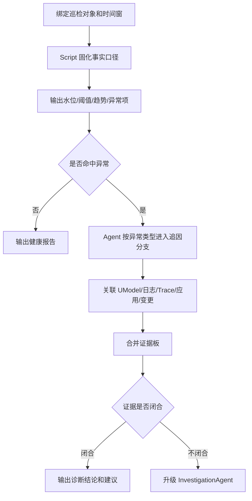

<div class="sls-starops-article-crumb">
  <a href="/doc/starops/starops.html">STAROps</a> <span class="sep">/</span> <span>主动巡检</span>
</div>

# RDS 脚本巡检与动态追因

<div class="sls-starops-article-meta">
  <span>分类 · 主动巡检</span>
</div>

> [查看对话回放内容演示](/playground/rds-inspection-via-script-replay.html)

在 STAROps 中，周期性巡检用于对云资源、应用依赖和关键业务对象进行定期健康检查。一次有效巡检应输出当前水位、异常项、长周期趋势、证据来源和后续调查方向，帮助运维团队提前发现容量、性能、安全和稳定性风险。

巡检的直接收益包括：

- 统一巡检口径，避免不同人员或不同 Agent 使用不同指标、时间窗和聚合方式。
- 减少重复人工取数，把水位、阈值、趋势和基础异常判断交给固定流程执行。
- 保留可审计证据，便于追溯一次巡检使用的数据源、查询口径和判断规则。
- 在发现异常后提供追因入口，继续判断异常来源、影响范围、反证和证据缺口。

要获得这些收益，巡检流程需要同时满足稳定性和追因能力。CPU、IOPS、磁盘、连接数、慢 SQL、错误日志等指标，需要固定时间窗、聚合方式、阈值、趋势算法和输出结构。同一个巡检对象在同一个输入下，应得到可复核、可审计、可对比的结果。异常出现后，流程还需要继续判断原因、责任对象、影响应用、关联 SQL、发布、配置或业务活动，并给出下一步调查方向。

纯脚本巡检适合稳定取数和基础判断，覆盖范围受预设规则限制。纯 Agent 巡检适合开放式调查，在周期性任务中容易出现取数口径漂移。STAROps 采用巡检 Skill + Agent 的组合：巡检 Skill 中的 Script 固化确定性事实，Agent 基于这些事实沿 UModel、日志、Trace、应用和变更关系做动态追因。

本实践以完成 RDS 巡检 Skill 作为示例。RDS 有明确的指标、SQL、日志、应用调用方和容量关系，适合展示"稳定巡检 + 动态追因"的方法。Redis、K8s、消息队列等对象可以沿同一策略实施。

## 解决的问题：稳定性和追因能力都要满足

巡检任务通常具有高频、重复、口径敏感的特点。团队需要它每小时、每天或每周稳定执行，结果可以横向比较，也可以回溯审计。

异常原因可能来自 SQL、应用、连接池、配置、发布、业务活动、定时任务或上下游依赖。这个阶段很难只靠预设脚本完全覆盖，需要 Agent 继续关联数据、判断影响面和收敛根因候选。

三种方式的边界如下：

| 方式 | 优点 | 问题 |
|---|---|---|
| 纯 Script | 固定查询、固定阈值、固定输出，结果稳定、成本低、可审计 | 只能覆盖预设判断，难以处理未知原因、跨域关联和证据冲突 |
| 纯 Agent | 可以根据现象动态探索，适合未知问题和复杂故障 | 周期性巡检中容易出现指标、窗口、聚合方式或数据源选择不一致 |
| 巡检 Skill + Agent | Script 固化事实口径，Agent 在异常后动态追因 | 需要把稳定口径、异常分类和追因分支沉淀成 Skill |

本实践采用第三种方式，要求巡检流程同时满足两类要求：

- 稳定巡检：事实层同输入同输出，可复核、可审计、可长期对比。
- 动态追因：异常出现后，不停留在孤立指标，继续沿关系判断影响面、根因候选、反证和证据缺口。

## 方案概述

巡检流程分为两层：使用 Script 构建确定性的数据获取能力；由 STAROps Agent 结合 UModel 动态拓扑实现动态追因能力。

### 确定性事实层

确定性事实层由巡检 Skill 中的 Script 执行。它负责稳定取数和基础判断，包括：

- 固定巡检对象、时间窗、指标名、数据源类型和聚合方式。
- 计算水位、阈值、P95 / P99、headroom、增长率和趋势方向。
- 输出异常项、原始采样、证据来源、置信度和下一步调查提示。
- 对数据缺失、样本不足、审计日志缺失、Trace 缺失等情况显式返回缺口，不静默当作通过。

### 动态追因层

动态追因层由 Agent 执行。Agent 读取 Script 输出的多维数据后，沿 UModel 和其他证据源继续追查：

- 从实例追到数据库、SQL、客户端账号、应用服务和接口方法。
- 从指标异常追到审计日志、慢日志、ERROR 日志、Trace 和业务入口。
- 从水位变化追到配置、发布、定时任务、批处理或业务活动。
- 输出主因候选、影响面、支撑证据、反证、证据缺口和置信度。
- 当已知经验解释不了异常，或证据冲突、缺失、需要多跳关联时，升级 InvestigationAgent。

## 通用执行协议

巡检对象可以变化，但执行协议保持一致。

1. 绑定巡检对象：把巡检目标绑定到 UModel 中的实例实体，例如 RDS 实例、Redis 实例、K8s 集群或消息队列实例，同时识别时间窗、业务线、应用和入口。
2. 运行确定性查询：Script 按对象的指标体系取数、算水位、判阈值、看趋势，生成稳定事实。
3. 生成异常项：每个异常项输出 `case_id`、`severity`、`instance_id`、`metric_name`、`current_value`、`threshold`、`window`、`trend`、`raw_samples`、`evidence_sources`、`confidence`、`investigation_hints` 和 `umodel_context`。
4. 动态追因：Agent 按异常类型进入对应分支，关联 SQL、日志、Trace、应用、接口、配置、发布和业务活动。
5. 合并证据板：主 Agent 汇总分支结果，输出主因候选、影响面、反证、缺口和是否需要升级 InvestigationAgent。

:::: details 查看执行流程图

::::

执行协议要求 Script 先生成稳定事实，再由 Agent 将异常关联到实体关系和证据来源。缺少事实层时，巡检结果容易受模型临场判断影响；缺少动态追因层时，巡检结果只能停留在阈值和异常列表。

## 示例：RDS 巡检 Skill

本实践使用已经完成的 RDS 巡检 Skill 作为示例。该 Skill 可以直接作为本最佳实践的样品，用于演示"确定性查询 + 动态追因"的完整流程。

RDS 巡检 Skill 包含两类能力：

- Runtime Skill：执行 RDS 巡检本身，运行脚本、输出异常项和追因提示。
- Guide Skill：协助用户完成安装校验、数字员工绑定、长期任务配置、通知配置和闭环验证。

其中 Runtime Skill 覆盖五个维度共 27 项巡检：

| 维度 | 示例脚本 | 项数 | 作用 |
|---|---|---:|---|
| 核心指标 | `rds-core-inspection.py` | 7 | 计算 CPU、内存、磁盘、IOPS、连接数、QPS / TPS、延迟等基础水位 |
| 性能 | `rds-performance-inspection.py` | 6 | 检查慢 SQL、锁等待、临时表、Buffer 命中率等性能异常 |
| 安全 | `rds-security-inspection.py` | 6 | 检查账号、权限、访问来源、风险配置等安全项 |
| 关联日志 | `rds-logs-inspection.py` | 2 | 结合审计日志、ERROR 日志或慢日志补充异常证据 |
| 长周期趋势 | `rds-trend-inspection.py` | 6 | 判断磁盘、IOPS、CPU、内存、连接数、慢 SQL 是否持续抬升 |

用户侧只需要提供业务语义层面的输入：

- 巡检对象范围：实例、业务线、应用、标签或环境。
- 巡检窗口：例如 `last_1h`、`last_24h`、`last_7d`、`last_15d`。
- 通知方式：联系人、群机器人或 Webhook。

数据源参数由 STAROps 运行时按巡检对象解析，例如 `region`、`workspace`、`project`、`metricstore`、`audit-logstore`、Trace / APM 数据源标识等。用户不需要手工填写这些内部数据源名称。

## RDS 示例流程：从磁盘水位高到动态追因

下面以 RDS 磁盘水位高为例，说明同一套协议如何工作。

1. Script 发现某 RDS 实例 `DiskUsage` 为 89.3%，超过 80 阈值；同时计算 7 天增长 +4pp、15 天日均增长 3.4MB/day，并输出样本完整性。
2. Agent 进入磁盘水位追因分支，先查看空间构成，区分 DataDisk、OtherDisk、binlog、临时文件、Redo Log、General Log、Undo Log 等来源。
3. 如果空间大头来自日志或配置，Agent 继续核对相关配置、容量上限和同窗口变化。
4. 如果空间增长来自业务数据，Agent 结合审计日志或慢日志聚合 Top SQL digest，再沿 UModel 关系查上游应用、接口、账号、客户端来源和业务入口。
5. 主 Agent 合并证据板，输出主因候选、影响面、反证、缺口和置信度。例如：主因候选是 Redo Log 配置接近上限加 General Log 偏大；业务写入存在增长但不是主要瓶颈；缺口是 per-table 磁盘占用需要额外确认。
6. 如果缺少审计日志、Trace、UModel 关系或表级空间证据，报告必须明确标记数据缺口和置信度下降。若已登记分支无法解释异常，升级 InvestigationAgent。

该示例中的职责边界为：Script 负责发现"磁盘高、趋势在上升、空间构成是什么"，Agent 负责继续判断"为什么高、谁造成、影响谁、证据是否闭合"。

## RDS 已知异常快速下钻

RDS 巡检 Skill 会把常见异常整理成追因分支。分支的作用是定义 Script 和 Agent 的交接规则：Script 先为已知异常准备基础证据，Agent 再基于这些证据继续排查。

例如，Script 发现 IOPS 高时，不只返回"IOPS 超过阈值"，还应同时返回 read / write IOPS、QPS、延迟、趋势和原始采样。Agent 拿到这些事实后，再去查 Top SQL digest、慢日志、审计日志、上游应用和同窗口发布。这样可以减少 Agent 从零选择指标和路径的随机性，也能保留异常后的动态排查能力。

| 异常类型 | Script 先准备的基础证据 | Agent 接着判断的问题 |
|---|---|---|
| IOPS 高 | read / write IOPS、水位、P95、QPS、延迟、趋势、原始采样 | 是否由少数 Top SQL 主导；是否来自特定应用、接口、发布或定时任务 |
| 磁盘水位高 | 磁盘使用率、增长率、空间构成、样本完整性 | 增长来自业务数据、日志、临时文件还是配置；是否需要继续查表增长和写入来源 |
| CPU / 内存高 | CPU、内存、QPS、连接数、Buffer 命中率、慢 SQL | 是否由重 SQL、请求量抬升、连接池异常、缓存命中下降或长期容量不足导致 |
| 连接数高 | 当前连接、P95、利用率、低峰基线、连接来源 | 是否来自业务流量增长、连接池配置、连接泄漏、异常重试或特定应用实例 |

追因分支不等同于最终根因。它只规定"已知异常先查哪些基础数据、下一步优先沿哪些关系继续查"。每个分支应输出证据摘要、反证、缺口和分支判断。主 Agent 再合并多个分支，形成主因候选、影响面和是否升级 InvestigationAgent 的判断。

## 数据与建模前提

巡检追因的关键是数据关系是否可用，而不是 Prompt 是否足够长。

如果客户已经接入 STAROps、ARMS/APM、RDS、SLS，通常可以复用以下数据对象：

| 数据对象 | 用途 |
|---|---|
| RDS 实例、数据库、账号、SQL digest | 绑定巡检主体和 SQL 证据 |
| 指标源 | 生成确定性事实和趋势判断 |
| 审计日志、慢日志、ERROR 日志 | 追查 SQL、错误族、客户端来源和访问模式 |
| 应用、接口、调用拓扑、Trace | 将 SQL 或指标异常关联到上游应用和业务入口 |
| 发布、配置、定时任务、业务活动 | 判断同窗口变化和触发因素 |

如果暂时缺少审计日志或 Trace，基础指标巡检仍然可以执行，但 SQL 追因、应用定位和影响面判断会下降。报告必须显式说明缺口，而不是把弱关联当成确定结论。

## 扩展到其他巡检对象

RDS 只是本实践的示例。扩展到其他对象时，换的是指标体系和追因分支，不换执行协议。

| 巡检对象 | 确定性事实层示例 | 动态追因层示例 |
|---|---|---|
| Redis | 内存使用率、键空间、慢命令、持久化延迟、主从延迟 | 热 Key、客户端来源、业务接口、容量配置、主从链路 |
| K8s | 节点水位、Pod 重启、工作负载异常、request / limit、调度失败 | 应用发布、镜像版本、节点资源、依赖服务、业务入口 |
| 消息队列 | 堆积量、消费延迟、生产消费速率、死信数量 | 生产者、消费者、业务 Topic、下游处理能力、错误重试 |

每个对象都需要定义：

- 指标体系和查询口径。
- 异常 `case_id` 和严重度规则。
- 追因分支和证据闭合标准。
- 数据缺口和置信度标记方式。
- 升级 InvestigationAgent 的条件。

## 验证标准

本实践是否成立，不能只看 Agent 是否生成了一份巡检报告。需要验证它是否稳定产出事实、命中追因分支，并保持证据质量。

建议选择一条企业历史巡检异常，分别对比通用自然语言 Agent 巡检和巡检 Skill：

| 路径 | 观察点 |
|---|---|
| 通用 Agent 自然语言巡检 | 工具调用次数、总耗时、取数口径是否稳定、是否识别主异常 |
| 巡检 Skill | 工具调用次数、总耗时、首次命中追因分支时间、并行取证能力、证据板完整度、是否触发升级 |

通过标准：

- 同一输入多次运行，确定性事实层输出稳定。
- 能输出水位、阈值、趋势、原始采样和证据来源。
- 异常项能进入对应追因分支，而不是只复述指标。
- Agent 能合并证据板，区分事实、主因候选、反证、缺口和置信度。
- 缺少审计日志、Trace 或 UModel 关系时，能显式标记数据缺口和置信度下降。
- 未登记异常、证据冲突或需要跨域多跳调查时，能升级 InvestigationAgent。
- 全流程保持只读，不执行生产变更。

已经完成的 RDS 巡检 Skill 可直接用于上述验证：先校验脚本包结构和 27 项 case，再选择真实历史异常或结构合理的测试应用跑通端到端流程。

## 实施边界

- 本实践用于 L0 只读巡检和诊断。
- Script 只执行只读查询和基础判断，不执行写入 SQL、配置修改、发布、重启或扩缩容。
- Agent 输出的是诊断结论和建议动作，不自动变更生产环境。
- 涉及用户、订单、金额等敏感信息时，报告只展示脱敏标识和聚合统计。
- 修复建议需要人工确认后进入客户自己的变更流程。

## 安装 Skill

本实践落地两份 Skill，二者职责不同，不能互相替代。安装方式任选其一：本地 Agent 走 [`npx skills`](https://www.npmjs.com/package/skills)，STAROps 数字员工下载 tar.gz 后在控制台「技能管理 → 上传技能」上传。

| Skill | 作用 | 本地 Agent（npx） | STAROps 控制台（tar.gz） |
|---|---|---|---|
| `rds-inspection` | 业务 Skill：调度脚本批量执行 27 项 RDS 巡检（核心 / 性能 / 安全 / 关联日志 / 长周期趋势五维度），输出结构化 JSON；异常项附带原始采样、上下游拓扑、追因提示与置信度。 | `npx skills add aliyun-sls/sls-doc-skills --skill rds-inspection` | [rds-inspection.tar.gz](https://starops-demo.oss-cn-beijing.aliyuncs.com/starops/demo/starops-best-practice/rds-inspection-via-script/docs/rds-inspection.tar.gz) |
| `rds-inspection-via-script-sop` | 引导 Skill：教 Agent 按 5 步 SOP 协助用户走完整流程，最终在 STAROps 中产生一个活跃的周期性巡检任务。 | `npx skills add aliyun-sls/sls-doc-skills --skill rds-inspection-via-script-sop` | [rds-inspection-via-script-sop.tar.gz](https://starops-demo.oss-cn-beijing.aliyuncs.com/starops/demo/starops-best-practice/rds-inspection-via-script/docs/rds-inspection-via-script-sop.tar.gz) |

`rds-inspection` 业务 Skill 承载确定性事实层；`rds-inspection-via-script-sop` 引导 Skill 把安装、绑定、长期任务、通知、闭环验证串成 5 步 SOP。两份 Skill 也可以通过下方 Path B 附录在 STAROps 助手现场生成。

## 附录：Path B Replay Prompt

使用方式：打开 STAROps，新建对话，整段复制下方 prompt 主体（含起止围栏的全部内容）并发送，等待生成完整 Skill 包（共 14 个文件：1 份 SKILL.md + 6 个 Python 脚本 + 7 份参考资料），下载后对照上面的脚本包结构确认产物合规。与直接安装 Path A 的 `rds-inspection` 业务 Skill 相比，Path B 适合需要为自家场景演进巡检项的客户。

:::: details 展开 Path B Replay Prompt
````markdown
# 重放 Prompt v2

本 Prompt 是 `rds-inspection` Skill 的生成指令。执行者先探索当前 workspace 的 RDS 数据源真相，再基于探索结果生成适配的、通用的 Skill。

与 v1 的差异：v1 写死 `starops sls promql query` 作为唯一数据源，在 RDS 指标未接入 SLS MetricStore 的环境会取不到数据。v2 要求执行者先用真实查询验证数据源真相，再生成适配的取数方式，并保持跨环境通用性。同时补齐 design 要求的增强字段与长周期趋势巡检。

请基于以下要求，完整构建一个可用的 `rds-inspection` Skill。不要只给方案，直接产出完整文件内容、目录结构、验证步骤和测试结果格式。

## 阶段零：数据源探索（用数据说话，不假设）

在写任何脚本前，先探索当前 workspace 的 RDS 数据到底在哪、能不能取到。探索结果决定后续取数方式，不要凭假设写死数据源。

### 探索动作

对当前 workspace 的若干 RDS 实例（至少取 2-3 个，优先 cn-hongkong 地域），逐项验证以下数据源是否可查到真实指标值：

1. **SLS MetricStore（PromQL）**：用 `starops sls promql query` 查 RDS 指标。试多种命名：`rds_cpu_usage` / `rds_cpu_usage_total` / `AliyunRds_CpuUsage` / `acs_rds_dashboard_cpu_usage` 等。记录哪些指标名能返回非空结果、哪些返回空。
2. **CloudMonitor**：如果 `starops` CLI 有 CloudMonitor 取数子命令（如 `starops cms ...` 或等价方式），查 `acs_rds_dashboard` 命名空间的 `AliyunRds_CpuUsage` / `AliyunRds_DiskUsage` / `AliyunRds_IOPSUsage` 等。记录是否可查、返回结构。
3. **审计日志 / 慢日志 LogStore**：用 `starops sls log query` 查是否有 RDS 审计日志或慢日志 LogStore。记录 logstore 名或"无"。

### 探索结论（必须输出）

在生成 Skill 前，先输出探索结论：

- 哪个数据源能取到 RDS 指标（SLS MetricStore / CloudMonitor / 两者都有 / 都没有）。
- 能取到的指标名清单（CPU / 内存 / 磁盘 / IOPS / 连接数 / QPS / 慢SQL / 复制延迟 等）。
- 是否有审计日志 LogStore，logstore 名。
- 取不到的字段和原因。

### 取数方式决策

基于探索结论决定 Skill 的取数方式，遵循通用性原则：

- **数据源参数化，不写死**：Skill 通过参数指定数据源（如 `--metricstore` 走 SLS，`--cloudmonitor` 走 CloudMonitor），不在代码里写死 workspace 或数据源类型。
- **优先 SLS，回退 CloudMonitor**：如果探索发现两者都有，默认走 SLS PromQL；如果只有 CloudMonitor，走 CloudMonitor 取数；都没有则在巡检结果里 `status=error` 并说明数据源缺失，不静默返回 `pass`。
- **跨环境复用**：生成的 Skill 必须能在"RDS 指标在 SLS"和"RDS 指标在 CloudMonitor"两种环境都跑，通过参数切换，不依赖某个固定环境。

---

## 目标

构建一个用于阿里云 RDS 数据库实例健康巡检的 Skill，要求：

1. 使用"脚本批量执行"方式，整体架构参考 `k8s-inspection`
2. 覆盖五个维度：核心指标、性能、安全、关联日志、长周期趋势
3. 输出结构化 JSON 结果，包含 design 要求的增强字段（investigation_hints / trend / confidence / evidence_sources / umodel_context）
4. 符合 Skill 文件格式要求，`SKILL.md` 必须包含合法 YAML frontmatter
5. 支持跨 workspace / region 复用，不依赖某个固定环境；数据源通过参数切换
6. 指标数据优先通过 `starops sls promql query` 获取，若探索发现 SLS 无 RDS 数据则回退 CloudMonitor 取数；日志数据通过 `starops sls log query` 获取
7. 五个维度脚本可并行执行，共 27 项巡检（核心 7 + 性能 6 + 安全 6 + 关联日志 2 + 长周期趋势 6）
8. 脚本架构遵循确定性设计原则：数据驱动声明 + 公共引擎，所有数值计算脚本化，同输入必同输出
9. 每个异常项必须附带 `raw_samples`（最近 N 条原始监控/日志样本，N≤10），供 Agent 二次复核
10. 每个异常项必须附带 `topology`（通过 UModel 查询到的上下游实体列表），用于影响面分析
11. 每个异常项必须输出 `investigation_hints`（按异常类型生成的追因提示列表），作为脚本→Agent 的接口
12. 每个异常项必须输出 `confidence`（基于数据完整性的置信度）和 `evidence_sources`（本次取了哪些数据源）

---

## 确定性架构约束

本 Skill 的脚本必须遵循以下确定性设计原则：

### 架构模式：数据驱动声明 + 公共引擎

- **业务脚本**（rds-core / rds-performance / rds-security / rds-logs / rds-trend）：只声明巡检项配置（`InspectionCase`），**零计算逻辑**
- **公共引擎**（rds_inspection_common.py）：承载所有计算（查询、解析、评估、格式化、聚合、采样、拓扑查询、趋势计算、置信度计算、investigation_hints 生成）
- 新增巡检项 = 新增一个 `InspectionCase` 数据项，不需要写新的计算代码

### 4 类确定性计算

| 计算类型 | 实现要求 | 示例 |
|---|---|---|
| 单位换算 | 纯函数，同输入同输出 | `format_bytes(value)` / `format_percent(value)` |
| 聚合计算 | PromQL/CloudMonitor 层完成聚合，脚本只消费结果 | `avg by (instance_id) (rate(...))` |
| 阈值+持续时间 | 阈值、持续时间、比较方向全在数据声明里 | `InspectionCase(duration=300, compare="gt")` + `calc_sustained_seconds()` |
| 输出标准化 | 固定 dataclass → JSON，status 枚举固定 | `InspectionResult(status="pass"/"find_problem"/"no_problem_found"/"error")` |

### 确定性保证

- 所有数值计算函数必须是纯函数（无随机数、无当前时间依赖、无全局状态）
- 同输入同输出（可复跑验证）
- 脚本独立可运行（不依赖 Skill 上下文）
- 错误处理结构化（超时、解析失败、权限不足都返回 `{"success": false, "error": "..."}`）

### Agent 复核辅助字段（非确定性域）

`raw_samples` / `topology` / `investigation_hints` / `trend` / `confidence` / `evidence_sources` / `umodel_context` 不参与状态判定，只作为输出附加信息供 Agent 二次复核与影响面分析。这些字段在确定性验证（diff）时必须先用 `jq` 剥离再对比，因为它们依赖外部时刻状态或数据源可用性。

- `raw_samples`：异常实例最近 N 条原始时间序列样本或命中日志（N≤10），仅在 `status=find_problem` 时填充，正常实例不采样
- `topology`：通过 UModel 查询异常实例的上下游依赖，查询失败时降级为空数组 + error，不影响巡检主流程
- `investigation_hints`：按 case 类型生成的中文追因提示列表（如 IOPS 高 → 检查高频小 IO 的 SQL / 检查缓冲池命中率 / 检查批量导入导出任务）。仅提示下一步查什么，不代替证据判断
- `trend`：历史趋势检测对象，含 `trend_direction` / `growth_rate` / `start_value` / `end_value` / `data_points` / `completeness`，趋势计算失败降级为空对象 + error；不输出未来到达阈值时间
- `confidence`：`high` / `medium` / `low`。有 raw_samples + topology + 趋势 = high；缺一 = medium；都缺或数据源不可用 = low
- `evidence_sources`：本次实际取到数据的来源列表（如 `["sls_promql", "umodel_topology"]`）
- `umodel_context`：topology 查询到的实体关系摘要（上游应用 / 下游库表），查询失败为空对象

---

## 交付要求

请直接构建以下完整目录结构：

```text
rds-inspection/
├── SKILL.md
├── scripts/
│   ├── rds_inspection_common.py
│   ├── rds-core-inspection.py
│   ├── rds-performance-inspection.py
│   ├── rds-security-inspection.py
│   ├── rds-logs-inspection.py
│   └── rds-trend-inspection.py
└── references/
    ├── execution-strategy.md
    ├── report-template.md
    ├── core.md
    ├── performance.md
    ├── security.md
    ├── logs.md
    └── trend.md
```

总计必须是 14 个文件（比 v1 多 rds-trend-inspection.py 和 references/trend.md）。

---

## 文件内容要求

### 1. `SKILL.md`

必须满足以下要求：

- 文件开头必须是合法 YAML frontmatter，例如：

```md
---
name: rds-inspection
description: 使用脚本批量执行阿里云 RDS 健康巡检，覆盖核心指标、性能、安全、关联日志、长周期趋势五个维度，输出结构化巡检报告并附带原始采样、上下游影响、追因提示与置信度。
---
```

- 正文标题必须是：`# RDS 数据库实例健康巡检`
- 内容必须包含以下部分：
  - 能力上下文边界
  - 数据源策略（SLS 优先、CloudMonitor 回退、参数切换、跨环境复用）
  - 执行策略
  - 组件巡检目录
  - 渐进式加载策略
  - 巡检等级定义
  - 操作分级与安全护栏
  - 诊断逻辑流
  - Routing
  - 输出格式化规范（含 investigation_hints / trend / confidence / evidence_sources / umodel_context 字段说明）
  - 确定性设计原则（数据驱动声明 + 公共引擎架构、4 类确定性计算、纯函数保证、同输入同输出）
  - Agent 复核辅助字段说明（raw_samples / topology / investigation_hints / trend / confidence / evidence_sources / umodel_context 的边界与用途）
- 明确说明：
  - 巡检前必须先列 todo list
  - 优先使用 `scripts/` 下脚本批量执行
  - 五个脚本可并行执行
  - 共覆盖 27 项巡检（核心 7 + 性能 6 + 安全 6 + 关联日志 2 + 长周期趋势 6）
  - 使用 `references/report-template.md` 生成报告
  - 异常项必须附带原始采样、上下游影响、追因提示与置信度，供 Agent 复核
  - `investigation_hints` 是脚本→Agent 接口，仅提示下一步查什么，不代替证据判断
  - 证据不足或分支不覆盖时，Agent 升级 InvestigationAgent 做开放调查
  - 不执行任何变更操作
  - 不访问数据库执行 SQL
  - 不展示敏感信息

---

### 2. `scripts/rds_inspection_common.py`

必须包含以下能力：

- 数据结构：
  - `InspectionCase`（需支持 `investigation_hints: list` 字段，按 case 类型声明追因提示）
  - `AbnormalResource`（必须包含字段：`entity_id` / `entity_name` / `metric_value` / `threshold` / `raw_samples: list` / `topology: dict` / `investigation_hints: list` / `trend: dict` / `confidence: str` / `evidence_sources: list` / `umodel_context: dict`）
  - `InspectionResult`
  - `BatchInspectionOutput`
- CLI 查询封装：
  - `run_promql`：通过 `starops sls promql query` 调用 PromQL
  - `run_cloudmonitor`：通过 CloudMonitor 取数（若 `starops` CLI 支持；若不支持，实现为 placeholder 并在 docstring 标注 TODO，调用约定固定，失败返回结构化 error）
  - `run_log_query`：通过 `starops sls log query` 调用日志查询
  - `query_topology(entity_type, entity_id, depth=1, direction="both")`：通过 `starops umodel topology` 查询上下游，失败时返回 `{"upstream": [], "downstream": [], "error": "..."}`
  - `query_trend(entity_type, entity_id, metric_name, windows)`：查询历史趋势，返回 `trend_direction` / `growth_rate` / `start_value` / `end_value` / `data_points` / `completeness`，失败降级空对象 + error
- 解析工具：
  - `parse_labels`
  - `parse_results`
  - `group_by_key`
  - `extract_raw_samples(series, limit=10)`：从时间序列结果中抽取最近 N 条原始样本
- 评估逻辑：
  - `calc_sustained_seconds`
  - `evaluate`
  - `calc_confidence(raw_samples, topology, trend)`：基于数据完整性算置信度
  - `build_investigation_hints(case)`：按 case 类型生成追因提示（case_id → hints 映射在公共引擎里维护）
  - `build_evidence_sources(used_sources)`：记录本次实际取到的数据源
- 批量执行：
  - `run_case`（在异常项填充 raw_samples / topology / investigation_hints / trend / confidence / evidence_sources / umodel_context，正常项不填充）
  - `run_all_cases`
- CLI 入口：
  - `build_arg_parser`
  - `cli_main`

实现要求：

- 支持 `--region`、`--project`、`--metricstore`、`--time-range`、`--limit`、`--cases`、`--list-cases`
- 新增 `--audit-logstore`：可选参数；日志脚本必填，其他脚本忽略
- 新增 `--cloudmonitor-namespace`：可选参数；指定 CloudMonitor 命名空间（默认 `acs_rds_dashboard`），用于 SLS 无 RDS 数据时回退
- 数据源选择策略：`--metricstore` 提供时优先走 SLS PromQL；SLS 查询返回空且 `--cloudmonitor-namespace` 提供时回退 CloudMonitor；都不可用时该 case `status=error` 并说明数据源缺失，不静默 `pass`
- 输出 JSON
- 执行错误、超时、JSON 解析失败都要返回结构化错误
- `--list-cases` 能正确列出巡检项
- 支持 instant / time series 结果处理
- 支持持续时间判断
- `query_topology` / `query_trend` 调用失败必须降级为空值并记录 error，不能让整次巡检失败

---

### 3. `scripts/rds-core-inspection.py`

必须实现 7 个巡检项：

1. `rds_cpu_high`（P1）：CPU > 80%，持续 5 分钟
2. `rds_memory_high`（P1）：内存 > 85%，持续 5 分钟
3. `rds_disk_high`（P2）：磁盘 > 80%，持续 10 分钟
4. `rds_iops_high`（P2）：IOPS > 80%，持续 5 分钟
5. `rds_connections_high`（P2）：连接数 > 80%，持续 5 分钟
6. `rds_instance_down`（P1）：实例状态异常
7. `rds_replication_lag`（P2）：复制延迟 > 10s，持续 5 分钟

要求：

- 使用公共模块
- 提供 `build_cases(time_range)`
- 提供 `extract_key(labels)`
- 支持 `--list-cases`
- 每个 case 的 `investigation_hints` 按 case 类型声明为中文自然语言提示（如 `rds_iops_high` → 检查高频小 IO 的 SQL / 检查缓冲池命中率 / 检查批量导入导出任务）

---

### 4. `scripts/rds-performance-inspection.py`

必须实现 6 个巡检项：

1. `rds_slow_queries`（P2）：慢查询 > 10 / 5min
2. `rds_lock_waits`（P2）：锁等待 > 5
3. `rds_buffer_hit_ratio_low`（P3）：缓冲池命中率 < 95%
4. `rds_temp_tables_high`（P3）：临时表占比 > 20%
5. `rds_qps_spike`（P3）：QPS > 1000
6. `rds_latency_high`（P2）：响应延迟 > 100ms

要求同上。

---

### 5. `scripts/rds-security-inspection.py`

必须实现 6 个巡检项：

1. `rds_ssl_disabled`（P2）：SSL 未启用
2. `rds_public_access`（P1）：公网访问开启
3. `rds_backup_failed`（P1）：备份失败
4. `rds_backup_retention_low`（P3）：备份保留天数 < 7
5. `rds_audit_log_disabled`（P2）：审计日志未启用
6. `rds_high_privilege_accounts`（P2）：存在高权限账号

要求同上。

---

### 6. `scripts/rds-logs-inspection.py`

必须实现 2 个巡检项，数据来源是关联的审计 / 错误日志 LogStore：

1. `rds_slow_sql_high`（P2）：慢 SQL 数量 > 10 / 5min（来源：审计日志，关键字 `execute_time > 1s`）
2. `rds_error_log_high`（P2）：ERROR 级别日志 > 10 / 5min（来源：错误日志，level=ERROR）

要求：

- 使用公共模块，复用 `run_log_query` 与 `query_topology`
- 提供 `build_cases(time_range)` 与 `extract_key(labels)`
- 支持 `--list-cases`
- 必须接受 `--audit-logstore` 参数；若未提供，直接返回 `error` 状态并提示参数缺失（不执行）
- 异常项的 `raw_samples` 字段须填充最近 N 条命中日志的脱敏摘要（SQL 文本超过 100 字符的部分截断；不输出账号、IP、表全名等敏感字段）

---

### 7. `scripts/rds-trend-inspection.py`（新增）

必须实现 6 个长周期趋势检测项，使用历史窗口增长率判断：

1. `rds_disk_trend`（P2）：磁盘使用率周增长率异常，输出 `trend_direction` / `growth_rate` / `start_value` / `end_value` / `data_points` / `completeness`
2. `rds_iops_trend`（P2）：IOPS 使用率周增长率异常，输出 `trend_direction` / `growth_rate` / `start_value` / `end_value` / `data_points` / `completeness`
3. `rds_cpu_trend`（P3）：CPU 使用率周增长率异常，输出 `trend_direction` / `growth_rate` / `start_value` / `end_value` / `data_points` / `completeness`
4. `rds_memory_trend`（P3）：内存使用率周增长率异常，输出 `trend_direction` / `growth_rate` / `start_value` / `end_value` / `data_points` / `completeness`
5. `rds_connections_trend`（P3）：连接数使用率周增长率异常，输出 `trend_direction` / `growth_rate` / `start_value` / `end_value` / `data_points` / `completeness`
6. `rds_slow_sql_trend`（P3）：慢查询数量周增长率异常，输出 `trend_direction` / `growth_rate` / `start_value` / `end_value` / `data_points` / `completeness`

要求：

- 使用公共模块，复用 `query_trend`
- 提供 `build_cases(time_range)` 与 `extract_key(labels)`
- 支持 `--list-cases`
- 趋势判断必须输出样本完整性、是否跨周末、是否受业务活动影响、是否缺少审计日志或 Trace
- 趋势数据源不足时 `status=error` 并说明，不静默 `pass`
- 每个 case 的 `investigation_hints` 按趋势异常类型声明为中文自然语言提示（如 `rds_disk_trend` → 检查空间构成 / 关联写入 QPS / 追踪上游写入量）

---

### 8. `references/execution-strategy.md`

必须包含：

- 工具路线定义
- 数据源策略（SLS 优先、CloudMonitor 回退、参数切换、跨环境复用）
- 批量执行原则
- 快速失败与跳过规则
- 脚本参数说明（必填 / 可选；`--audit-logstore` 标注为日志脚本必填；`--cloudmonitor-namespace` 标注为可选回退）
- JSON 输出结构示例（包含 `raw_samples` / `topology` / `investigation_hints` / `trend` / `confidence` / `evidence_sources` / `umodel_context` 示例）
- 状态说明：`pass` / `find_problem` / `no_problem_found` / `error`

---

### 9. `references/report-template.md`

必须包含：

- 报告头部
- 健康状态总览
- 异常项汇总（按 P1 / P2 / P3 分类）
- 长周期趋势汇总（历史窗口增长率、趋势方向、样本完整性）
- 分维度详情（核心 / 性能 / 安全 / 关联日志 / 长周期趋势）
- 每个异常项的渲染段必须包含：原始采样（最近 N 条）、影响的上下游（来自 topology）、追因提示（investigation_hints）、置信度（confidence）、证据来源（evidence_sources）
- 数据缺口与置信度说明
- 修复建议优先级
- 附录
- 巡检脚本信息

---

### 10. `references/core.md`

必须包含：

- 核心指标巡检项清单表格
- 每项的修复建议
- 每项的 investigation_hints 示例

---

### 11. `references/performance.md`

必须包含：

- 性能巡检项清单表格
- 每项的修复建议
- 每项的 investigation_hints 示例

---

### 12. `references/security.md`

必须包含：

- 安全巡检项清单表格
- 每项的修复建议

---

### 13. `references/logs.md`

必须包含：

- 关联日志巡检项清单表格（2 项）
- 慢 SQL / ERROR 日志的查询条件、阈值、修复建议
- 审计日志接入与 `--audit-logstore` 配置说明

---

### 14. `references/trend.md`（新增）

必须包含：

- 长周期趋势巡检项清单表格（6 项，7d / 15d）
- 每项的趋势判断方式、输出字段、阈值
- 每项的 investigation_hints 示例
- 趋势样本完整性要求（是否跨周末、业务活动影响、数据缺口标注）

---

## 实现约束

1. 所有脚本必须是可运行 Python 3 脚本
2. 优先复用公共模块，不要在五个脚本里重复实现公共逻辑
3. JSON 输出字段必须稳定
4. 不能依赖特定 workspace 名称
5. 只能依赖传入参数：`--region` / `--project` / `--metricstore` / `--time-range` / `--audit-logstore` / `--cloudmonitor-namespace`
6. 设计目标是跨 workspace / region 复用，数据源可切换
7. 不要加入与需求无关的额外文件
8. 不要只写伪代码，必须给出完整可落地内容
9. UModel 拓扑查询通过 `starops umodel topology --entity-type=RDS --entity-id=<id> --depth=1 --direction=both` 调用；若 CLI 暂不可用，使用 placeholder 函数并在 docstring 标注 TODO，但调用约定必须固定
10. `raw_samples` / `topology` / `investigation_hints` / `trend` / `confidence` / `evidence_sources` / `umodel_context` 仅在异常项填充，正常实例与 `status=pass` 时一律不采样不填充，避免输出膨胀
11. `topology` / `query_trend` 查询失败不能阻断巡检；失败时填充空值 + error 并继续
12. `investigation_hints` 是脚本→Agent 接口，仅提示下一步查什么，不代替证据判断，不下根因结论

---

## 验证要求

构建完成后，必须执行并展示以下验证步骤。

### 1. 结构验证

```bash
find ./rds-inspection -type f | sort
```

验收：必须正好看到 14 个文件，路径与要求完全一致。

### 2. Python 语法验证

```bash
python3 -m py_compile rds-inspection/scripts/rds_inspection_common.py
python3 -m py_compile rds-inspection/scripts/rds-core-inspection.py
python3 -m py_compile rds-inspection/scripts/rds-performance-inspection.py
python3 -m py_compile rds-inspection/scripts/rds-security-inspection.py
python3 -m py_compile rds-inspection/scripts/rds-logs-inspection.py
python3 -m py_compile rds-inspection/scripts/rds-trend-inspection.py
```

验收：6 个脚本全部通过，无语法错误。

### 3. `--list-cases` 功能测试

```bash
cd rds-inspection/scripts

python3 rds-core-inspection.py --list-cases --region test --project test --metricstore test
python3 rds-performance-inspection.py --list-cases --region test --project test --metricstore test
python3 rds-security-inspection.py --list-cases --region test --project test --metricstore test
python3 rds-logs-inspection.py --list-cases --region test --project test --metricstore test --audit-logstore test
python3 rds-trend-inspection.py --list-cases --region test --project test --metricstore test
```

验收：5 个脚本都能打印巡检项，总数 27（核心 7 + 性能 6 + 安全 6 + 关联日志 2 + 长周期趋势 6）。

### 4. 实际执行测试（用真实数据）

用阶段零探索到的真实数据源参数执行：

```bash
python3 rds-core-inspection.py \
  --region <探索到的 region> \
  --project <探索到的 project> \
  --metricstore <探索到的 metricstore 或省略走 cloudmonitor> \
  --time-range last_1h
```

验收：返回结构化 JSON，顶层至少包含：
`total_cases` / `passed` / `find_problem_cases` / `errors` / `no_problem_found` / `has_find_problem` / `results`

`results` 每项至少包含：
`case_id` / `item` / `severity` / `status` / `duration_seconds` / `time_range` / `total_entities` / `abnormal_count` / `abnormal_resources` / `raw_query` / `error`

`abnormal_resources` 每项（`status=find_problem` 时）至少包含：
`entity_id` / `entity_name` / `metric_value` / `threshold` / `raw_samples`（≤10 条）/ `topology`（含 `upstream` / `downstream`，失败时为 `[]` + `error`）/ `investigation_hints` / `trend` / `confidence` / `evidence_sources` / `umodel_context`

**关键验收**：如果阶段零探索发现 RDS 指标在 CloudMonitor 而非 SLS，实际执行测试必须能取到真实数据（`total_entities > 0` 或 `status=find_problem`），证明取数方式适配了真实数据源。如果仍是 `total_entities=0` 且 `status=pass`，说明取数方式没适配，必须修正。

### 5. 确定性验证

对同一组参数执行两次相同命令，对比输出。由于非确定域字段依赖外部时刻状态，必须先剥离再对比：

```bash
cd rds-inspection/scripts

# 第一次执行
python3 rds-core-inspection.py --region <region> --project <project> --metricstore <metricstore> --time-range last_1h > /tmp/run1.json

# 第二次执行（同参数）
python3 rds-core-inspection.py --region <region> --project <project> --metricstore <metricstore> --time-range last_1h > /tmp/run2.json

# 剥离非确定域字段后对比
jq 'walk(if type=="object" then del(.raw_samples, .topology, .investigation_hints, .trend, .confidence, .evidence_sources, .umodel_context) else . end)' /tmp/run1.json > /tmp/run1.stripped.json
jq 'walk(if type=="object" then del(.raw_samples, .topology, .investigation_hints, .trend, .confidence, .evidence_sources, .umodel_context) else . end)' /tmp/run2.json > /tmp/run2.stripped.json
diff /tmp/run1.stripped.json /tmp/run2.stripped.json
```

验收：`diff` 无差异（同输入同输出）。如果剥离后仍有差异，说明确定性域内有不确定性缺陷。

### 6. 跨 workspace 复用验证

明确说明：
- 该 Skill 是否依赖固定 workspace
- 是否只需传入正确的 `region / project / metricstore`（日志脚本额外传 `--audit-logstore`，SLS 无数据时传 `--cloudmonitor-namespace`）即可复用
- 是否存在硬编码环境参数
- 是否能在其他有 RDS 数据的环境执行（无论 RDS 指标在 SLS 还是 CloudMonitor）

---

## 输出要求

请按以下顺序输出：

1. 阶段零探索结论（数据源真相、能取到的指标、数据缺口）
2. 完整目录结构
3. 14 个文件的完整内容
4. 验证命令与验证结果
5. 确定性验证结论（含非确定域字段剥离说明）
6. 复用性结论
7. 打包为 tar.gz 交付：`tar -czf rds-inspection.tar.gz rds-inspection/`，输出 tar 文件路径，供取回

不要只给摘要，不要只给伪代码，不要省略文件内容。
请直接开始构建。
````
::::

## 相关入口

- [返回 STAROps 最佳实践首页](/starops/starops.html)
- [打开 STAROps Playground](/playground/staropsdemo.html)
- [进入 STAROps 控制台](https://starops.console.aliyun.com)
