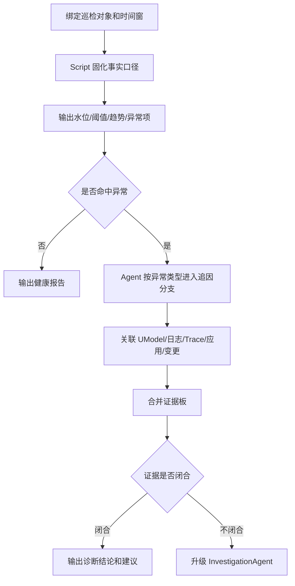

  <a href="/doc/starops/starops.html">STAROps</a> / 主动巡检

# 如何提升巡检稳定性，同时支持异常后的动态追因

  分类 · 主动巡检

:::: details 查看对话回放内容演示
[查看对话回放内容演示](/playground/rds-inspection-via-script-replay.html)
::::

在 STAROps 中，周期性巡检用于对云资源、应用依赖和关键业务对象进行定期健康检查。一次有效巡检应输出当前水位、异常项、长周期趋势、证据来源和后续调查方向，帮助运维团队提前发现容量、性能、安全和稳定性风险。

巡检的直接收益包括：

- 统一巡检口径，避免不同人员或不同 Agent 使用不同指标、时间窗和聚合方式。
- 减少重复人工取数，把水位、阈值、趋势和基础异常判断交给固定流程执行。
- 保留可审计证据，便于追溯一次巡检使用的数据源、查询口径和判断规则。
- 在发现异常后提供追因入口，继续判断异常来源、影响范围、反证和证据缺口。

要获得这些收益，巡检流程需要同时满足稳定性和追因能力。CPU、IOPS、磁盘、连接数、慢 SQL、错误日志等指标，需要固定时间窗、聚合方式、阈值、趋势算法和输出结构。同一个巡检对象在同一个输入下，应得到可复核、可审计、可对比的结果。异常出现后，流程还需要继续判断原因、责任对象、影响应用、关联 SQL、发布、配置或业务活动，并给出下一步调查方向。

纯脚本巡检适合稳定取数和基础判断，覆盖范围受预设规则限制。纯 Agent 巡检适合开放式调查，在周期性任务中容易出现取数口径漂移。STAROps 采用巡检 Skill + Agent 的组合：巡检 Skill 中的 Script 固化确定性事实，Agent 基于这些事实沿 UModel、日志、Trace、应用和变更关系做动态追因。

本实践以完成 RDS 巡检 Skill 作为示例。RDS 有明确的指标、SQL、日志、应用调用方和容量关系，适合展示“稳定巡检 + 动态追因”的方法。Redis、K8s、消息队列等对象可以沿同一策略实施。

## 解决的问题：稳定性和追因能力都要满足

巡检任务通常具有高频、重复、口径敏感的特点。团队需要它每小时、每天或每周稳定执行，结果可以横向比较，也可以回溯审计。

异常原因可能来自 SQL、应用、连接池、配置、发布、业务活动、定时任务或上下游依赖。这个阶段很难只靠预设脚本完全覆盖，需要 Agent 继续关联数据、判断影响面和收敛根因候选。

三种方式的边界如下：

| 方式 | 优点 | 问题 |
|---|---|---|
| 纯 Script | 固定查询、固定阈值、固定输出，结果稳定、成本低、可审计 | 只能覆盖预设判断，难以处理未知原因、跨域关联和证据冲突 |
| 纯 Agent | 可以根据现象动态探索，适合未知问题和复杂故障 | 周期性巡检中容易出现指标、窗口、聚合方式或数据源选择不一致 |
| 巡检 Skill + Agent | Script 固化事实口径，Agent 在异常后动态追因 | 需要把稳定口径、异常分类和追因分支沉淀成 Skill |

本实践采用第三种方式，要求巡检流程同时满足两类要求：

- 稳定巡检：事实层同输入同输出，可复核、可审计、可长期对比。
- 动态追因：异常出现后，不停留在孤立指标，继续沿关系判断影响面、根因候选、反证和证据缺口。

## 方案概述

巡检流程分为两层：使用 Script 构建确定性的数据获取能力；由 STAROps Agent 结合 UModel 动态拓扑实现动态追因能力。

### 确定性事实层

确定性事实层由巡检 Skill 中的 Script 执行。它负责稳定取数和基础判断，包括：

- 固定巡检对象、时间窗、指标名、数据源类型和聚合方式。
- 计算水位、阈值、P95 / P99、headroom、增长率和趋势方向。
- 输出异常项、原始采样、证据来源、置信度和下一步调查提示。
- 对数据缺失、样本不足、审计日志缺失、Trace 缺失等情况显式返回缺口，不静默当作通过。

### 动态追因层

动态追因层由 Agent 执行。Agent 读取 Script 输出的多维数据后，沿 UModel 和其他证据源继续追查：

- 从实例追到数据库、SQL、客户端账号、应用服务和接口方法。
- 从指标异常追到审计日志、慢日志、ERROR 日志、Trace 和业务入口。
- 从水位变化追到配置、发布、定时任务、批处理或业务活动。
- 输出主因候选、影响面、支撑证据、反证、证据缺口和置信度。
- 当已知经验解释不了异常，或证据冲突、缺失、需要多跳关联时，升级 InvestigationAgent。

## 通用执行协议

巡检对象可以变化，但执行协议保持一致。

1. 绑定巡检对象：把巡检目标绑定到 UModel 中的实例实体，例如 RDS 实例、Redis 实例、K8s 集群或消息队列实例，同时识别时间窗、业务线、应用和入口。
2. 运行确定性查询：Script 按对象的指标体系取数、算水位、判阈值、看趋势，生成稳定事实。
3. 生成异常项：每个异常项输出 `case_id`、`severity`、`instance_id`、`metric_name`、`current_value`、`threshold`、`window`、`trend`、`raw_samples`、`evidence_sources`、`confidence`、`investigation_hints` 和 `umodel_context`。
4. 动态追因：Agent 按异常类型进入对应分支，关联 SQL、日志、Trace、应用、接口、配置、发布和业务活动。
5. 合并证据板：主 Agent 汇总分支结果，输出主因候选、影响面、反证、缺口和是否需要升级 InvestigationAgent。

:::: details 查看执行流程图

::::

执行协议要求 Script 先生成稳定事实，再由 Agent 将异常关联到实体关系和证据来源。缺少事实层时，巡检结果容易受模型临场判断影响；缺少动态追因层时，巡检结果只能停留在阈值和异常列表。

## 示例：RDS 巡检 Skill

本实践使用已经完成的 RDS 巡检 Skill 作为示例。该 Skill 可以直接作为本最佳实践的样品，用于演示“确定性查询 + 动态追因”的完整流程。

RDS 巡检 Skill 包含两类能力：

- Runtime Skill：执行 RDS 巡检本身，运行脚本、输出异常项和追因提示。
- Guide Skill：协助用户完成安装校验、数字员工绑定、长期任务配置、通知配置和闭环验证。

其中 Runtime Skill 覆盖五个维度共 27 项巡检：

| 维度 | 示例脚本 | 项数 | 作用 |
|---|---|---:|---|
| 核心指标 | `rds-core-inspection.py` | 7 | 计算 CPU、内存、磁盘、IOPS、连接数、QPS / TPS、延迟等基础水位 |
| 性能 | `rds-performance-inspection.py` | 6 | 检查慢 SQL、锁等待、临时表、Buffer 命中率等性能异常 |
| 安全 | `rds-security-inspection.py` | 6 | 检查账号、权限、访问来源、风险配置等安全项 |
| 关联日志 | `rds-logs-inspection.py` | 2 | 结合审计日志、ERROR 日志或慢日志补充异常证据 |
| 长周期趋势 | `rds-trend-inspection.py` | 6 | 判断磁盘、IOPS、CPU、内存、连接数、慢 SQL 是否持续抬升 |

用户侧只需要提供业务语义层面的输入：

- 巡检对象范围：实例、业务线、应用、标签或环境。
- 巡检窗口：例如 `last_1h`、`last_24h`、`last_7d`、`last_15d`。
- 通知方式：联系人、群机器人或 Webhook。

数据源参数由 STAROps 运行时按巡检对象解析，例如 `region`、`workspace`、`project`、`metricstore`、`audit-logstore`、Trace / APM 数据源标识等。用户不需要手工填写这些内部数据源名称。

## RDS 示例流程：从磁盘水位高到动态追因

下面以 RDS 磁盘水位高为例，说明同一套协议如何工作。

1. Script 发现某 RDS 实例 `DiskUsage` 为 89.3%，超过 80 阈值；同时计算 7 天增长 +4pp、15 天日均增长 3.4MB/day，并输出样本完整性。
2. Agent 进入磁盘水位追因分支，先查看空间构成，区分 DataDisk、OtherDisk、binlog、临时文件、Redo Log、General Log、Undo Log 等来源。
3. 如果空间大头来自日志或配置，Agent 继续核对相关配置、容量上限和同窗口变化。
4. 如果空间增长来自业务数据，Agent 结合审计日志或慢日志聚合 Top SQL digest，再沿 UModel 关系查上游应用、接口、账号、客户端来源和业务入口。
5. 主 Agent 合并证据板，输出主因候选、影响面、反证、缺口和置信度。例如：主因候选是 Redo Log 配置接近上限加 General Log 偏大；业务写入存在增长但不是主要瓶颈；缺口是 per-table 磁盘占用需要额外确认。
6. 如果缺少审计日志、Trace、UModel 关系或表级空间证据，报告必须明确标记数据缺口和置信度下降。若已登记分支无法解释异常，升级 InvestigationAgent。

该示例中的职责边界为：Script 负责发现“磁盘高、趋势在上升、空间构成是什么”，Agent 负责继续判断“为什么高、谁造成、影响谁、证据是否闭合”。

## RDS 已知异常快速下钻

RDS 巡检 Skill 会把常见异常整理成追因分支。分支的作用是定义 Script 和 Agent 的交接规则：Script 先为已知异常准备基础证据，Agent 再基于这些证据继续排查。

例如，Script 发现 IOPS 高时，不只返回“IOPS 超过阈值”，还应同时返回 read / write IOPS、QPS、延迟、趋势和原始采样。Agent 拿到这些事实后，再去查 Top SQL digest、慢日志、审计日志、上游应用和同窗口发布。这样可以减少 Agent 从零选择指标和路径的随机性，也能保留异常后的动态排查能力。

| 异常类型 | Script 先准备的基础证据 | Agent 接着判断的问题 |
|---|---|---|
| IOPS 高 | read / write IOPS、水位、P95、QPS、延迟、趋势、原始采样 | 是否由少数 Top SQL 主导；是否来自特定应用、接口、发布或定时任务 |
| 磁盘水位高 | 磁盘使用率、增长率、空间构成、样本完整性 | 增长来自业务数据、日志、临时文件还是配置；是否需要继续查表增长和写入来源 |
| CPU / 内存高 | CPU、内存、QPS、连接数、Buffer 命中率、慢 SQL | 是否由重 SQL、请求量抬升、连接池异常、缓存命中下降或长期容量不足导致 |
| 连接数高 | 当前连接、P95、利用率、低峰基线、连接来源 | 是否来自业务流量增长、连接池配置、连接泄漏、异常重试或特定应用实例 |

追因分支不等同于最终根因。它只规定“已知异常先查哪些基础数据、下一步优先沿哪些关系继续查”。每个分支应输出证据摘要、反证、缺口和分支判断。主 Agent 再合并多个分支，形成主因候选、影响面和是否升级 InvestigationAgent 的判断。

## 数据与建模前提

巡检追因的关键是数据关系是否可用，而不是 Prompt 是否足够长。

如果客户已经接入 STAROps、ARMS/APM、RDS、SLS，通常可以复用以下数据对象：

| 数据对象 | 用途 |
|---|---|
| RDS 实例、数据库、账号、SQL digest | 绑定巡检主体和 SQL 证据 |
| 指标源 | 生成确定性事实和趋势判断 |
| 审计日志、慢日志、ERROR 日志 | 追查 SQL、错误族、客户端来源和访问模式 |
| 应用、接口、调用拓扑、Trace | 将 SQL 或指标异常关联到上游应用和业务入口 |
| 发布、配置、定时任务、业务活动 | 判断同窗口变化和触发因素 |

如果暂时缺少审计日志或 Trace，基础指标巡检仍然可以执行，但 SQL 追因、应用定位和影响面判断会下降。报告必须显式说明缺口，而不是把弱关联当成确定结论。

## 扩展到其他巡检对象

RDS 只是本实践的示例。扩展到其他对象时，换的是指标体系和追因分支，不换执行协议。

| 巡检对象 | 确定性事实层示例 | 动态追因层示例 |
|---|---|---|
| Redis | 内存使用率、键空间、慢命令、持久化延迟、主从延迟 | 热 Key、客户端来源、业务接口、容量配置、主从链路 |
| K8s | 节点水位、Pod 重启、工作负载异常、request / limit、调度失败 | 应用发布、镜像版本、节点资源、依赖服务、业务入口 |
| 消息队列 | 堆积量、消费延迟、生产消费速率、死信数量 | 生产者、消费者、业务 Topic、下游处理能力、错误重试 |

每个对象都需要定义：

- 指标体系和查询口径。
- 异常 `case_id` 和严重度规则。
- 追因分支和证据闭合标准。
- 数据缺口和置信度标记方式。
- 升级 InvestigationAgent 的条件。

## 验证标准

本实践是否成立，不能只看 Agent 是否生成了一份巡检报告。需要验证它是否稳定产出事实、命中追因分支，并保持证据质量。

建议选择一条企业历史巡检异常，分别对比通用自然语言 Agent 巡检和巡检 Skill：

| 路径 | 观察点 |
|---|---|
| 通用 Agent 自然语言巡检 | 工具调用次数、总耗时、取数口径是否稳定、是否识别主异常 |
| 巡检 Skill | 工具调用次数、总耗时、首次命中追因分支时间、并行取证能力、证据板完整度、是否触发升级 |

通过标准：

- 同一输入多次运行，确定性事实层输出稳定。
- 能输出水位、阈值、趋势、原始采样和证据来源。
- 异常项能进入对应追因分支，而不是只复述指标。
- Agent 能合并证据板，区分事实、主因候选、反证、缺口和置信度。
- 缺少审计日志、Trace 或 UModel 关系时，能显式标记数据缺口和置信度下降。
- 未登记异常、证据冲突或需要跨域多跳调查时，能升级 InvestigationAgent。
- 全流程保持只读，不执行生产变更。

已经完成的 RDS 巡检 Skill 可直接用于上述验证：先校验脚本包结构和 27 项 case，再选择真实历史异常或结构合理的测试应用跑通端到端流程。

## 实施边界

- 本实践用于 L0 只读巡检和诊断。
- Script 只执行只读查询和基础判断，不执行写入 SQL、配置修改、发布、重启或扩缩容。
- Agent 输出的是诊断结论和建议动作，不自动变更生产环境。
- 涉及用户、订单、金额等敏感信息时，报告只展示脱敏标识和聚合统计。
- 修复建议需要人工确认后进入客户自己的变更流程。

## 安装 Skill

本实践落地两份 Skill，二者职责不同，不能互相替代。引导 Skill 可在本地 Agent 通过 [`npx skills`](https://www.npmjs.com/package/skills) 加载，或由 STAROps 数字员工下载 tar.gz 后在控制台「技能管理 → 上传技能」上传；业务 Skill 的实际巡检依赖 STAROps 运行时数据，只能在 STAROps 控制台运行。

| Skill | 作用 | 本地 Agent | STAROps 控制台 |
|---|---|---|---|
| `rds-inspection` | 业务 Skill：调度脚本批量执行 27 项 RDS 巡检（核心 / 性能 / 安全 / 关联日志 / 长周期趋势五维度），输出结构化 JSON；异常项附带原始采样、上下游拓扑、追因提示与置信度。 | 不支持独立巡检（依赖 STAROps 运行时数据） | [rds-inspection.tar.gz](https://starops-demo.oss-cn-beijing.aliyuncs.com/starops/demo/starops-best-practice/rds-inspection-via-script/docs/rds-inspection.tar.gz) |
| `rds-inspection-via-script-sop` | 引导 Skill：教 Agent 按 5 步 SOP 协助用户走完整流程，最终在 STAROps 中产生一个活跃的周期性巡检任务。 | `npx skills add aliyun-sls/sls-doc-skills --skill rds-inspection-via-script-sop` | [rds-inspection-via-script-sop.tar.gz](https://starops-demo.oss-cn-beijing.aliyuncs.com/starops/demo/starops-best-practice/rds-inspection-via-script/docs/rds-inspection-via-script-sop.tar.gz) |

`rds-inspection` 业务 Skill 承载确定性事实层；`rds-inspection-via-script-sop` 引导 Skill 把安装、绑定、长期任务、通知、闭环验证串成 5 步 SOP。

## 相关入口

- [返回 STAROps 最佳实践首页](/starops/starops.html)
- [打开 STAROps Playground](/playground/staropsdemo.html)
- [进入 STAROps 控制台](https://starops.console.aliyun.com)
